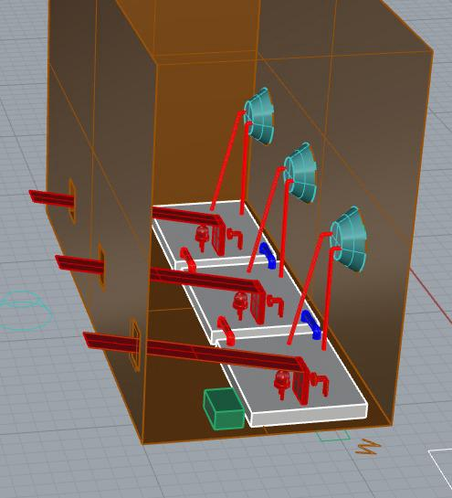
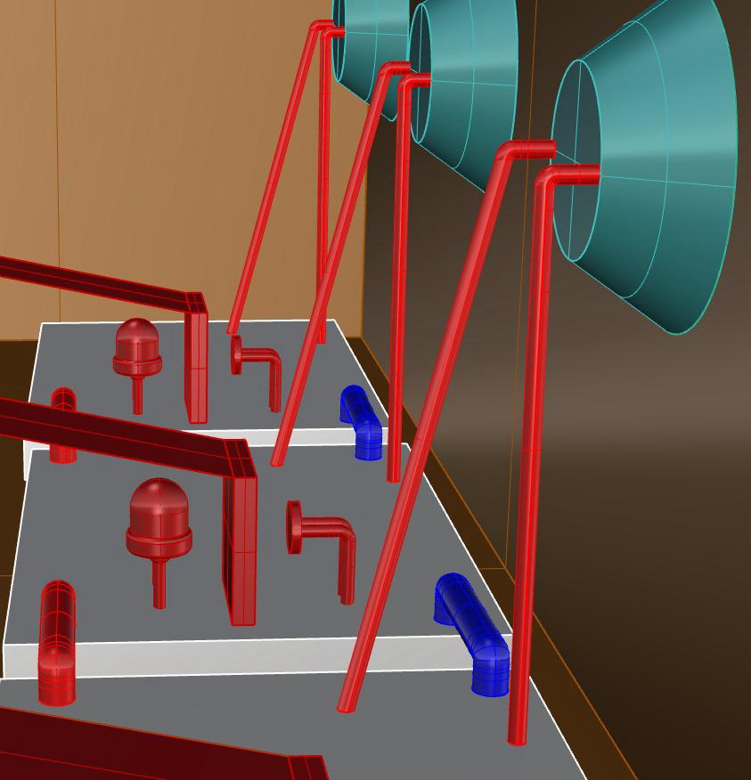
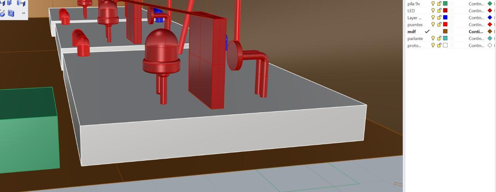

# sesion-06a

# PROYECTO 01 - Grupo 09 

**Integrantes:**
- Bastián Solís Cavieres
- Carlo Martinez Arzola
- Martin Silva Reyes

# NOMBRE DEL PROYECTO: *Caja Sonora Interactiva*

Antes que nada, tomamos como base el circuito del 'Atari Punk Console', es decir, primero partimos con el circuito inicial del APC, el cual modificamos principalmente para alterar la frecuencia del parlante mediante el uso de botones e interruptores.

Circuito Inicial del APC (Atari Punk Console)

# Imagenes del Proyecto:

# Estructura hecha con Corte Láser

# Estructura por dentro

La idea principal de nuestra caja es que sea interactiva, por lo que cuenta con tres agujeros por donde saldrán las bocinas que emiten el sonido. Por esta razón, el corte láser fue diseñado de esta forma, permitiendo que el sonido se proyecte adecuadamente hacia el exterior.

Aquí se puede apreciar cómo la bocina queda posicionada en el agujero, permitiendo que el sonido se proyecte hacia el exterior.

Se muestra una vista superior del interior de nuestra caja, la cual contiene un circuito APC. La idea final es incorporar tres protoboards para implementar el sistema de bocinas en los 3 agujeros.

Nuestra caja incorpora bisagras que permiten abrirla fácilmente, lo cual facilita el acceso al interior para insertar la batería de 9V necesaria para el funcionamiento del proyecto.

Aca se aprecia más de cerca el funcionamiento de nuestro APC, con el LED azul encendido como parte de una prueba para verificar que todo funcionara correctamente.

