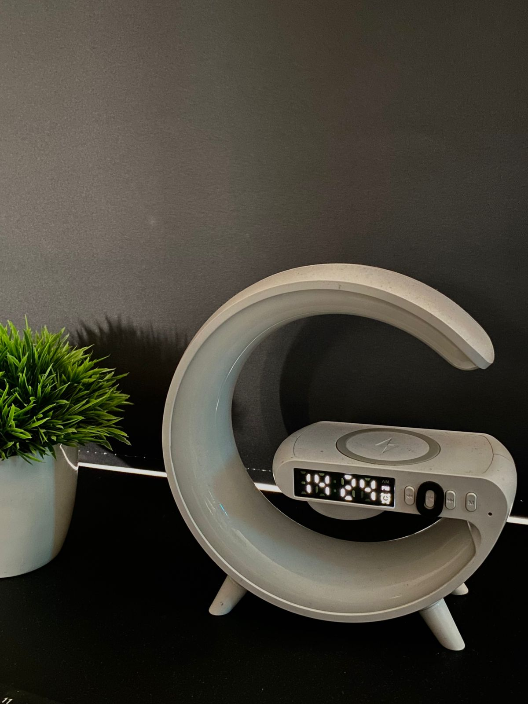

# sesion-10a

# encargo-20: Pantallas de siete segmentos

Una pantalla de siete segmentos es un dispositivo electrónico que muestra números y algunos caracteres alfanuméricos mediante la activación de siete segmentos individuales en forma de LED. Cada segmento está etiquetado con una letra de la 'a' a la 'g', y al encender combinaciones específicas de estos segmentos, se pueden representar los dígitos del 0 al 9 y algunas letras.

# Ejemplos de uso:

- Relojes digitales: Para mostrar la hora, minutos y segundos.
- Calculadoras: Para mostrar los resultados de las operaciones.
- Medidores electrónicos: Para mostrar las lecturas, como voltaje, corriente, etc.
- Contadores: Para mostrar la cantidad de objetos o eventos.
- Pantallas de electrodomésticos: Para mostrar la configuración o el estado del aparato.
- Pantallas de automóviles: Para mostrar información del vehículo, como la velocidad, el nivel de combustible, etc.
- Dispositivos de medición: Para mostrar las lecturas.
- Instrumentos musicales: Para mostrar la nota o el ritmo.

# Fotografias Propias de Ejemplos

# Estacion de Carga RGB: 

Reloj digital con pantalla de 7 segmentos. El reloj utiliza dígitos blancos tipo display de 7 segmentos, muy visibles incluso en ambientes con poca luz.

Indica la hora en formato de 12 horas (AM/PM).

Tiene iconos de alarma activa y configuración de hora visibles.

# Reloj Digital Casio A168

El Casio A168 es un clásico reloj digital que utiliza una pantalla LCD (Liquid Crystal Display) para mostrar la hora, fecha y otras funciones. Que aunque conceptualmente similar a la de 7 segmentos, es más avanzada y su diferencia de los relojes que usan pantallas de 7 segmentos LED tradicionales, el Casio A168 utiliza una pantalla LCD segmentada, que tiene características similares pero con diferencias importantes.

| Característica     | LCD segmentado (Casio A168)                                             | LED 7 segmentos tradicional    |
| ------------------ | ----------------------------------------------------------------------- | ------------------------------ |
| Consumo energético | Muy bajo (permite batería de larga duración)                            | Alto (requiere más energía)    |
| Visualización      | Números, letras, símbolos (más versátil)                                | Solo números (menos flexible)  |
| Visibilidad        | Buena en luz ambiental, menos visible en oscuridad sin retroiluminación | Muy visible en oscuridad       |
| Costo              | Generalmente más económico y duradero                                   | Más caro y con menor vida útil |

