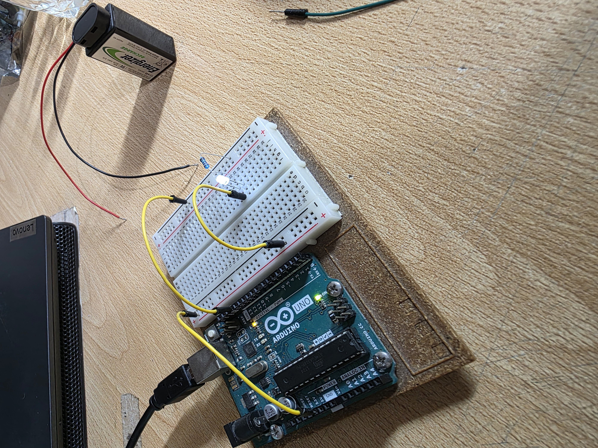
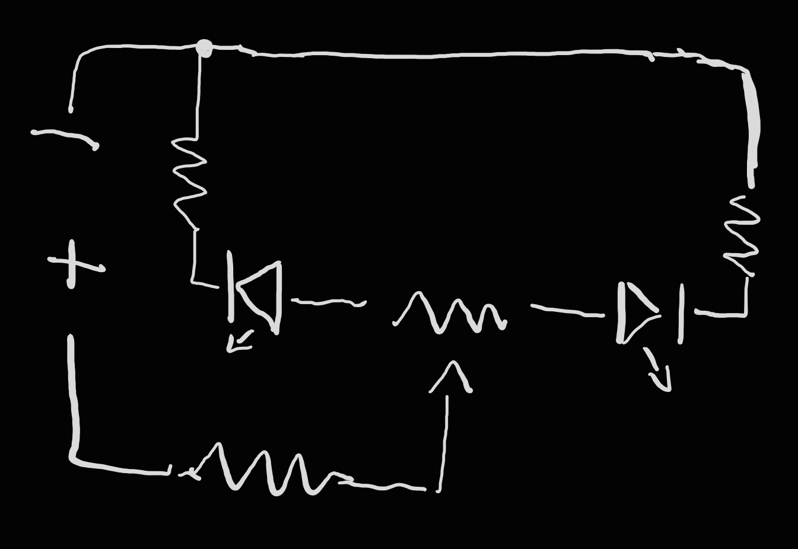
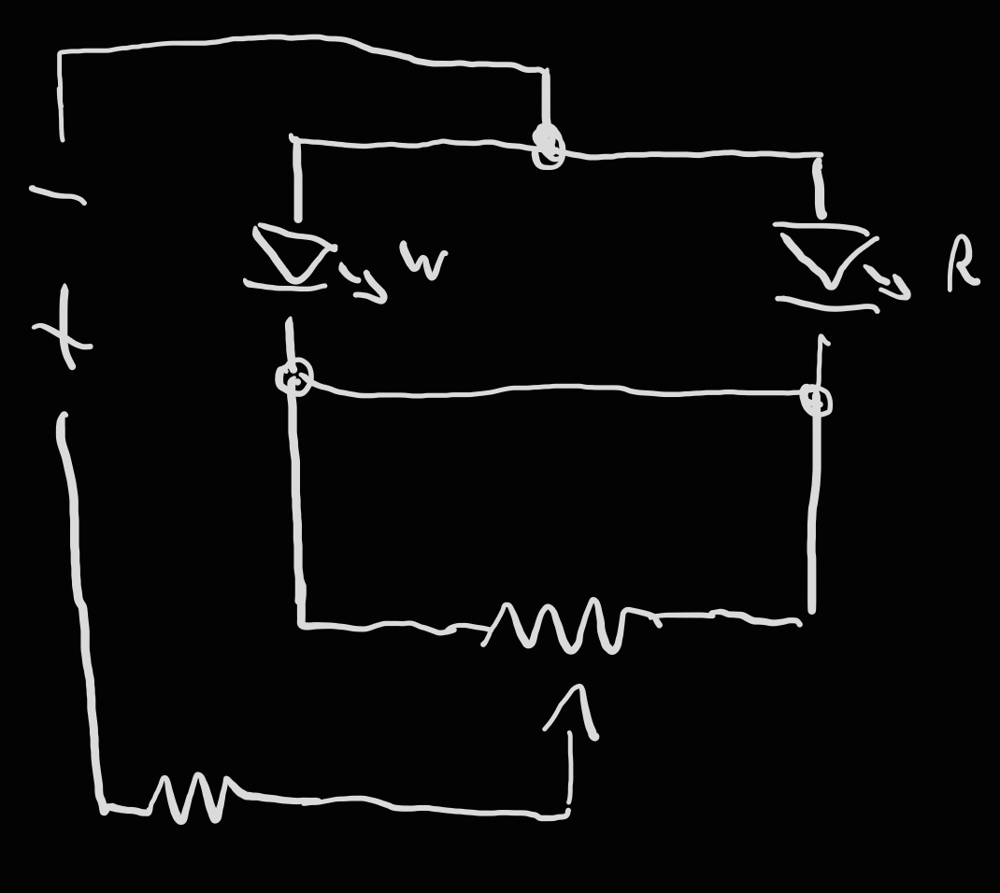
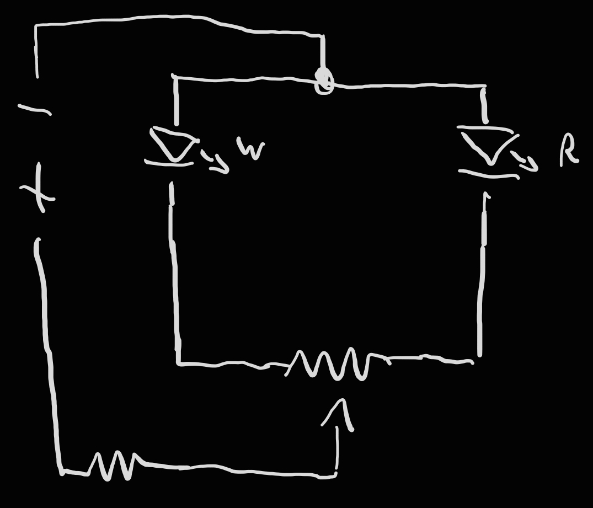

# sesion-02a

## Apuntes
>
### Carpetas y archivos
>
Nombres sin espacios " ", solo guiones "-" y "_" o camelCase (ej: valorTotal)
Sin letras mayúsculas en nombres de archivos y/o carpetas
Asegurarse que el archivo tenga la extensión deseada (.exe .txt. .md .stl ...)
>
### [Github personal web page](https://youtu.be/o5g-lUuFgpg?si=7qb0U5vslgImk-H2)
>
nombrePerfil.github.io = pagina web personal gratis (html, md compatible)
>
CNAME (Cannonical NAME record). Maps one domain name to another eg: originalName.github.io -clicheSurame.com (dominio nuevo se tiene que comprar)
>
[Profile readme generator](https://youtu.be/onUx22pgiBM?si=5ASsmWzo5xztjWpg)
>
### [Tinkercad](https://www.tinkercad.com)
>
simulación circuitos electricos
>
### Circuitos
>
cerrado v/s abierto
En un circuito cerrado hay flujo de corriente, mientras que en uno abierto, no.

Como se ve en las imagenes, un componente puede estar conectado al positivo de una fuente de alimentación y al negativo de otra, pero al no estar cerrado el circuito este LED no se ilumina.

Voltaje = diferencia de potencial entre 2 puntos -0V = negativo/tierra

I=V/R  [Ley de Ohm](https://www.youtube.com/watch?v=HsLLq6Rm5tU)

Circuito = laso cerrado con elementos resistivos

#### Tipos de circuito

* [Paralelo](https://youtu.be/5uyJezQNSHw?si=AVs_V-hrtPFCKdkU) -se divide la corriente pero se mantiene el voltaje. Si un componente falla, no falla todo el circuito

* [Serie](https://youtu.be/VV6tZ3Aqfuc?si=LqOyVR3KekmErDvc) -Se divide/multiplica el voltaje. Si un componente falla, falla todo el circuito.

## encargo-04

### Pueblo nuevo

Escuché el disco Tecnoasuar de CASTEX y S3T3 (lo elegí pq el autocorrector de mi cerebro acostumbrado al inglés le cambió el titulo a *Tecnosaur*). Lo primero que llamó mi atención fue que la canción "Música con computadores" no sonaba como un dinosaurio robótico, sino como una clase de música grabada con un microfono antiguo. Tras escuchar el resto del álbum estaba seguro que tenía relación con algo pedagógico, lo cual se me hiso bien extraño, por que nunca habia escuchado de un disco cuyas canciones fuesen hechas como ejemplos prácticos para enseñar.
>
>Tras leer la descripción del álbum me di cuenta que el disco que escuché no era un conjunto de ejemplos prácticos (o quizas sí, no se suficiente de musica para decirlo), sino que es un homenaje a un disco que sí tenia como objetivo enseñar música y a su creador José Vicente Asuar, un pionero de la música electroacústica en Chile, creador del primer laboratorio de música electrónica en latinoamérica y del sintetizador COMDASUAR.
>
>Fuera del contexto del álbum, encontré curioso que en el disco, el componente vocal no tiene emoción ni un ritmo musical, a diferencia de otras obras de música electrónica ej: *"Around the world"* de Daft Punk, es como si un computador hubiese "cantado" la parte vocal.
___

## encargo-05

### Resistencias

De acurdo a la tabla vista en la foto, las siguientes resistencias tendrian los siguientes colores (4 y 5 bandas, sin banda de tolerancia):

1 Ohm   

   

10 Ohm   

   

100 Ohm   

   

1k Ohm   

   

>
### LEDs

El rango de voltaje en que operan difiere entre LEDs de distintos colores.
Para determinar el rango de voltaje de un LED se puede usar una [calculadora de voltaje](https://somanytech.com/led-voltage-calculator-for-different-color/) o testear el LED con un multimetro (in diode mode)

Tras medir los LEDs que nos dieron los profes (Ø3.5mm), estos son los voltajes optimos de operación:

 | Color | Voltaje |
|-------|---------|
| $${\color{white}Blanco}$$ | 2.6 |
| $${\color{blue}Azul}$$ | 2.5 |
| $${\color{yellow}Amarillo}$$ | 1.9 |
| $${\color{green}Verde}$$ | 1.9 |
| $${\color{red}Rojo}$$ | 1.8 |

### Experimentos

1 LED (Ø3.5mm) + LED Ø11mm + potenciómetro

Tras medir ambas LEDs con un multimetro y ver que ambas se encendian con el mismo voltaje, con Martin las conectamos en serie para ver la differencia de brillo entre ambas.

El LED más grande tiene un voltaje máximo más alto que el led más pequeño (3.3V v/s 2V) y se ilumina más.

2 LED (x2) + resistencia (x3) + potenciómetro

Conecté 2 LEDs a los extremos de un potenciómetro para ver si lograba que una se apagara al aumentar la resistencia.

No logré que se apagara alguna de las LEDs.

3 LED white + LED red + resistencia + potenciómetro

Tras ver que el LED blanco se apagaba al conectarlo junto con uno rojo, armé un circuito para ver que pasa si un LED recibe el flujo de electrones antes que el otro.

Cambia la intensidad del LED rojo en  una curva + - +, pero el LED blanco se mantiene apagado.

4 LED white + LED red + resistencia + potenciómetro

Decidí conectar los LEDs independiente uno del otro y ver que pasaba.

Al aumentar el voltaje del LED rojo (y disminuir la del blanco), el LED blanco se apaga, sin embargo el LED rojo no se apaga al reducir su voltaje.
