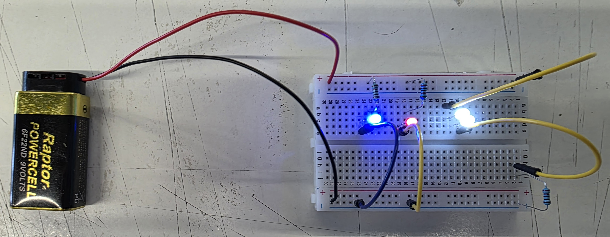
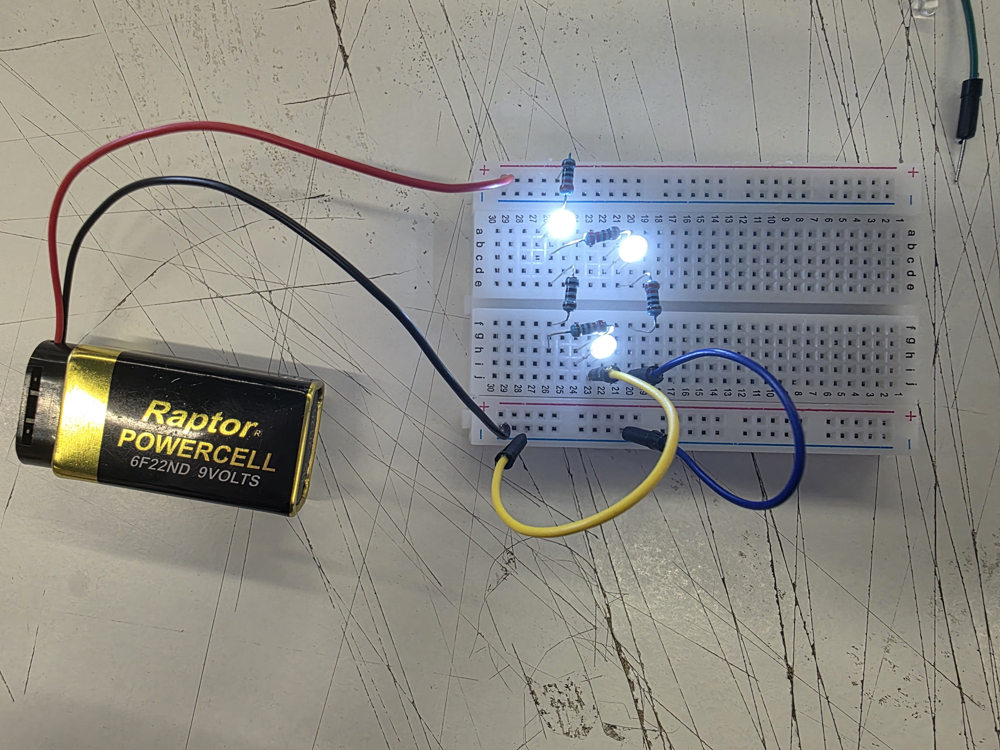
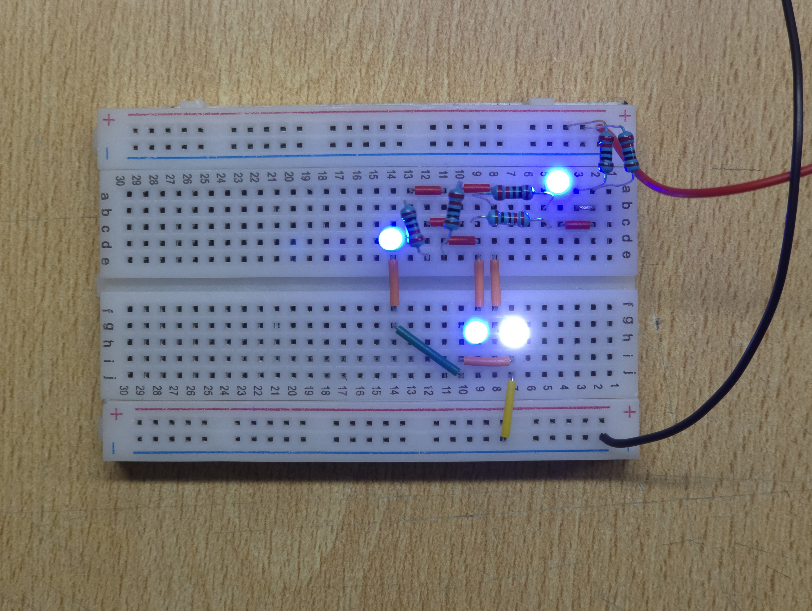
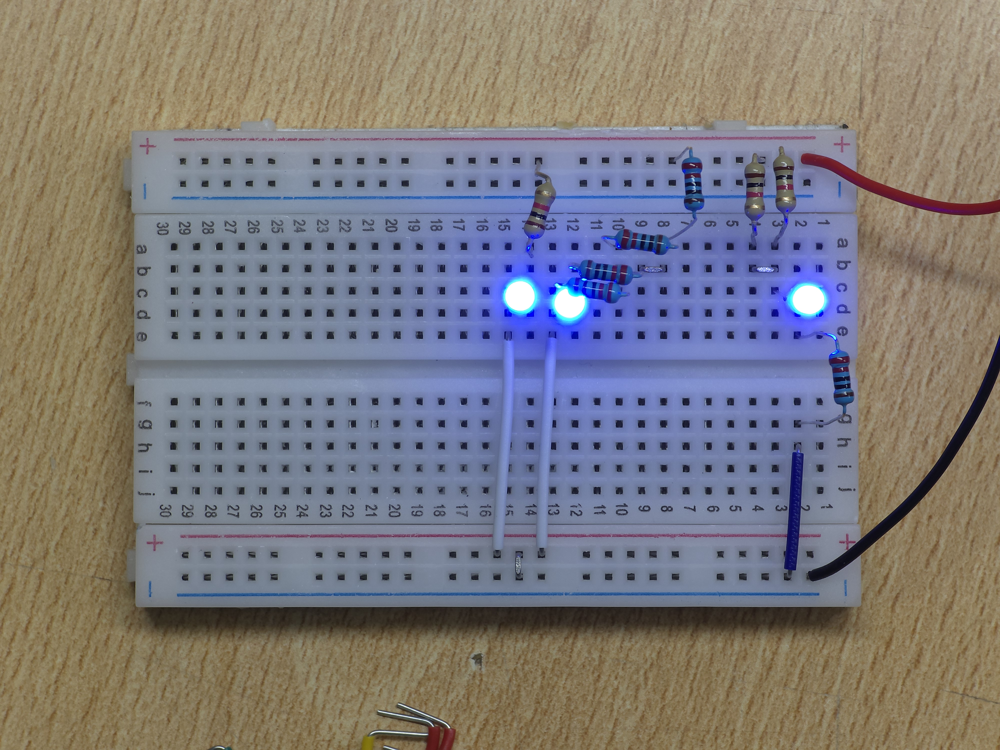

# sesion-02b

## Apuntes

### Music facts

Música electrónica se basa en el tempo <https://youtu.be/X83r6euJ0pk?si=Nlu_lP52Yvdogsdr&t=35>, el cual se marca con un metrónomo tradicionalmente y se mide en BPM (Beats Per Minute)

[TR-808 drum machine](https://youtu.be/MSKq0r5W2O0?si=nVshmN0YMwFmBIHO)

[TR-303](https://youtu.be/kf2-WLK3gPA?si=5F29i2VBgnFZ-uGF)

### [YML (YAML)](https://youtu.be/BEki_rsWu4E?si=LxkK22Gq85jf582R)

> *"YAML Ain't Markup Languaje"* (o en sus inicios *"Yet Another Markup Languaje"*), aka YAML o YML es un archivo de configuración como lo son .json y .xml, pero diseñado para ser más facil de entender por un humano (al ser más limpio y ordenado)

### Circuito en clase

>
> | Bill Of Materials (BOM) | Qty | Name | Valor |
> |:-----------------------:|:---:|:----:|:-----:|
> |       Resistencia       |  3  | R1, R2, R3 | 1k ohm |
> |         LED             |  4  | D1, D2, D3, D4 | TODO |
> |         Batteria        |  1  | Batt | 9V |

>
> | Tabla dependencia | D1 | D2 | D3 | D4 |
> |:-----------------:|---------------|---------------|---------------|---------------|
> | R1     |      0        |      1        |       1       |        1      |
> | R2     |       1       |      0        |       1       |        1      |
> | R3     |      1        |      1        |       0       |        0      |
>

## Ejercicios
>
> ### 1.-

imagen no existe: <https://github.com/disenoUDP/dis8644-2025-1/blob/main/00-docentes/sesion-02b/archivos/schLearn1.png>

>> | Bill Of Materials (BOM) | Qty | Name | Valor |
>>  |:-----------------------:|:---:|:----:|:-----:|
>> |       Resistencia       |  4 | R1, R2, R3, R5 | 220 ohm |
>> |       Resistencia       |  1 | R4 | 1k ohm |
>> |         LED             |  4  | D1, D2, D3, D4 | TODO |
>> |         Batteria        |  1  | Bt1 | 9V |
>>
>>
>>
>> | Tabla dependencia | D1 | D2 | D3 | D4 |
>>  |:-----------------:|:-------------:|:-------------:|:-------------:|:-------------:|
>> | R1     |      0        |      0        |       0       |        0      |
>> | R2     |       1       |      0        |       0       |        1      |
>> | R3     |      1        |      1        |       1       |        0      |
>> | R4     |      1        |      1        |       1       |        0      |
>> | R5     |      1        |      0        |       0       |        1      |

> ### 2.-

IMAGEN NO EXISTE: <https://github.com/disenoUDP/dis8644-2025-1/blob/main/00-docentes/sesion-02b/archivos/schLearn2.png>

>>
>> | Bill Of Materials (BOM) | Qty | Name | Valor |
>>  |:-----------------------:|:---:|:----:|:-----:|
>> |       Resistencia       |  6 | R1, R2, R3, R4, R5, R6 | 220 ohm |
>> |         LED             |  4  | D1, D2, D3, D4 |  TODO|
>> |         Batteria        |  1  | Bt1 | 9V |
>>
>>
>>
>> | Tabla dependencia | D1 | D2 | D3 | D4 |
>>  |:-----------------:|:-------------:|:-------------:|:-------------:|:-------------:|
>> | R1     |       1       |       1       |       1       |       1       |
>> | R2     |       1       |       1       |       1       |       1       |
>> | R3     |       1       |       1       |       1       |       1       |
>> | R4     |       1       |       1       |       1       |       1       |
>> | R5     |       1       |       1       |       1       |       1       |
>> | R6     |       1       |       1       |       1       |       1       |

### 3

IMAGEN NO EXISTE <https://github.com/disenoUDP/dis8644-2025-1/blob/main/00-docentes/sesion-02b/archivos/schLearn3.png>

| Bill Of Materials (BOM) | Qty | Name | Valor |
|:-----------------------:|:---:|:----:|:-----:|
|       Resistencia       |  5 | R1, R2, R3, R4, R8 | 220 ohm |
|       Resistencia       |  3 | R5, R6, R7 | 1k ohm |
|         LED             |  3 | D1, D2, D3 | TODO |
|         Batería        |    | Bt1 | 9V |

>> | Tabla dependencia | D1 | D2 | D3 |
>>  |:-----------------:|:-------------:|:-------------:|:-------------:|
>> | R1     |       1       |       0       |       1       |
>> | R2     |       1       |       0       |       1       |
>> | R3     |       1       |       0       |       1       |
>> | R4     |       1       |       0       |       1       |
>> | R5     |       0       |       1       |       1       |
>> | R6     |       1       |       1       |       1       |
>> | R7     |       1       |       1       |       1       |
>> | R8     |       1       |       1       |       0       |

