# sesion-03b

## Apuntes
>
> ### 555 astable V2
>
>   
>  
>  
>  
>  
> Comenzamos regresando al circuito de la clase pasada, considerado como **"lugar seguro"**, una plantilla base desde la cual hacer modificaciones y experimentar.  
>  
>  
>  
>  
>  
>  
> 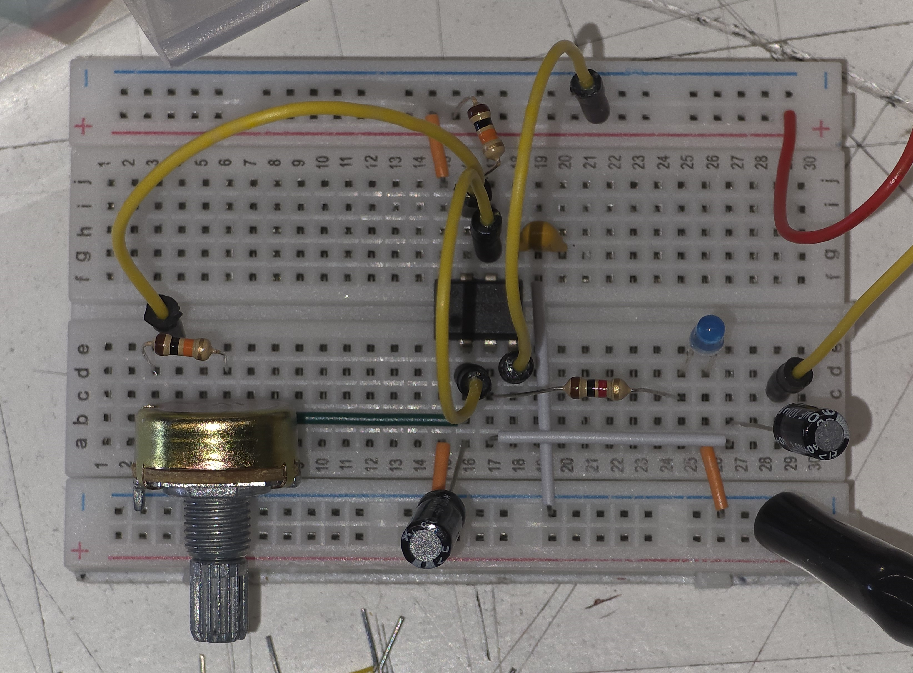  
>  
>  
>  
> Alteramos el circuito, conectando un ${\color{#ffe4a8}potenciómetro}$] en serie con ${\color{#ffe4a8}R2}$, un ${\color{#6462fe}capacitor}$ al pin3 del **NE-555** ${\color{red}(+)}$ y un parlante conectado su terminal positiva ${\color{red}(+)}$ a la pata negativa ${\color{white}(-)}$ del ${\color{#ffe4a8}resistencia}$ y la terminal negativa a ${\color{white}GND}$.  
>  
>  
>  
>  
>  
>  
>   
>  
>  
>  
> Después cambiamos  ${\color{#ffe4a8}R2}$ por una  <strong> ${\color{#ffe4a8}fotoresistencia}$ </strong>, lo que tuvo el efecto de alterar la frecuencia del sonido emitido dependiendo de cuanta luz permitieramos que recibiera el LDR (tapandolo con la mano [+ grave] o alumbrandolo con el celular [+ agudo])
>  
>  
>  
>  
>  
>  
>>   
>>  
>> [Fotoresistencia/Light Dependent Resistor (LDR)](https://youtu.be/DYcLFHgVCn0?si=fQL99084OkrClTet&t=1293)  
>> Son resistencias cuyo valor cambia dependiendo de la intensidad de la luz que reciban   (**+luz** = **-resistencia**)
>>  
>>  
>>  
>  
> 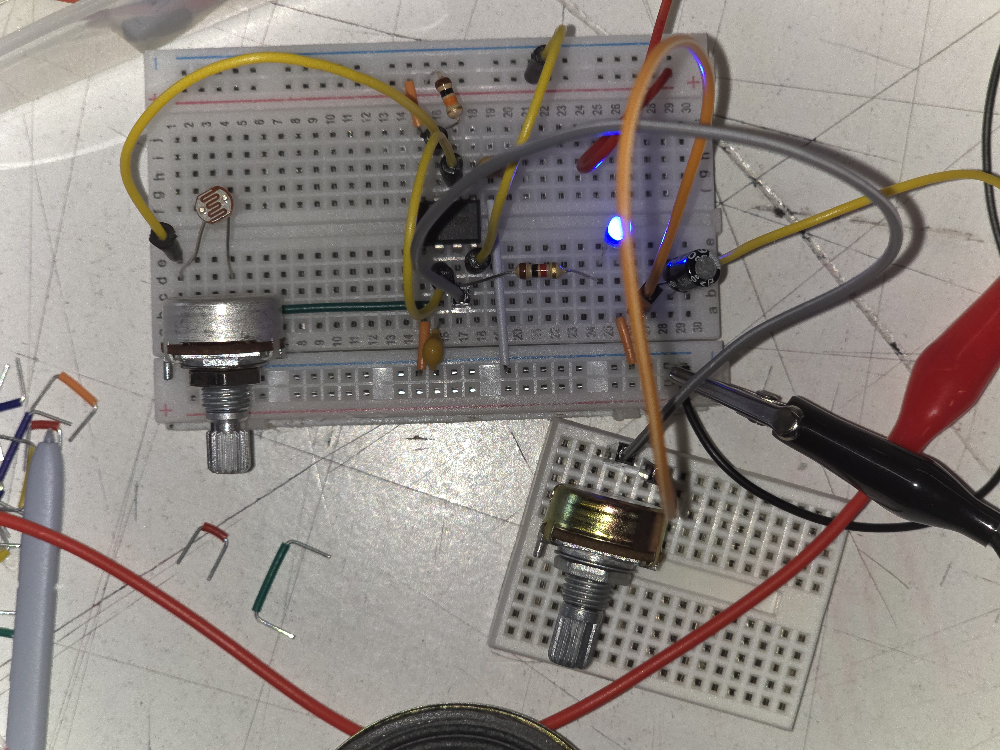  
>  
>  
>  
>
> En uno de los pasos anteriores conecté el parlante al ${\color{#ffe4a8}resistor}$ conectado al pin3, lo que causó que el parlante fuese casi inaudible, tras eso, conecté un ${\color{#ffe4a8}potenciómetro}$ entre el pin3 y el parlante, actuando como un control de volumen.  
>  
>  
>  
>  
>  
>
> ### Other things  
>>
>> #### [Kicad](https://youtu.be/EPH23zhPg50?si=98jkaAui-U_X-FTh)  
>>
>> software de diseño y simulación de circuitos (PCBs), similar a altium designer, pero gratis. (Misaaaaaa tiene tutoriales en youtube)  
>>
>> #### [falstad.com](https://www.falstad.com/circuit/)
>>
>> Simulador del flujo de corriente en circuitos + osciloscopio simulado  
>>  
>>   
>>  
>>  
>>  
>>  
>>  
>>  
>>  
>>  
>>  
>>  
>>  
>>  
>>  
>>  
-----------------------------------------------------------------------------------------------------------

## Encargo 08  

### Gonzalo Martínez y sus Congas Pensantes  
>
> En comparación con las otras bandas de música electrónica, escuchar esto fue sorpresivo, me esperaba algo que fuese 100% musica electrónica (o algo experimental), no algo más "normal" o "tradicional" que tuviese elementos de música electrónica acompañando y casi como bailando con los elementos de música más tradicional, intercambiando entre sí *"the spotlight of the song"* a lo largo del disco.  
>  
> El disco fue compuesto por **Jorge González** (ex-vocalista de "Los prisioneros"), según un articulo de la Tercera, tiene su origen en los recuerdos de la niñez de González, donde el cuenta recordar como la cumbia atrapaba a la gente en baile, y se le ocurrió mezclarla con música electrónica.  
>  
> Como suele ocurrir con obras adelantadas a su época, parece que este disco fue ignorado por el público, mas no por otros artistas, que comenzaron a surgir otras obras que mezclaban elementos de la música electrónica con la música latinoamericana.  
-----------------------------------------------------------------------------------------------------------

## Encargo 09  

### Museo de Arte Contemporaneo (CAM)  
>
> Me llamó la atencion el contraste, si se puede llamar así, de tener un edificio típico de como se esperaría que fuese un museo, con un letrero con luces neon en el vestíbulo, abitaciones de exposiciones, aunque algunas tenian obras más tradicionales (pintura, escultura, etc) se sentia alien el ver objetos electrónicos (en muchos casos con todos sus componenetes *and inner workings* expuestas) 
> 
> Más allá de sentir como mi cerebro se cortocircuitaba al batallar por intentar comprender las obras, encontré curioso lo limpio que era todo, en el sentido que habia un claro intento por hacer invisibles los cables, estando en su mayoría pegados a la pared o suspendidos desde el techo y/o pintados del color de las paredes/suelo/obra de la que provenian.  
> 
> Me hubiese gustado que los cables, las venas que proveen de vida los circuitos, hubiesen sido considerados como parte de las obras, en lugar de un *afterthought* 
>    
>  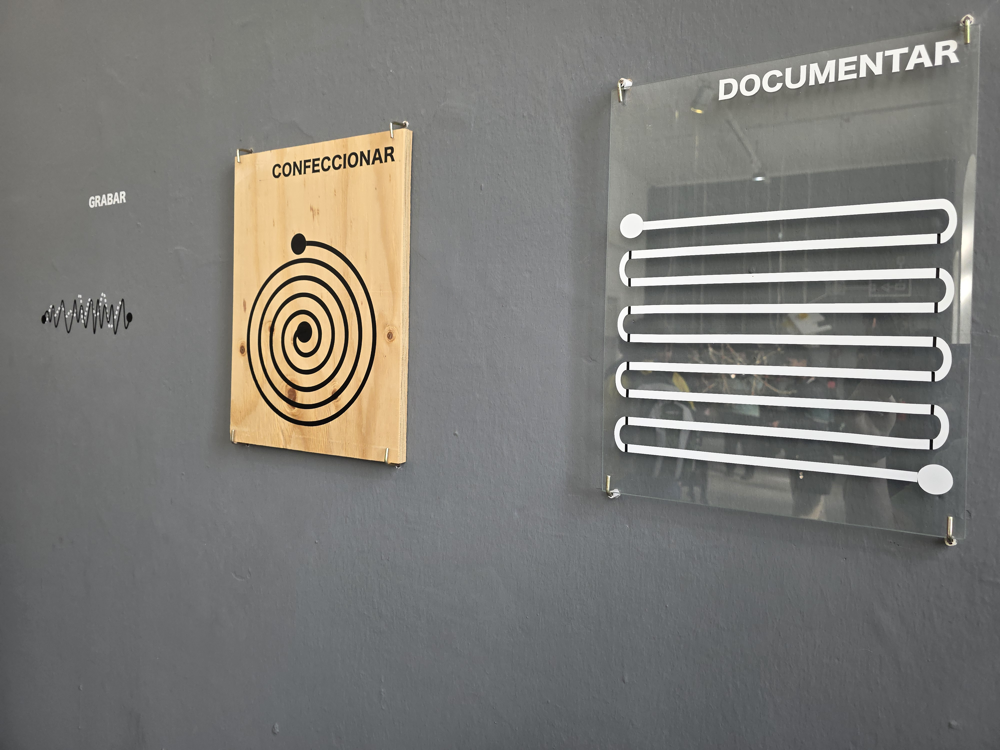  
> 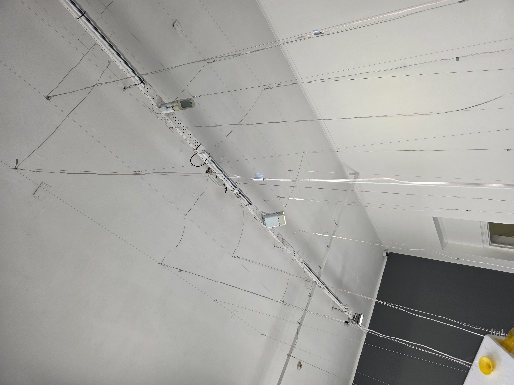  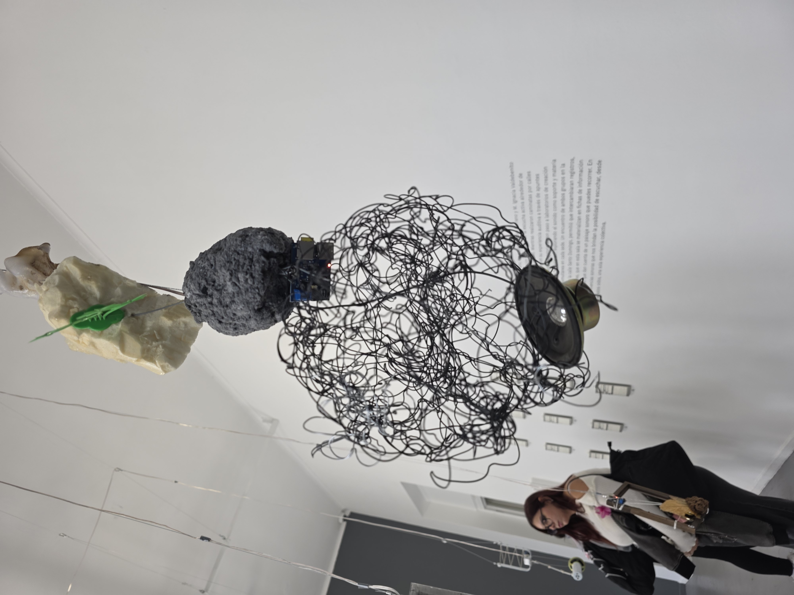 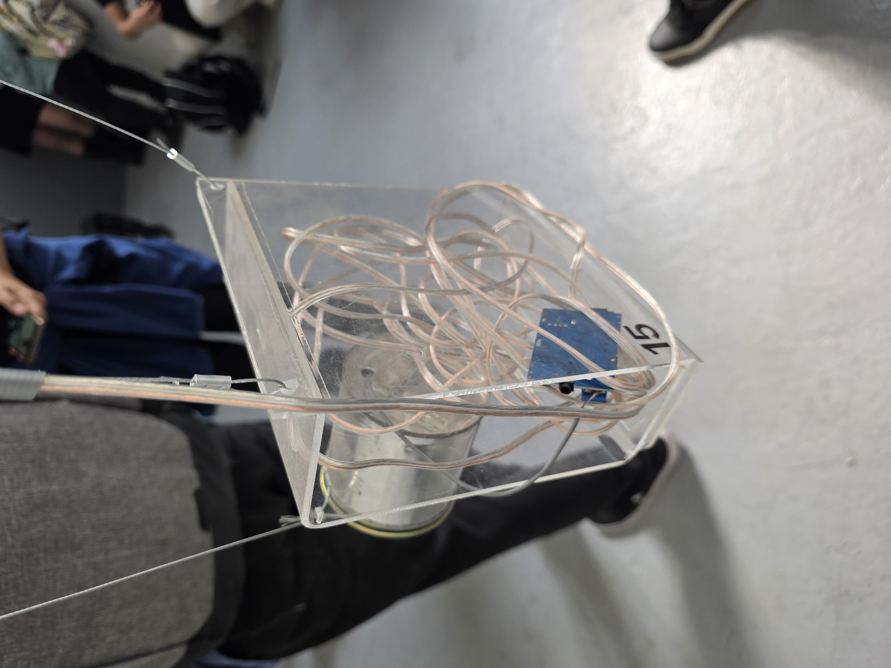
>  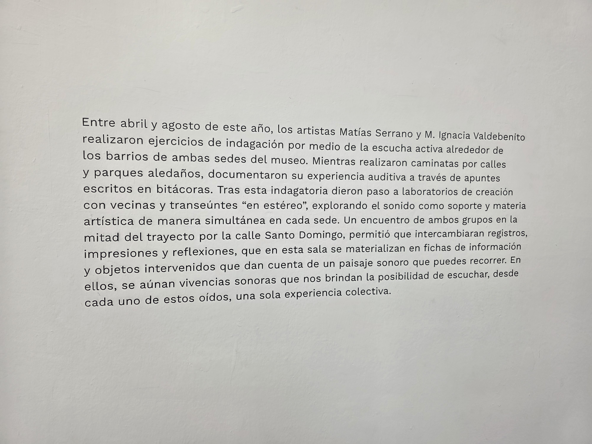 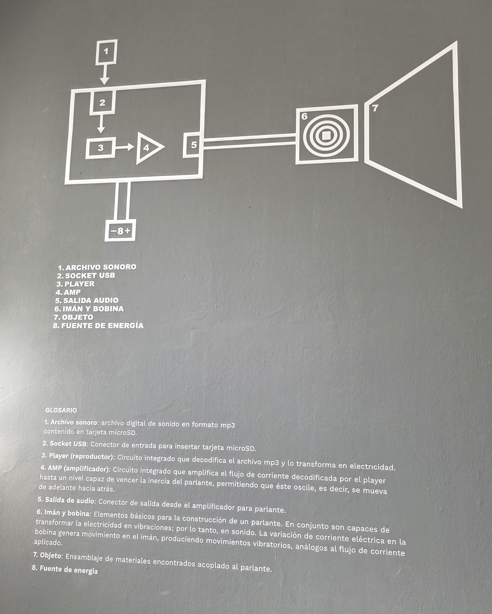 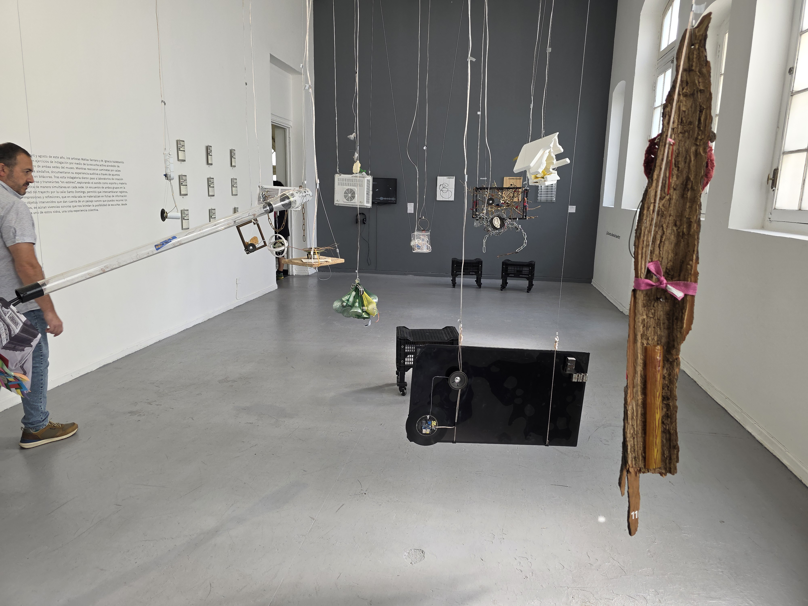
> 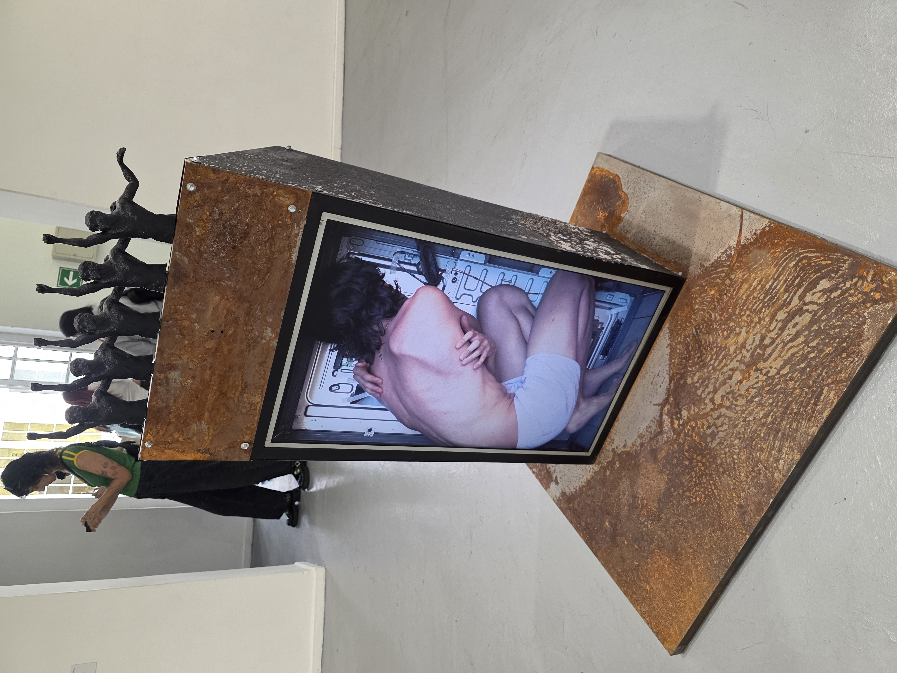   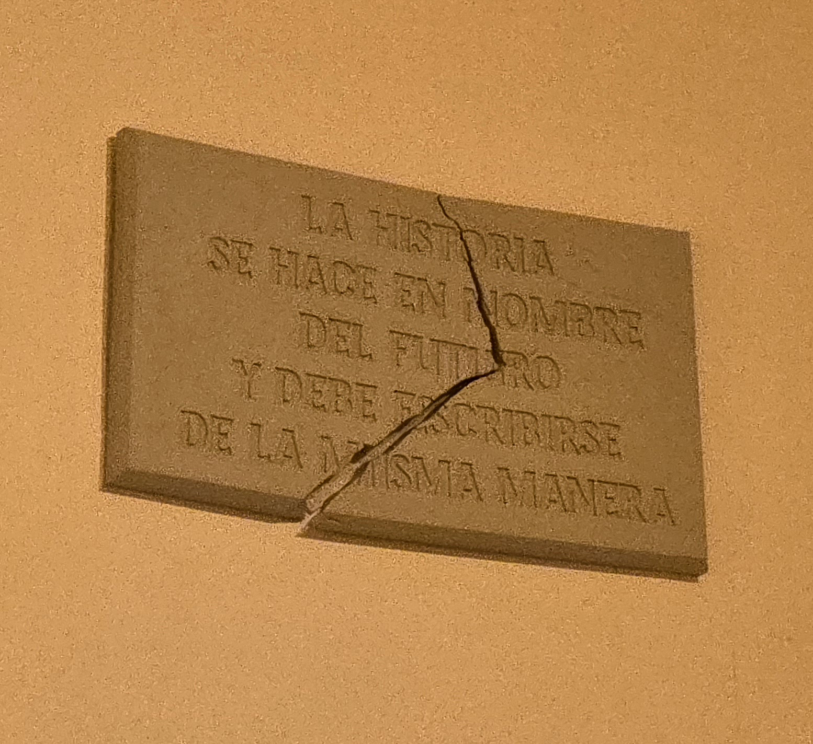
> 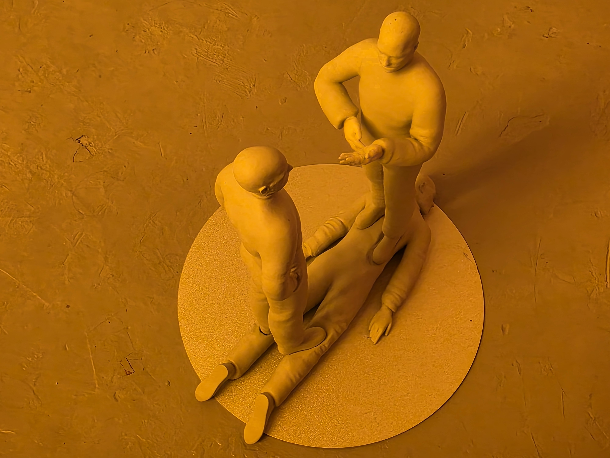 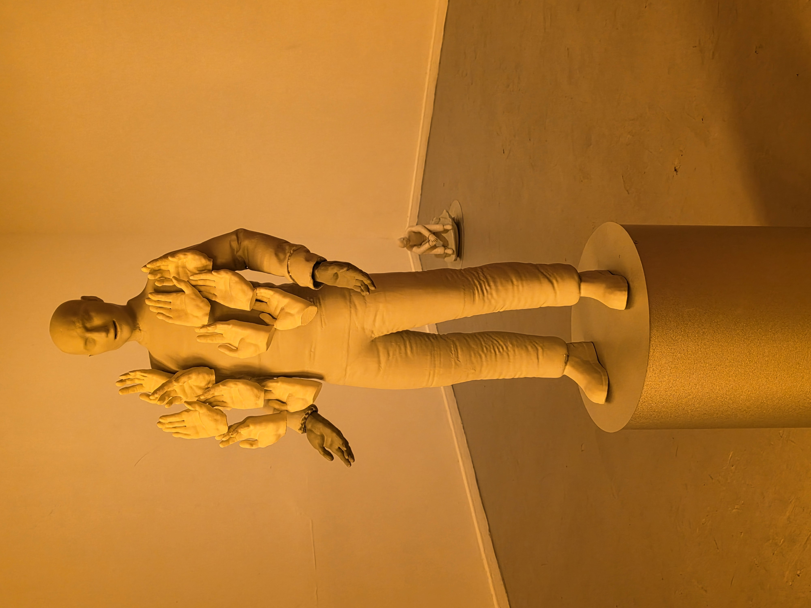 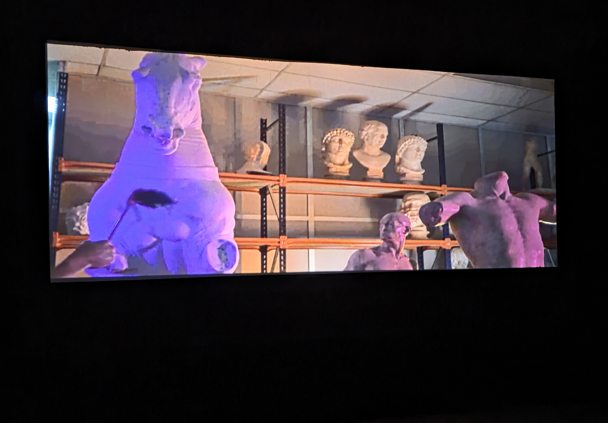
