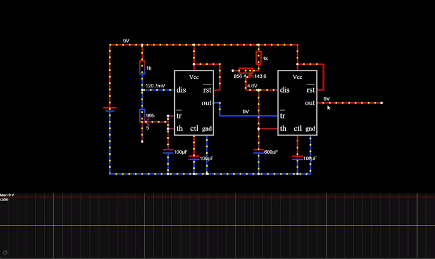
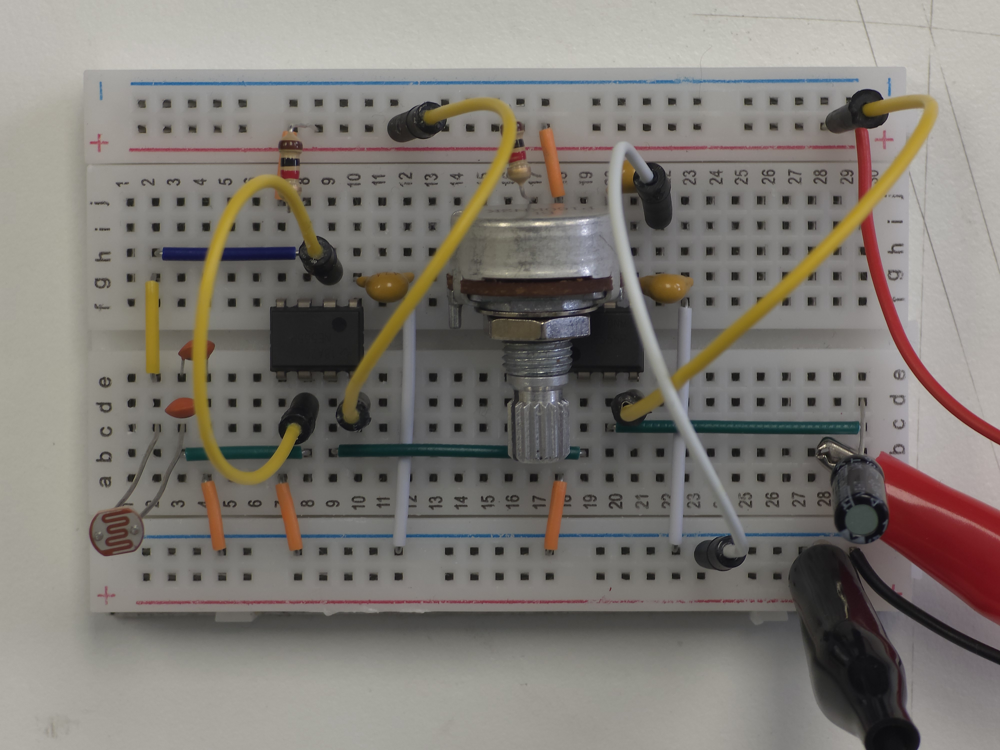

# sesion-04a

## Apuntes
>
> ### [Zack Lieberman](https://www.media.mit.edu/people/zachl/overview/)
>>
>> Profesor, investigador y artista del **MIT**  ${\color{#3d3d44}(Massachusetts \space Institute \space of \space Technology)}$
>> Co-creador de *"[openFrameworks](https://openframeworks.cc/)"*, un toolkit open source para hacer "código creativo" basado en el lenguaje C++. Y cofundador de *"[School for Poetic Computation](https://sfpc.io/)"*, una escuela donde estudian como interconectar código, diseño, *hardware* y la teoría, con el propósito de realizar intervenciones artísticas.
>
> ### [Atari punk console](https://youtu.be/uBJKCRK7hd0?si=q8Cx4-g8A45gtgCR)
>>
>> Circuito que emplea ${\color{white}2x \space "555 \space Timer"}$ para hacer sonidos ([1 bit music](https://youtu.be/UhwV4-jEz2U?si=hwOg4v35xgO0x5zt)) [ ${\color{white}on/off}$ ]
>>
>> ### Especulación de su funcionamiento
>>
>> ${\color{White}Timer}$${\color{White}1}$ (izq) opera en modo ${\color{#b0e6e6}astable}$ y ${\color{White}timer}$${\color{White}2}$ (der) en modo ${\color{#b0e6e6}monostable}$
>>
>> El ${\color{White}timer}$${\color{White}1}$ controla cuan rápido comienza a descargarse el ${\color{#6462fe}capacitor \space (pin7)}$ del ${\color{White}timer}$${\color{White}2}$, ya que este puede empezar a descargarse desde el momento que tiene ${\color{Red}6V}$, por lo que el ${\color{White}timer}$${\color{White}1}$, a una frecuencia más alta hace que ${\color{White}timer}$${\color{White}2}$ se active cuan pronto su ${\color{#6462fe}capacitor \space (pin7)}$ alcance ${\color{Red}6V}$, por lo que se descarga (cambia de estado ${\color{#b0e6e6}[high/low]}$) más seguido y tiene menos energia que liberar.
>>
>> Y mientras menor la frecuencia de ${\color{White}timer}$${\color{White}1}$, mayor el tiempo entre pulsos que recive ${\color{White}timer}$${\color{White}2}$ para cambiar de estado ${\color{#b0e6e6}[high/low]}$, por lo que el ${\color{#6462fe}capacitor \space (pin7)}$  tiene más tiempo para cargarse, lo que ocasiona que el ${\color{White}timer}$${\color{White}2}$ se mantenga accionado por más tiempo antes de volver a su  ${\color{#b0e6e6}estado \space estable}$.
>>
>> No hay una sola forma correcta de elaborar este circuito, es altamente ${\color{white}modificable}$ y ${\color{white}escalable}$.

> ### Other things
>>
>> ${\color{white}Modulación}$ = variación de un valor (ej: ${\color{#ffe4a8}resistencia}$ variable)  ${\color{#3d3d44}(similar \space a}$ aceleración ${\color{#3d3d44}= \space variación \space de \space velocidad)}$
>>
>> [555 timer circuits.com](https://www.555-timer-circuits.com/) circuitos + errores comúnes + calculadora (frecuencia)

:warning: Si ${\color{#ffe4a8}R1}$ < 1kΩ y ${\color{red}VCC \space = \space 9V}$, se puede ${\color{white}quemar}$ el 555 timer :warning:

### 1-Bit Symphony
>
> Al escuchar el disco por primera vez, me llamó la atención lo complejas que eran las melodías que producia el aparato, pues los sonidos de 1 bit que nosotros mismos habiamos producido en clases, a pesar de poder variar en frecuencia, eran muy similares en cuanto a un ruido persistente se refiere.
>
> No me esperaba que con semejantes limitaciones tecnológicas, de igual manera se pudiesen componer piezas tan complejas y variadas.
> Escuchando a **Perich** hablar sobre el concepto que un album fuese más que una grabación en un CD ${\color{#3d3d44}(Compact \space Disc)}$ y que al escuchar el album, uno esté experimentando la composición del mismo.
>
> Sin embargo, por más interesante que suene la idea, no considero que la ejecución cumpla con su objetivo, pues el código que hace que el parlante emita la música está pre-grabado en el microprocesador, de manera similar en que la información grabada en un disco, un vinilo, una memoria flash o un caset es luego utilizada por un aparato reproductor para emitirla.
>
