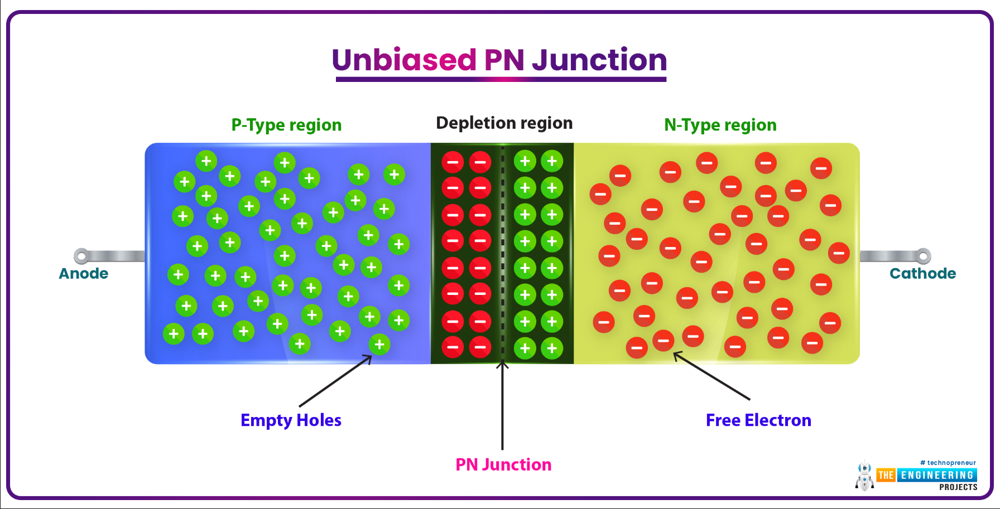
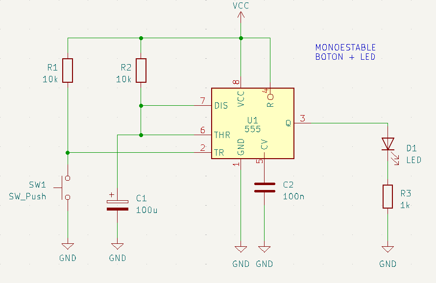
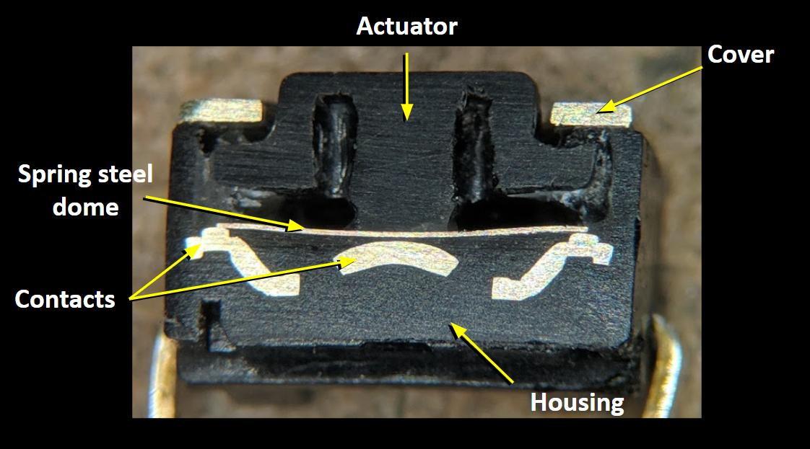
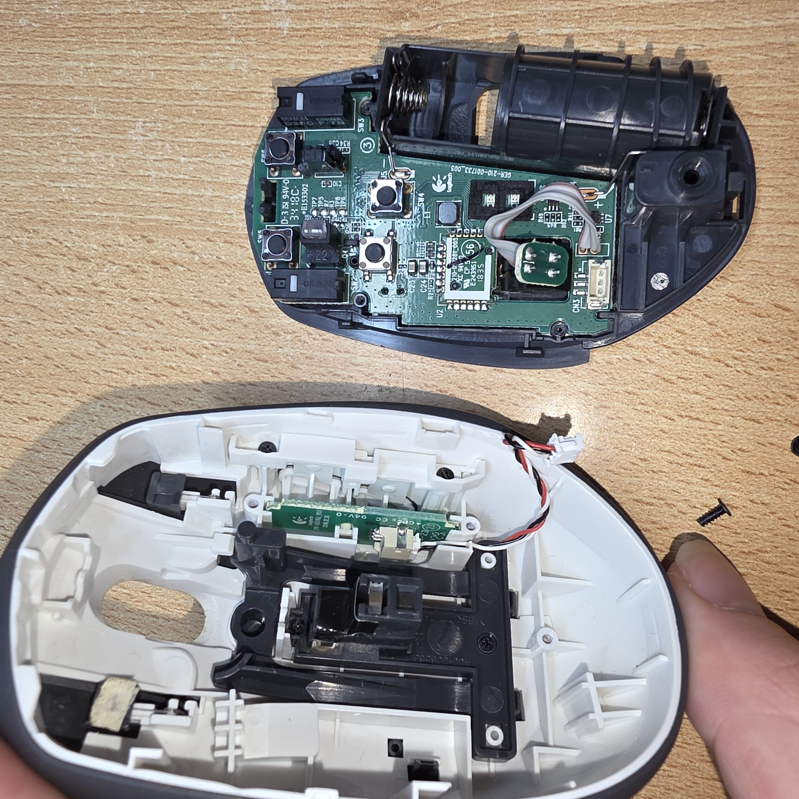
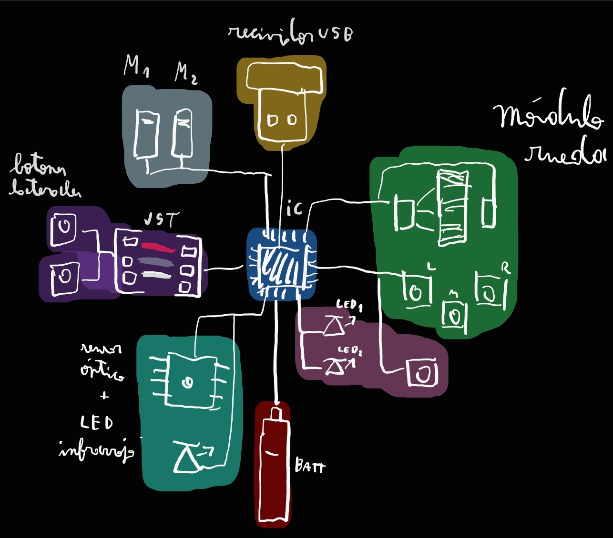

# sesion-04b

## Apuntes

### Semiconductores

Son elementos que conducen electricidad ${\color{#b0e6e6}a \space veces}$. Hechos en base a silicio, se puede controlar bajo que condiciones ${\color{#b0e6e6}permiten}$ que fluya corriente, dependiendo de las impuridades que se le añadan al silicio durante su manufactura

Algunos de los semiconductores más conocidos son [Diodos](https://youtu.be/Fwj_d3uO5g8?si=eLHL5z7lVKGsZLGO) y [Transistores](https://youtu.be/OwS9aTE2Go4?si=8A0mQECx-MySfj-R)  

El silicio o silicona también es empleado en la [manufactura](https://youtu.be/g8Qav3vIv9s?si=SgyKNQiU5Iu0JIH8) de [Circuitos integrados](https://youtu.be/dX9CGRZwD-w?si=RD4EN_lyvIlrVc-l)

### [Pulse Width Modulation1](https://youtu.be/aeE0u1J-1pg?si=EWB5LtXMR-1_rJlJ) [(PWM2)](https://youtu.be/B_Ysdv1xRbA?si=gfMATx2EDeaGAVc6)

Es una ${\color{#b0e6e6}onda}$ (corriente) que consiste de ${\color{white}Low(s)}$ y ${\color{red}High(s)}$, se emplea para ${\color{#b0e6e6}controlar}$ ciertos componentes electrónicos (o aspectos de ellos), como ${\color{#b0e6e6}motores}$ (rpm), ${\color{lightgreen}LEDs}$ (luminosidad variable), ${\color{#b0e6e6}"heating \space elements"}$, y los sonidos que emitía el ${\color{#b0e6e6}parlante}$ en los circuitos con el  ${\color{white}555 \space timer}$.

### [555 Monoestable](https://youtu.be/ckTlx-Q-RNk?si=PRbHdi_ONOloSaGT)

Circuito que es ${\color{#b0e6e6}estable}$ en uno de sus estados, es decir que tras hacer que cambie de estado ${\color{white}[High/Low]}$ el circuito ${\color{#b0e6e6}volverá}$ por si solo al estado predeterminado (${\color{#b0e6e6}estable}$).   Con esta configuración del 555 podemos controlar la ${\color{#b0e6e6}duración \ del \ período \ de}$ ${\color{#b0e6e6}tiempo}$ que transcurre antes de regresar al estado estable, variando la capacitancia del ${\color{#6462fe}capacitor}$.   Para más información ir a ["Sesion-03a"/Encargo-07 (sección con imagenes alineadas a la derecha)](https://github.com/disenoUDP/dis8644-2025-1/tree/main/25-FranUDP/sesion-03a)

Al presionar el ${\color{#b0e6e6}"Push \ button \ switch"}$ se ${\color{white}cierra}$ el circuito, cambiando de estado ${\color{White}[High/Low]}$ el 555 timer.

### Other things

### Interfase

**"Conexión o frontera común entre dos aparatos o sistemas independientes"**, es decir el medio a travez del cual interactuan 2 o más elementos distintos, puede ser un usuario y una maquina, una mmaquina con otra maquina, etc.

### [Human Computer Interfase (HCI)](https://youtu.be/yNzLBI0wsGU?si=9lidxNN8wXQHMg5Y)

Como el usuario interactua con la tecnología (ej: [VirtualRealityUI](https://youtu.be/Fhlw88_Beu4?si=kz6jP0oUvXSCtUGA))

### Push button (switch)

Es un interruptor que de por sí, se mantiene abierto (Normally Open [N.O]), hasta que uno lo acciona y cierra el circuito, sim embargo, tras soltar el switch, este volverá inmediatamente a abrir el circuito.  

Las "patas" que están alineados son parte del mismo pin (conectados), mientras que las patas paralelas son los distintos pines del switch

## Encargo 11

### Switched on bach

suena como los sonidos electrónicos (sintetizador) que tienen los teclados (instrumento) eléctricos que nos hacían tocar en el colegio y similar al soundtrack de los juegos de la gameboy advanced, en lugar de emitir los sonidos más "duros" de otros instrumentos y artistas que hemos escuchado en los encargos pasados. se nota la influencia de la música clásica, al ser una melodía calmada.

Escuchando entrevistas, encontré curioso que seleccionara la música de Bach por ser simple (no tocaba multiples notas al mismo tiempo), lo cual eliminaba una de las limitaciones del sintetizador moog, que solo podía tocar una nota a la vez.

-----------------------------------------------------------------------------------------------------------

## Encargo 12

### Análisis objeto electrónico

* Objeto:  Logitech M585 Wireless Mouse.

### Uso

* Se conecta a un dispositivo enchufando el recividor USB o mediante bluetooth.
* Se desplaza por una superficie plana para desplazar el cursor en el dispositivo conectado
* Se presionan los botones para producir imputs en el dispositivo conectado
* Si se está conectado por bluetooth a un dispositivo y el recividor conectado a otro, apretando el botón detrás de la rueda, se cambia cual dispositivo está siendo controlado

### Indicación uso

* El switch de encendido y apagado cambia de color (verde [encendido]/rojo [apagado])
* Se enciende una de las 2 LEDs para indicar a que dispositivo está conectado
* Las funciones de los botones M1, M2, rueda y botones laterales se pueden deducir al apretarlos y ver que pasa
* La función de los botones laterales de la rueda me es desconocida, nunca logré que hicieran algo

### Usuario

Alguien que usa más de un dispositivo al mismo tiempo

### Interacción

El mouse cuenta con 8 botones y una rueda, los botones son táctiles, pero la rueda no es muy precisa ni tiene buen feedback, el feedback de los botones laterales de la rueda se confunde con el botón de la rueda

### Grados de control

Permite hacer scroll, rehacer, deshacer, mover cursor en plano 2D, cambiar dispositivo activo, botones laterales a la rueda no sé

El mouse NO permite controlar desplazamiento en espacio 3D, rotar o angular el mouse, no se puede usar con cable, no registra imput si se mueve muy rápido y no es ambidiestro

### Energía

Utiliza una pila AA, cuando se le acaba la bateria hay que cambiar la pila o no se puede usar

### PCBs

El mouse consiste de 2 PCBs, una placa principal donde está el microprocesador (n51802), sensor óptico, switches, LEDs, resistencias, etc. Y una Placa secundaria donde están los switches de los botones laterales, que está conectada a la placa principal mediante un cable conectado a conectores JST  

En las placas hay numeros, letras y nombres que indican donde van los componentes, Textos indicando lugar y fecha de manufactura, terminal Vcc y GND y logos  

### Diagrama de flujo

