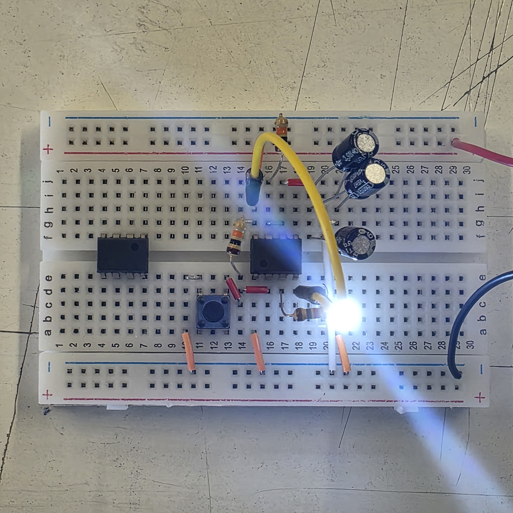

# sesion-04b

## Apuntes
>
> ### Semiconductores  
> Son elementos que conducen electricidad ${\color{#b0e6e6}a \space veces}$. Hechos en base a silicio, se puede controlar bajo que condiciones ${\color{#b0e6e6}permiten}$ que fluya corriente, dependiendo de las impuridades que se le añadan al silicio durante su manufactura   
>     
> Algunos de los semiconductores más conocidos son [Diodos](https://youtu.be/Fwj_d3uO5g8?si=eLHL5z7lVKGsZLGO) y [Transistores](https://youtu.be/OwS9aTE2Go4?si=8A0mQECx-MySfj-R)   
>  
> El silicio o silicona también es empleado en la [manufactura](https://youtu.be/g8Qav3vIv9s?si=SgyKNQiU5Iu0JIH8) de [Circuitos integrados](https://youtu.be/dX9CGRZwD-w?si=RD4EN_lyvIlrVc-l)  
>  
>  
> ### [Pulse Width Modulation1](https://youtu.be/aeE0u1J-1pg?si=EWB5LtXMR-1_rJlJ) [(PWM2)](https://youtu.be/B_Ysdv1xRbA?si=gfMATx2EDeaGAVc6)
>    Es una ${\color{#b0e6e6}onda}$ (corriente) que consiste de ${\color{white}Low(s)}$ y ${\color{red}High(s)}$, se emplea para ${\color{#b0e6e6}controlar}$ ciertos componentes electrónicos (o aspectos de ellos), como ${\color{#b0e6e6}motores}$ (rpm), ${\color{lightgreen}LEDs}$ (luminosidad variable), ${\color{#b0e6e6}"heating \space elements"}$, y los sonidos que emitía el ${\color{#b0e6e6}parlante}$ en los circuitos con el  ${\color{white}555 \space timer}$.
>  
>  
>  
>  
> ### [555 Monoestable](https://youtu.be/ckTlx-Q-RNk?si=PRbHdi_ONOloSaGT)  
>    Circuito que es ${\color{#b0e6e6}estable}$ en uno de sus estados, es decir que tras hacer que cambie de estado ${\color{white}[High/Low]}$ el circuito ${\color{#b0e6e6}volverá}$ por si solo al estado predeterminado (${\color{#b0e6e6}estable}$).     Con esta configuración del 555 podemos controlar la ${\color{#b0e6e6}duración \ del \ período \ de}$ ${\color{#b0e6e6}tiempo}$ que transcurre antes de regresar al estado estable, variando la capacitancia del ${\color{#6462fe}capacitor}$.     Para más información ir a ["Sesion-03a"/Encargo-07 (sección con imagenes alineadas a la derecha)](https://github.com/disenoUDP/dis8644-2025-1/tree/main/25-FranUDP/sesion-03a)
>                        Al presionar el ${\color{#b0e6e6}"Push \ button \ switch"}$ se ${\color{white}cierra}$ el circuito, cambiando de estado ${\color{White}[High/Low]}$ el 555 timer.  
>  
>  
>  
>  
>  
>  
>  
>  
>  
>
> ### Other things
>> ### Interfase
>> **"Conexión o frontera común entre dos aparatos o sistemas independientes"**, es decir el medio a travez del cual interactuan 2 o más elementos distintos, puede ser un usuario y una maquina, una mmaquina con otra maquina, etc. 
>>
>> ### [Human Computer Interfase (HCI)](https://youtu.be/yNzLBI0wsGU?si=9lidxNN8wXQHMg5Y)
>> Como el usuario interactua con la tecnología (ej: [VirtualRealityUI](https://youtu.be/Fhlw88_Beu4?si=kz6jP0oUvXSCtUGA))
>>
>> ### Push button (switch)
>>  
>>             Es un interruptor que de por sí, se mantiene abierto (Normally Open [N.O]), hasta que uno lo acciona y cierra el circuito, sim embargo, tras soltar el switch, este volverá inmediatamente a abrir el circuito.     
>>  
>> Las "patas" que están alineados son parte del mismo pin (conectados), mientras que las patas paralelas son los distintos pines del switch
>>                  
>  
-----------------------------------------------------------------------------------------------------------
## Encargo 11
### TITULO
> suena como los sonidos electrónicos (sintetizador) que tienen los teclados (instrumento) eléctricos que nos hacian tocar en el colegio y similar al soundtrack de los juegos de la gameboy advanced, en lugar de emitir los sonidos más "duros" de otros instrumentos y artistas que hemos escuchado en los encargos pasados. se nota la influencia de la música clásica, al ser una melodía calmada.
>
> Escuchando entrevistas, encontré curioso que seleccionara la música de Bach por ser simple (no tocaba multiples notas al mismo tiempo), lo cual eliminaba una de las limitaciones del sintetizador moog, que solo podía tocar una nota a la vez.
>
> 
<!--escuchar switched on bach (wendy carlos)-->
-----------------------------------------------------------------------------------------------------------
## Encargo 12
### TITULO
>
> 
