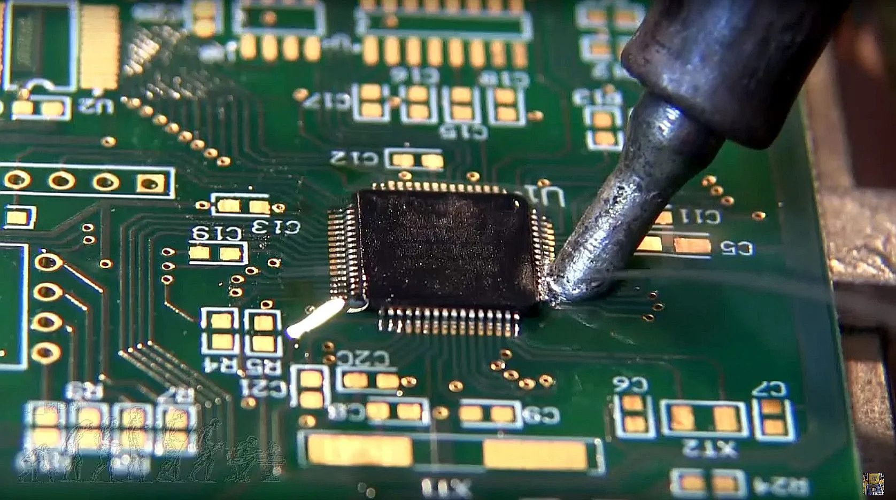
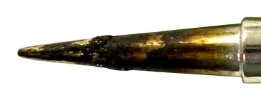
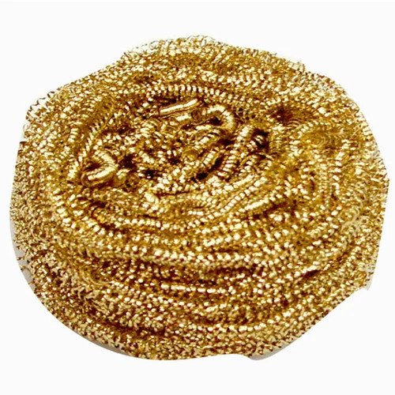
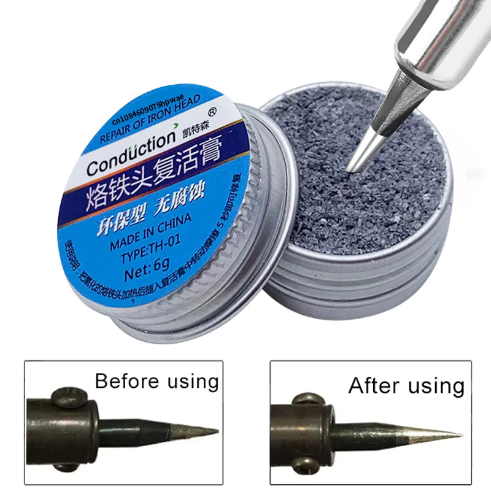

# sesion-05b

## Apuntes
>
> ### Forrest Mims
>
>        Creador del ${\color{#b0e6e6}Atari \ Punk \ Console}$    
> Ingeniero *"amateur"*, no tuvo una educación formal en ciencias (*self taught*)    
> Reconocido por su serie de libros electrónicos hechos a mano, como el [*"Engineers Notebook"*](https://github.com/alaricmoore/MiniEngineeringNotebooks/blob/main/The%20Forrest%20Mims%20Engineers%20Notebook.pdf)
>          
>
> ### ¿Para que soldar?
>
>    Soldar nos permite ${\color{#b0e6e6}unir}$ los componentes que conforman un circuito sin tener que emplear conexiones mecánicas complejas y de gran tamaño (JST, Pernos, etc)          
>
>
> ### Tipos de componentes
>>
>> ### Through-hole
>>
>>    Son componentes con alambres como patas/terminales (los mismos que se usan en la breadboard), estas ${\color{#b0e6e6}patas \ se \ meten \ a \ través \ de \ agujeros}$ en una PCB o Perfboard y se sueldan
>>        
>>
>> ### SMD (Surface Mount Devices)
>>
>>      Se diferencian de los anteriores por su tamaño más ${\color{#b0e6e6}compacto}$ y que en lugar de atravesar la placa, van ${\color{#b0e6e6}adheridos \ en \ la \ superficie}$ de esta, lo que permite poner componentes en ambos lados de la PCB, contribuyendo a un circuito más ${\color{#b0e6e6}compacto}$.
>>          
>
> ### Cómo soldar
>>
>> ### [Through hole](https://youtu.be/3jAw41LRBxU?si=_cKxKc2zExNf6gPp)  
>>
>>      The iron ${\color{#b0e6e6}heats \ up \ both \ surfaces}$ we want to ${\color{#b0e6e6}join}$ for a second or two, then we add the ${\color{#b0e6e6}solder \ wire}$, after it melts we remove it and wait a couple seconds before removing the iron        
>>
>> ### [SMD](https://youtu.be/fYInlAmPnGo?si=X_h2LHiLMA25unwe)   <!-- no se mencionó en clase, pero lo añado igual -->
>>
>>      There's various methods for soldering this type of components, from the humble soldering iron (variable temperature model), a hot air gun (fine tip and variable temperature) to a more fancy [solder reflow](https://youtu.be/DYrucIWig24?si=Y5CHW0jy0_b62-el) oven/plate (or a [DIY reflow "iron"](https://youtu.be/C7blZigaaaA?si=EtifpZyFZAmeQf4f))        
>>
> ### [Mantenimiento](https://youtu.be/Pn6ZESPgxpQ?si=k4FLOCinJwCzV0uI) <!-- no se mencionó en clase, pero lo añado igual -->
>
> Para garantizar una buena soldadura, hay que tener el cautín (soldering iron) en buen estado. Aquí hay algunos tips:  
>
> 1.-  Es importante prevenir la ${\color{#b0e6e6}oxidación}$ de las puntas del cautín, pues si se oxidan el ${\color{#b0e6e6}estaño}$   &nbsp;&nbsp;&nbsp;&nbsp; ${\color{#b0e6e6}no \ se \ adherirá}$ a estas.   &nbsp;&nbsp;&nbsp;&nbsp;&nbsp;Para prevenir la oxidación hay que ${\color{#b0e6e6}dejar \ estaño \ en \ la \ punta}$ tras dejar de usar el cautín, ya   &nbsp;&nbsp;&nbsp;&nbsp;&nbsp;que este evitará que haya contacto entre la punta y el oxigeno mientras no la usamos.      
>
> 2.- Si se va a ${\color{#b0e6e6}limpiar}$ la punta usar una ${\color{#b0e6e6}esponja \ húmeda}$ o la ${\color{#b0e6e6}virutilla \ de \ latón \ (brass)}$    
 &nbsp;&nbsp;&nbsp; :warning: <strong>Nunca usar virutilla de acero o papel lija para quitar la oxidación, ya que se dañará la punta</strong> :warning: 
    
>
>
> 3.- Cada 2 o 3 soldaduras limpiar la punta (paso 2), ya que el estaño al ${\color{#b0e6e6}permanecer \ caliente}$ mucho tiempo ${\color{#b0e6e6}pierde \ sus \ propiedades}$ y se   &nbsp;&nbsp;&nbsp;&nbsp;&nbsp;hace más difícil de utilizar    
>
> 4.- ${\color{#b0e6e6}Nunca}$ mantener el cautín caliente por más tiempo del necesario, ya que al estar ${\color{#b0e6e6}caliente}$ se ${\color{#b0e6e6}oxida \ más \ rápido}$    
>
> 5.-  En caso que la punta ${\color{#b0e6e6}presente \ oxidación}$, usar ${\color{#b0e6e6}"tip \ tinner/tip \ activator"}$ para quitar la oxidación y   &nbsp;&nbsp;&nbsp;&nbsp;&nbsp;hacer el paso 2 más fácil                
>
> 6.-  Tras usar ${\color{#b0e6e6}"Flux"}$, limpiar componentes electrónicos con ${\color{#b0e6e6}alcohol \ isopropílico}$ para   &nbsp;&nbsp;&nbsp;&nbsp;&nbsp;prevenir  ${\color{#b0e6e6}corrosión}$            
>
> ### Other things
>
>> ### Switches
>>>
>>> ### PS-535
>>>
>>>   Es un Push button switch ${\color{#b0e6e6}Normally \ Open \ (NO)}$   Algo curioso de este interruptor es que los signos ${\color{red}+ \ (derecha)}$ y ${\color{white}- \ (izquierda)}$ ${\color{#b0e6e6}señalizan \ incorrectamente}$ cuales son las ${\color{#b0e6e6}terminales}$ del botón, ya que tras testearlo con el multímetro encontré que las ${\color{#b0e6e6}terminales}$ son los pines de ${\color{#b0e6e6}arriba}$ y ${\color{#b0e6e6}abajo}$ (destacados en azul)        
>>>
>>> ### 7mm Push button NO
>>>
>>>   Interruptor ${\color{#b0e6e6}NO}$ que cuenta con un ${\color{#b0e6e6}hilo \ (rosca)}$ para ${\color{#b0e6e6}fijarlo}$ al ${\color{#b0e6e6}"enclosure/case"}$ con una tuerca.   En sus ${\color{#b0e6e6}patas}$ tiene ${\color{#b0e6e6}agujeros}$ para pasar un cable por allí antes de soldarlo ${\color{#3d3d44}(same \ as \ with \ through \ hole \ components)}$         
>>
>> ### Base dip (IC Socket)
>>
>>      Se usan para ${\color{#b0e6e6}evitar \ freír}$ los ${\color{#b0e6e6}ICs}$ con el ${\color{#b0e6e6}calor \ del \ cautín}$ ${\color{#3d3d44}(sin \ temperatura \ regulable)}$   Además de permitir ${\color{#b0e6e6}cambiar}$ o ${\color{#b0e6e6}reutilizar}$ el IC ${\color{#b0e6e6}sin}$ tener que ${\color{#b0e6e6}desoldarlo}$     
>>
>> ### [Cable AWG-26 (American Wire Gauge 26)](https://www.tarluz.com/es/copper-network/which-utp-cable-wire-gauge-should-i-choose-awg24-awg26-or-awg28/)
>>
>>       Es un ${\color{#b0e6e6}cable}$ barato y de diámetro pequeño, ideal para circuitos con poca corriente        
>>
>> ### Estaño 60/40
>>
>>     Es un alambre de estaño compuesto por ${\color{#b0e6e6}60}$ % ${\color{#b0e6e6}estaño \ ("tin")}$ y ${\color{#b0e6e6}40}$ % ${\color{#b0e6e6}plomo \ ("lead")}$, se suele ${\color{#b0e6e6}derretir \ a \ 370°C}$.    Mientras ${\color{#b0e6e6}más \ alto \ el \ contenido \ de \ plomo \ a \ menor \ temperatura \ se \ derretirá}$, por lo que es importante considerar que tipos de componentes y cuan sensibles son al calor (y la salud propia también) al decidir cual estaño se va a utilizar     
>>
>> ### [Distintas puntas del cautín](https://youtu.be/_HmSQiVhQag?si=x4oVYdoZ7U9L0nP-) <!-- no se mencionó en clase, pero lo añado igual -->
>>
>>  ${\color{white}Cónicas:}$ De propósito general y para detalles precisos (dependiendo del tamaño)    ${\color{white}Cuchillo:}$ Se usa para esparcir y quitar estaño    ${\color{white}Cincel:}$ Permite calentar un área más grande que la cónica    ${\color{white}Angulada \ (plana):}$ Permite calentar una gran área y esparcir más estaño    ${\color{white}Angulada \ (cavidad):}$ Igual que la anterior, pero puede acumular más estaño   
>>
>  
