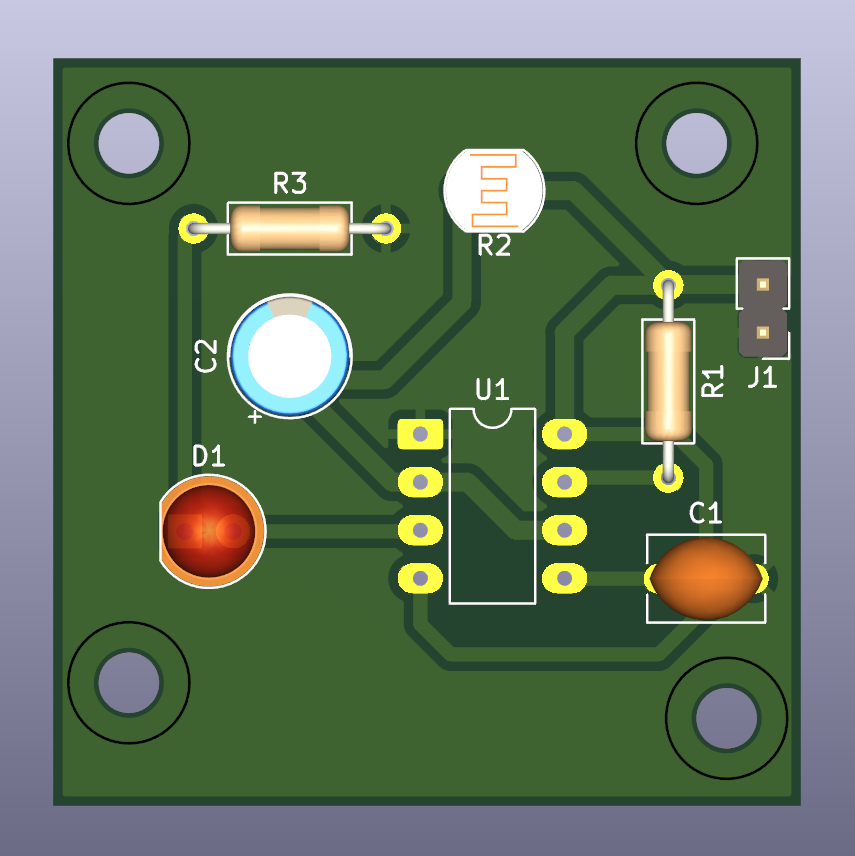

# sesion-06b
>
## Encargo 12

### Kicad
>
> Instalé kicad 9.0, descargando el instalador para windows desde la [pagina web de kicad](https://www.kicad.org/) y luego siguiendo los pasos de instalación como es usual, con la exepción de la ubicación de instalación, ya que decidí instalar el programa en la carpeta "documentos" en lugar de "archivos de programa(x86)", porque tiene un icono visualmente distinto y está casi vacía, a diferencia de la otra carpeta, lo cual debería hacer que mover archivos de aquí y allá sea menos tedioso   
> Luego de haberlo iniciado por primera vez, fui a preferencias y cambié el idioma de español a inglés, para evitar tener una interfase con idiomas mezclados (algunas cosas en inglés y otras en español), posibles problemas de traducción (que el nombre de un elemento no calce con el nombre en español) y comodidad (al no tener que traducir la información que busco y encuentro en inglés, al español)   
> También, tras notar que se pueden instalar [plugins](https://youtu.be/LB4SqPW2E0c?si=hg1W7cy8FF33NNm1), busqué información hacerca de los más populares, que hacen y si me podrían ser de utilidad, antes de instalarlos (instalé Interactive Html Bom, Board2Pdf, Transform It, gerber to order y Solarized Dark Theme (not a plugin, but a color theme)   
> Y para comenzar a familiarizarme con el software, seguí el tutorial de misaaa ("Manual de supervivencia de kicad")   
>                                               
-----------------------------------------------------------------------------------------------------------

## Encargo 13

### [Sisters with transistors](https://archive.org/details/sisters_with_transistors)
>
> :warning: <strong>Disclaimer:</strong> considerando que este github está abierto a todo público, no estoy justificando o dando juicio de valor alguno sobre las prácticas mencionadas  :warning:   
> Me llama la atención lo que se menciona en el documental, acerca de las mujeres encontrando resistencia en el ámbito de composición musical.   Ya que observando esta situación con mi usual enfoque pragmático, comprendo que la mujer haya sido excluida de la fuerza laboral, al ser esta actividad usualmente riesgosa para la salud (y la vida en algunas circunstancias), lo cual sumado al mayor "valor reproductivo" nos deja con ellas en la casa cuidando niños (misma razón detrás del "mujeres y niños primero" en evacuaciones). Comprendo que hayan sido excluidas del mundo científico debido al pensamiento emocional (aunque estudios hayan demostrado que en cuanto a efectividad intelectual no hay diferencia alguna entre hombres y mujeres).    Sin embargo teniendo estos antecedentes, no logro comprender su exclusión en cuanto a composición musical, ya que componer es exponencialmente más seguro que el trabajo manual de la época (es posible que sea por el riesgo de manipular elementos eléctricos, sin embargo en el documental se menciona "composición musical" como un todo), la música de por sí se enfoca en transmitir emociones, sentimientos y demás, por lo que lógicamente una mujer compositora debiese haber sido considerado como "ideal" en la época.   Voy a tener que investigar al respecto, pues dudo que la exclusión del 50% de la población del ámbito de composición musical haya sido por mero capricho, especialmente considerando que por años este 50% de la población no se haya molestado en oponerse a esta prohibición.
>   
>
> #### Delia Derbyshire  
>
> decidí escuchar un albun de ella, por su historia trabajando en la serie clásica de Doctor Who ${\color{#3d3d44}(aprendí \ inglés \ viendo \ la \ serie \ moderna}$ ${\color{#3d3d44}2005-2022)}$   
> Escuché el álbum "kpm 1000 Series: Electronic" me llama la atención lo simple de sus composiciones, en el sentido de que no hay muchas cosas pasando al mismo tiempo, usualmente hay un tema sonando de fondo con otro aun poco más rápido siendo el foco, también como cada pieza se siente "alíen" no se si sea por el efecto como "eco" que tiene cada nota tocada.
