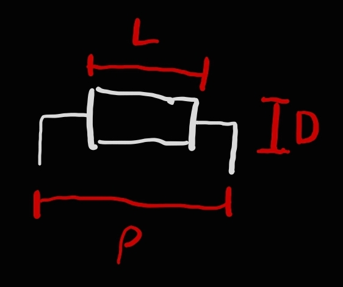
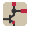
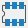
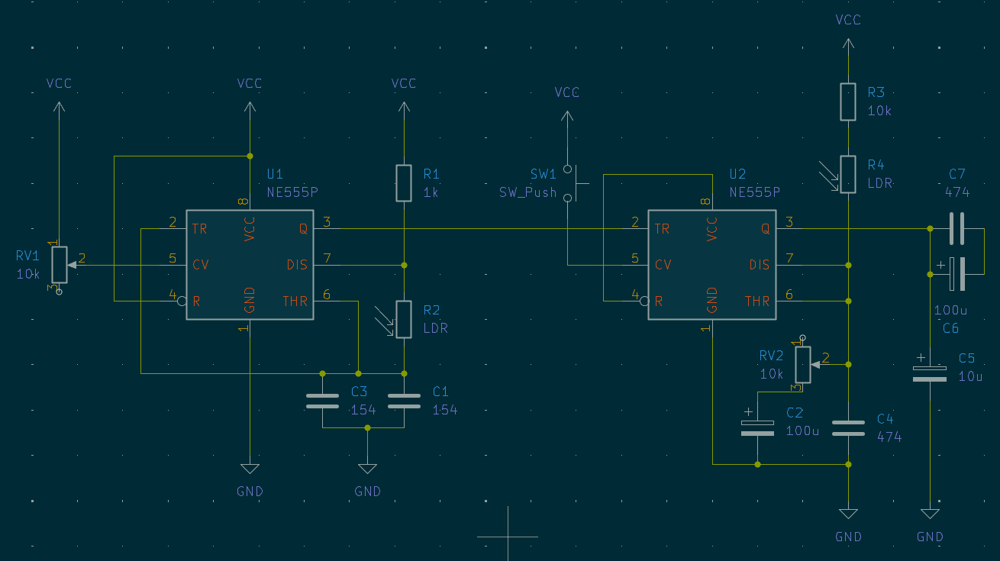

# sesion-07a

## Apuntes
>
> ### Componentes electrónicos
> Todos poseen 3 características:  
> * ${\color{#b0e6e6}Valor}$ (ej: 1k resistencia)   
> * ${\color{#b0e6e6}Símbolo}$: dibujo que representa un ${\color{#b0e6e6}componente}$ en el diagrama/esquema ej:               
> * ${\color{#b0e6e6}Rating}$: Cuanto ${\color{red}voltaje}$ y/o ${\color{#b0e6e6}corriente}$ soporta antes de quemarse o explotar  
>
> Aparte de las características ya mencionadas, otro detalle son las ${\color{#b0e6e6}dimensiones \ físicas}$ que ocupa cada componente (${\color{#b0e6e6}footprint}$)   
>    Length    Diameter/Width    Pitch (distancia entre las patas)   
>
> ### Kicad    
> Software suite (múltiples programas distintos en un mismo lugar)   
>> ### Esquema (sch)    
>> Se importan los ${\color{#b0e6e6}símbolos}$ de los componentes a utilizar y se definen las ${\color{#b0e6e6}conexiones}$ entre ellos, que luego serán utilizadas para guiar el diseño de la PCB.  
>> ### Shortcuts:  
>> | A |  Añadir simbolo     |
>> |:-:|:----------------|
>> | R | Rotar elemento |
>> | M | Mover elemento |
>> | G | Mover elemento + conexiones |
>> | Q | Pin sin conectar    |
>> | E | Ver info componente |
>> | V | Editar valor componente |
>> | X | Espejar simbolo y textos en el eje X |
>> | Y | Espejar simbolo y textos en el eje Y |
>> | W | Trazar cable    |
>> 
>> ### Generate Bill Of Materials    
>> Automaticamente exporta nuestro BOM en formato .cvs (editable en excel)  
>
> ### PCB Editor    
> Tras asignar la ${\color{#b0e6e6}footprint}$ de cada componente, estos se pueden comenzar a ${\color{#b0e6e6}organizar}$ en la placa PCB junto con sus ${\color{#b0e6e6}conexiones}$.    Para ${\color{#b0e6e6}actualizar}$ el editor PCB con los componentes y conexiones del editor esquemático apretar el ícono a la derecha   
> ### Shortcuts:  
> Algunos de los shortcuts anteriores ${\color{#b0e6e6}no \ funcionan}$ en el editor PCB
> | A |  Añadir simbolo     |
> |:-:|:----------------|
> | R | Rotar elemento |
> | M | Mover elemento |
> | G | Mover elemento + conexiones |
> | E | Ver info componente |
> | V | Rotar entre capa de cobre frontal y posterior y si se tiene seleccionado un cable, poner una via |
> | X | Trazar cable    |
> | W | Rotar entre grosores de trazos de cobre (cable) |
>
> Para ver la placa PCB en 3d presionar ${\color{#b0e6e6}"Alt \ + \ 3"}$ (windows)  
>> Componentes seleccionados en el editor PCB se verán ${\color{lightgreen}verdes}$ en el visor 3d  
>
> ### Other things
>
>> #### THT (Through Hole Technology)   
>> 
>> ### Package
>> ${\color{#b0e6e6}Dimensiones \ estándar}$ para componentes ej: DO 35 o 0805                    
>  
-----------------------------------------------------------------------------------------------------------
## Encargo 14
### Esquema Atari Punk en Kicad
>                         
>
-----------------------------------------------------------------------------------------------------------
## Encargo 15
### 2 dudas o aprendizajes
>> ### 1: ¿cómo podemos hacer una placa con más de 2 capas? [(Tutorial)](https://youtu.be/RlB2mzoIKbo?si=8R2g06NOSoa8hhVs) 
>> Haciendo click en ${\color{#b0e6e6}Board \ Setup}$  y luego seleccionando la cantidad de capas de cobre
>> 
>> ### 2: ¿Qué es "impedance"?  
>>  viendo varios tutoriales, algo que muchos mencionan es "impedance" y que los trazos de cobre tienen que tener un valor de 50Ω, por lo que logro entender parece ser algo para evitar que la señal electromagnética de cada trazo interfiera con la del que tiene al lado, aunque podría ser solo algo específico de diseños RF (RadioFrequency)
>  
