# sesion-07b

## Apuntes

### Instalación librería customizada

Tras ${\color{#b0e6e6}descargar}$ los símbolos y/o footprints que queremos añadir a Kicad, es ideal (aunque no necesario) ${\color{#b0e6e6}moverlos}$ a una ${\color{#b0e6e6}ubicación}$ adecuada (como la carpeta de instalación de Kicad) para evitar accidentalmente cambiarlos de dirección o eliminarlos.  

Luego hay que ir a ${\color{#b0e6e6}preferencias}$ y seleccionar ${\color{#b0e6e6}librería \ de \ símbolos}$

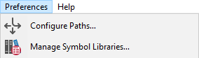

Una vez dentro de la ${\color{#b0e6e6}librería \ de \ símbolos}$, apretar el ${\color{#b0e6e6}icono \ de \ carpeta}$, buscar la ubicación del archivo o carpeta que se desea importar, seleccionarlo y darle ok.

### Kicad

### Circuitos paralelos

### Indicador de energía

Este circuito ${\color{#b0e6e6}enciende \ un \ LED}$ para indicar que el circuito (total) ${\color{#b0e6e6}tiene \ energía}$ y por lo tanto, tiene una fuente de poder conectada

### Circuito de protección

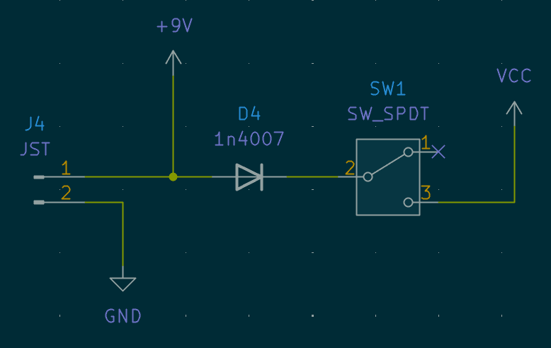

Este circuito se encarga de ${\color{#b0e6e6}prevenir}$ que explote el circuito (total) en caso de que ${\color{#b0e6e6}accidentalmente}$ se ${\color{#b0e6e6}conecten \ los \ cables \ al \ revéz}$, mediante la implementación de un diodo.  (en mi caso no es realmente necesario, pues decidí poner un conector JST para la batería)
>
> ### Gráficos

Nos enseñaron ${\color{#b0e6e6}2 \ métodos}$ para ${\color{#b0e6e6}añadir \ logos}$ y ${\color{#b0e6e6}gráficos}$ en la placa PCB:

${\color{white}Footprint}$:  Se añade la gráfica a la ${\color{#b0e6e6}librería \ de \ footprints}$ y luego se inserta en la placa

${\color{white}Importar \ gráficos}$:  Se importa un gráfico en formato ${\color{#b0e6e6}.xdf}$ o ${\color{#b0e6e6}.svg}$

### Capas

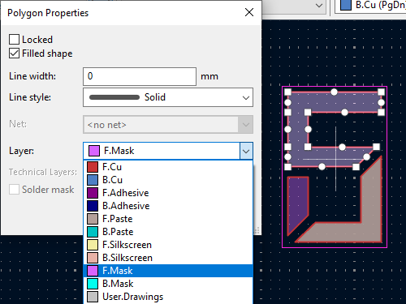

Se puede cambiar la capa en la cual se insertó el gráfico haciendo ${\color{#b0e6e6}doble \ click \ 2 \ veces}$ en él y luego seleccionando la capa a la cuál queremos moverlo Dependiendo de la ${\color{#b0e6e6}capa}$ que elijamos, el gráfico tendrá un ${\color{#b0e6e6}efecto \ distinto}$ en la PCB:

*   ${\color{white}.Cu}$:

Considerando que en la zona donde está el gráfico no hay un plano sólido de cobre, esté se verá de un tono más claro, ya que ${\color{#b0e6e6}generará}$ un ${\color{#b0e6e6}trazo \ de \ cobre}$ bajo la superficie de la PCB

*   ${\color{white}.Silkscreen}$:

Poner el gráfico en esta capa hará que lo ${\color{#b0e6e6}impriman}$ sobre la superficie de la pcb con tinta blanca

*   ${\color{white}.Mask}$:

Ubicar el gráfico en esta capa hace que en esa sección de la placa no esté el recubrimiento superior, lo que hace que el ${\color{#b0e6e6}cobre}$ (estaño u oro, dependiendo del acabado) y/o el material de la PCB queden ${\color{#b0e6e6}expuestos}$

### Other things

### Símbolo v/s Footprint

Si tenemos un ${\color{#b0e6e6}componente}$ que va conectado al circuito, pero ${\color{#b0e6e6}no \ queremos \ ponerlo \ en \ la \ placa \ PCB}$, se le puede asignar el ${\color{#b0e6e6}footprint}$ de un conector, pins, *"soldering pads"*, etc

### SPDT

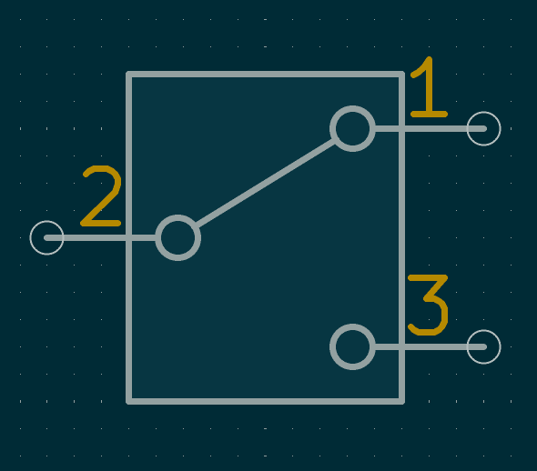

Es un ${\color{#b0e6e6}interruptor}$ de ${\color{#b0e6e6}2 \ posiciones}$, que en lugar de abrir o cerrar un circuito, puede hacer que un circuito esté abierto, mientras un segundo circuito está cerrado (no pueden estar ambos cerrados o abiertos a la vez)

### Color del cable (sch)

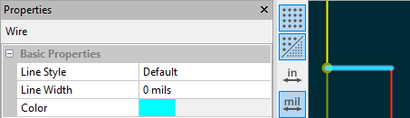

@21-SebastianSaez1003 me mostró que en el ${\color{#b0e6e6}modo \ esquemático}$ se puede ${\color{#b0e6e6}cambiar \ el \ color \ de \ los \ cables}$ para que sea más facil ${\color{#b0e6e6}diferenciarlos}$

### JST

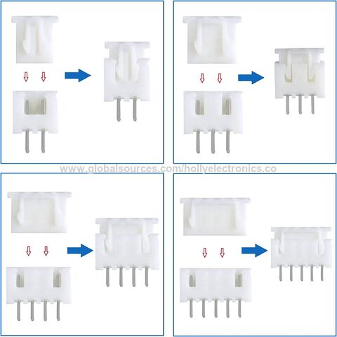

Conector ámpliamente usado en la industria, pequeño y barato, similar a los conectores ${\color{#b0e6e6}dupont}$ pero con un ${\color{#b0e6e6}mecanismo \ de \ retención}$ que además ${\color{#b0e6e6}previne}$ que se ${\color{#b0e6e6}inserte \ al \ revés}$

## Encargo 16

### UDPudu - Cotización

Considerando 1 PCB por persona (30 PCBs total), El precio de la orden sería de $16.40 USD + envío ($14.03 USD - $48.39 USD) o $1.02 USD - $2.16 USD por cada PCB

Si se consideran 5 PCBs por persona (150 PCBs total), El precio quedaría en $31.1 USD + envío ($71.80 USD - $90.41 USD) o $0.69 USD - $0.81 USD por cada PCB

Parámetros modificados:

* Color: ${\color{blue}Azul}$
* Surface finish: Leadfree HASL

## Encargo 17

### JLCPCB - parámetros

### Material

### FR4 (Fire Retardant 4)

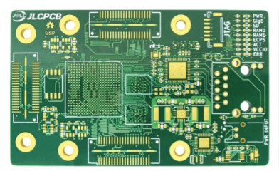

resina apoxi reforzada con fibra de vidrio, es ${\color{#b0e6e6}barato}$ y suficientemente ${\color{#b0e6e6}resistente}$ para la mayoría de aplicaciones. ${\color{#b0e6e6}No \ es \ buen}$ ${\color{#b0e6e6}conductor \ de \ calor}$

### Flex

Se emplea una lámina de polímero ${\color{#b0e6e6}flexible}$ como substrato, son muy ${\color{#b0e6e6}delgadas}$ y ${\color{#b0e6e6}livianas}$. Se suelen emplear como cables que unen otras PCBs en diseños con limitaciones de espacio y en situaciones donde no sea recomendable tener una PCB rígida, como en teclados flexibles

### Aluminio

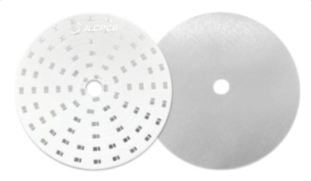

Se utiliza en circuitos donde es escencial ${\color{#b0e6e6}disipar}$ el ${\color{#b0e6e6}calor}$ producido por los componentes rápidamente. Todas las ampolletas LED (quemadas) que he desarmado tienen montadas las LEDs en una pcb de aluminio

### Centro de cobre

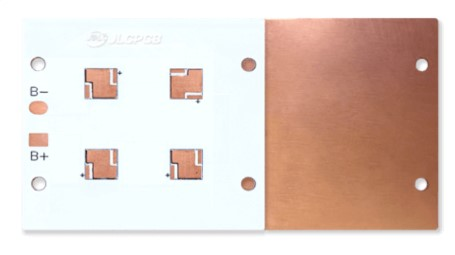

Similar al aluminio, pero es ${\color{#b0e6e6}2 \ veces \ mejor \ disipando \ calor}$ (400 W/mK v/s 205 W/mK) y al tener ${\color{#ffe4a8}menos \ reistencia}$ a la corriente, afecta en menos medida a componentes muy sensibles a variaciones en la señal eléctrica, además de ser capaz de entregar una ${\color{#b0e6e6}mayor \ corriente}$ a circuitos más poderosos

### Rogers

Más ${\color{#b0e6e6}blando}$ que el FR4, pero es ${\color{#b0e6e6}menos \ disruptivo \ a \ señales \ de \ alta \ frecuencia}$ (Coeficiente de disperción de pérdida de señal FR4 = 0.02% v/s Rogers 0.004%), haciendolo ideal para circuitos de ${\color{#b0e6e6}radio \ frecuencia \ (RF)}$ y soporta mejor el calor

### PTFE teflon

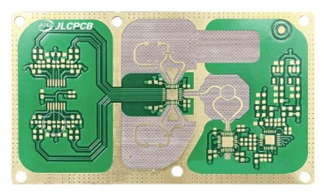

Similar a Rogers, pero su ${\color{#b0e6e6}Coeficiente \ de \ disperción \ de \ pérdida \ de \ señal \ es \ más \ bajo}$ (0.001% v/s 0.004%), tiene una ${\color{#b0e6e6}mejor \ conductividad \ térmica}$ y tiene una mayor ${\color{#b0e6e6}resistencia \ a \ químicos}$. Se suele emplear en instrumentos médicos y la industria aeroespacial

### N° de capas de cobre

La cantidad de ${\color{#b0e6e6}planos \ en \ los \ cuales \ se \ trazaron \ conexiones}$ en la PCB. Se suelen emplear capas extra para ${\color{#b0e6e6}reducir \ el \ tamaño}$ de una placa, al no necesitar tento espacio (ejes X,Y) para trazar conexiones. Y para delimitar capas enteras como ${\color{red}Vcc}$ y/o ${\color{white}GND}$ para ${\color{#b0e6e6}estabilizar \ la \ señal}$ en circuitos sensibles a "ruido"

### Tipo de producto

La ${\color{#b0e6e6}calidad}$ de manufactura y ${\color{#b0e6e6}rigurosidad \ de \ testeo}$ de la placa

### Diseño diferente

${\color{#b0e6e6}Cuantas \ placas \ distintas}$ conforman el archivo subido a JLCPCB

### Formato de entrega

${\color{#b0e6e6}Quien \ y \ como}$ se realiza la ${\color{#b0e6e6}cubicación}$ de las distintas placas PCBs en el panel (gran PCB)

### Grosor de la PCB

Define el ${\color{#b0e6e6}grosor}$ de la placa final (${\color{#ffe4a8}mayor \ grosor \ = \ mayor \ resistencia}$) (a ${\color{#6462fe}menor \ grosor}$ es posible que la placa se comporte como un ${\color{#6462fe}capacitor}$, alterando la señal, lo que puede ser beneficioso o perjudical dependiendo de nuestro diseño

### Color

El color de la máscara. Se suele utilizar el ${\color{lightgreen}verde}$, pero no es el único color disponible

### Silkscreen

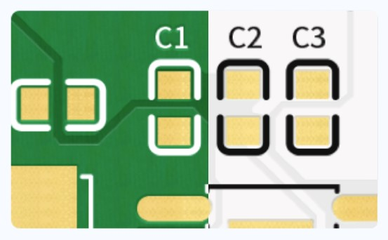

El ${\color{#b0e6e6}color}$ de la ${\color{#b0e6e6}tinta}$ a utilizar para imprimir los trazados de la capa silkscreen, en ${\color{#b0e6e6}JLCPCB \ es \ blanco \ o \ negro}$, pero algunos fabricantes, como ${\color{#b0e6e6}PCBway}$, permiten imprimir ${\color{#b0e6e6}gráficos \ a \ color}$ en esta capa

### Tipo de material

Que ${\color{#b0e6e6}"sabor"}$ específico del material base a utilizar (ej: mayor resistencia al calor)

### Acabado de superficie

El tipo de ${\color{#b0e6e6}recubrimiento}$ que se aplicará sobre la ${\color{#b0e6e6}capa \ de \ cobre}$ (esto se hace para ${\color{#b0e6e6}evitar}$ la ${\color{#b0e6e6}oxidación}$ del cobre, ya que ${\color{#b0e6e6}si \ se}$ ${\color{#b0e6e6}oxida \ no \ se \ puede \ soldar}$)

### HASL (Hot Air Solder Leveling)

Se cubre el cobre con ${\color{#b0e6e6}estaño}$, el cual puede tener o no tener plomo. Este acabado hace más ${\color{#b0e6e6}facil \ soldar}$ componentes a la placa

### ENIG (Electroless Nickel Immersion Gold)

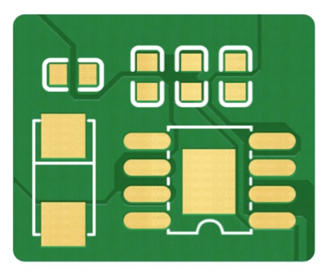

Se recubre el cobre en una capa delgada de ${\color{#b0e6e6}niquel}$, la cual es a su vez recubierta en una capa delgada de ${\color{#b0e6e6}oro}$. Este acabado resulta en una ${\color{#b0e6e6}superficie}$ excepcionalmente ${\color{#b0e6e6}plana \ y \ uniforme}$, lo que lo hace ideal para ${\color{#b0e6e6}diseños \ con}$ ${\color{#b0e6e6}componentes \ muy \ pequeños \ y \ en \ grandes \ densidades}$, que de otra forma se moverían más durante el proceso de soldadura

### Peso de cobre (externo e interno)

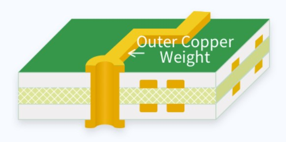

El ${\color{#b0e6e6}grosor \ de \ los \ trazos \ de \ cobre}$ (eje Z), en caso de tener que aumentar el volumen de los trazados de cobre, para permitir que la ${\color{#b0e6e6}corriente}$ circule bien (alta corriente) se puede aumentar el grosor de la capa de cobre, en lugar de ensanchar los trazados (eje X,Y)

### Recubrimiento de vias

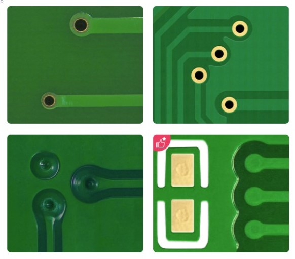

Las vias tipicamente se ${\color{#b0e6e6}recubren \ para \ evitar \ algún \ cortocircuito}$, limitando el material conductor expuesto. A veces se dejan algunas vias expuestas con el propósito de ${\color{#b0e6e6}programar \ un \ microcontrolador}$ o simplemente usarlas como ${\color{#b0e6e6}puntos \ de \ testeo}$

### Tamaño mínimo del agujero de las vias

Dependiendo de la ${\color{#b0e6e6}densidad}$ de nuestro circuito, tener vias más pequeñas puede ayudar a ${\color{#b0e6e6}reducir \ el \ tamaño}$ de la placa

### Tolerancia del corte del borde

${\color{#b0e6e6}Cuan \ cerca \ de \ las \ dimensiones \ especificadas}$ resultan los cortes realizados a la placa.  En caso de tener placas PCB con componentes en ambos lados, que se tenga que soldar sobre otra PCV (módulo smd) podría ser beneficioso reducir la tolerancia

### Confirmación de archivo de producción

El ${\color{#b0e6e6}fabricante}$ prepara el o los ${\color{#b0e6e6}archivos}$ que utilizarán para ${\color{#b0e6e6}fabricar}$ la orden y los enviarán al ${\color{#b0e6e6}cliente}$ para que los ${\color{#b0e6e6}revise}$ y autorice la producción. Puede ser conveniente para diseños con detalles específicos o pedidos especiales, para evitar la producción de una placa que no cumple los requerimientos del cliente

### Marca en la PCB

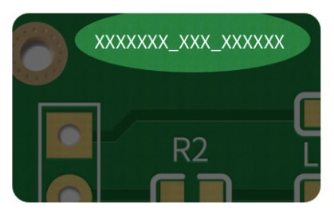

${\color{#b0e6e6}Método}$ (número de serie, codigo de barra o QR) y ${\color{#b0e6e6}posición \ del \ código \ de \ identificación}$ de cada PCB (definida por el fabricante o el cliente)

### Dedos de oro

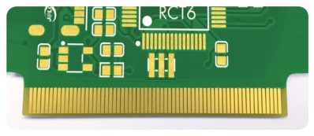

El ${\color{#b0e6e6}acabado}$ de superficie (HASL o ENIG) aplicado a los ${\color{#b0e6e6}puntos \ de \ conexión}$ en el ${\color{#b0e6e6}borde}$ de la placa

### Agujeros almenados (castellated holes)

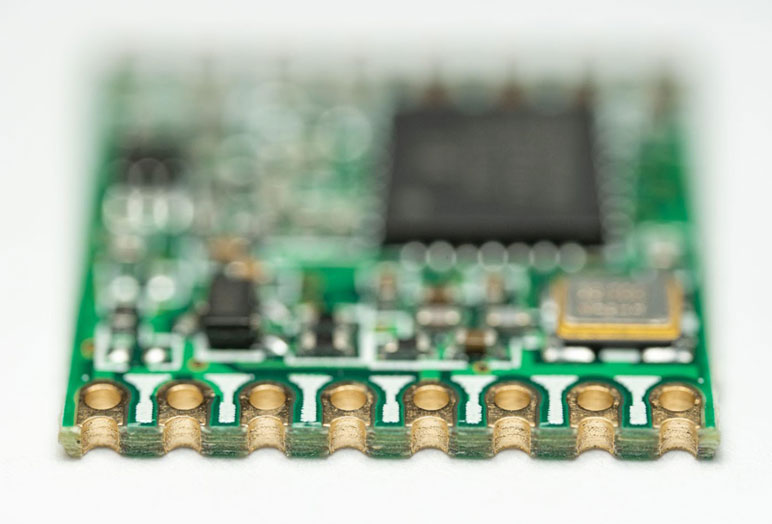

Una mezcla de agujeros y "soldering pads" que van de forma ${\color{#b0e6e6}vertical}$ por el ${\color{#b0e6e6}borde \ de \ la \ placa}$. Se utilizan para ${\color{#b0e6e6}soldar}$ una PCB ${\color{#b0e6e6}sobre}$ otra facilmente (módulo SMD [acabado ${\color{#b0e6e6}ENIG}$])

### Recubrimiento del borde

Se recubren los bordes de la placa con niquel y oro, para aumentar la ${\color{#b0e6e6}durabilidad}$ de la placa, para ${\color{#b0e6e6}estabilizar \ la \ señal}$ de GND y para ${\color{#b0e6e6}absorver}$ energía de las ${\color{#b0e6e6}ondas \ electromagnéticas}$ generadas por los trazos de cobre que rebotan en las esquinas de la placa e interfieren con algunos componentes sensibles
