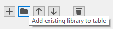
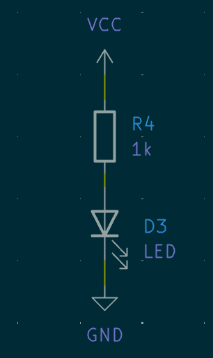
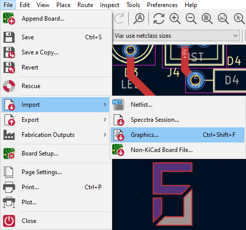
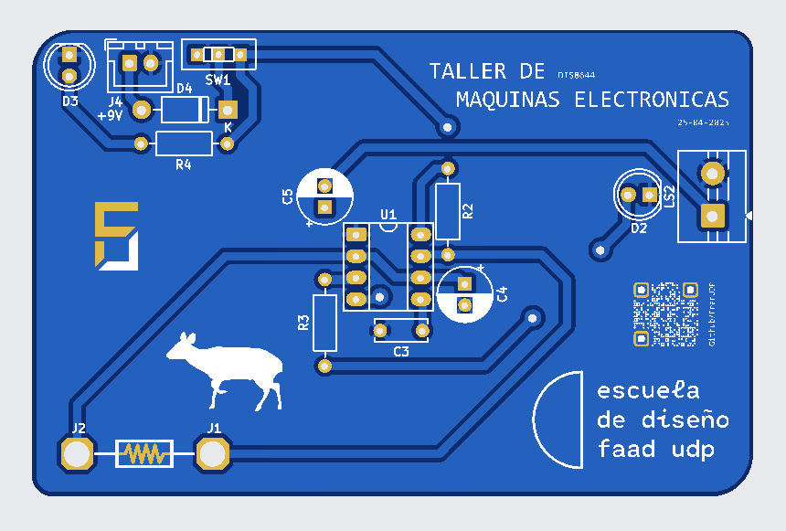
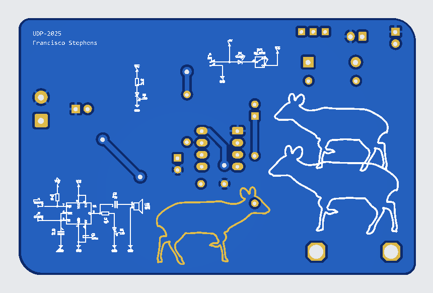
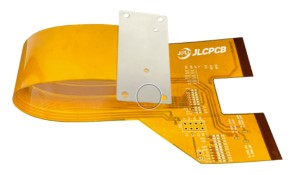
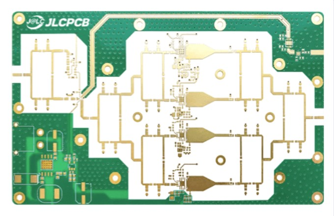
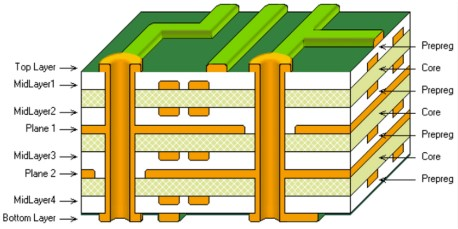
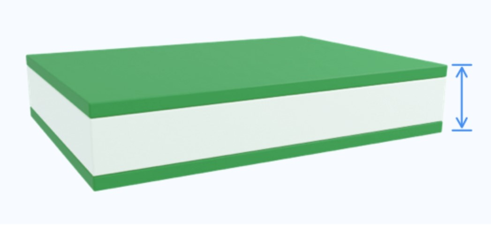
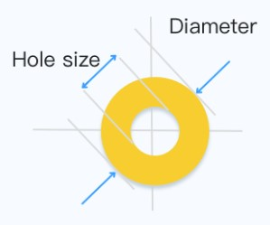

# sesion-07b

## Apuntes
> ###### ${\color{#3d3d44}Se \ recomienda \ usar \ modo \ oscuro, \ hay \ palabras \ en \ color \ blanco \ que \ de \ otra \ forma \ no \ son \ visibles.}$  
> ###### ${\color{#3d3d44}The \ use \ of \ dark mode \ is \ recommended, \ there's \ white \ colored \ text \ that \ otherwise \ is \ not \ visible.}$  
>
> ### Instalación librería customizada
> Tras ${\color{#b0e6e6}descargar}$ los símbolos y/o footprints que queremos añadir a Kicad, es ideal (aunque no necesario) ${\color{#b0e6e6}moverlos}$ a una ${\color{#b0e6e6}ubicación}$ adecuada (como la carpeta de instalación de Kicad) para evitar accidentalmente cambiarlos de dirección o eliminarlos.    
> Luego hay que ir a ${\color{#b0e6e6}preferencias}$ y seleccionar ${\color{#b0e6e6}librería \ de \ símbolos}$      
>
> Una vez dentro de la ${\color{#b0e6e6}librería \ de \ símbolos}$, apretar el ${\color{#b0e6e6}icono \ de \ carpeta}$, buscar la ubicación del archivo o carpeta que se desea importar, seleccionarlo y darle ok.    
>
> ### Kicad 
> ### Circuitos paralelos
>> ### Indicador de energía
>>        Este circuito ${\color{#b0e6e6}enciende \ un \ LED}$ para indicar que el circuito (total) ${\color{#b0e6e6}tiene \ energía}$ y por lo tanto, tiene una fuente de poder conectada         
>>
>> ### Circuito de protección
>>      Este circuito se encarga de ${\color{#b0e6e6}prevenir}$ que explote el circuito (total) en caso de que ${\color{#b0e6e6}accidentalmente}$ se ${\color{#b0e6e6}conecten \ los \ cables \ al \ revéz}$, mediante la implementación de un diodo.   (en mi caso no es realmente necesario, pues decidí poner un conector JST para la batería)        
> 
> ### Gráficos
>> Nos enseñaron ${\color{#b0e6e6}2 \ métodos}$ para ${\color{#b0e6e6}añadir \ logos}$ y ${\color{#b0e6e6}gráficos}$ en la placa PCB:   
>>        ${\color{white}Footprint}$:   Se añade la gráfica a la ${\color{#b0e6e6}librería \ de \ footprints}$ y luego se inserta en la placa
>>            
>>          ${\color{white}Importar \ gráficos}$:   Se importa un gráfico en formato ${\color{#b0e6e6}.xdf}$ o ${\color{#b0e6e6}.svg}$           
>>
>> ### Capas
>>         Se puede cambiar la capa en la cual se insertó el gráfico haciendo ${\color{#b0e6e6}doble \ click \ 2 \ veces}$ en él y luego seleccionando la capa a la cuál queremos moverlo        Dependiendo de la ${\color{#b0e6e6}capa}$ que elijamos, el gráfico tendrá un ${\color{#b0e6e6}efecto \ distinto}$ en la PCB:  
>> *   ${\color{white}.Cu}$:  Considerando que en la zona donde está el gráfico no hay un plano sólido de cobre, esté se verá de un tono más claro, ya que ${\color{#b0e6e6}generará}$ un ${\color{#b0e6e6}trazo \ de \ cobre}$ bajo la superficie de la PCB      
>>
>> *   ${\color{white}.Silkscreen}$:  Poner el gráfico en esta capa hará que lo ${\color{#b0e6e6}impriman}$ sobre la superficie de la pcb con tinta blanca       
>>
>> *   ${\color{white}.Mask}$:  Ubicar el gráfico en esta capa hace que en esa sección de la placa no esté el recubrimiento superior, lo que hace que el ${\color{#b0e6e6}cobre}$ (estaño u oro, dependiendo del acabado) y/o el material de la PCB queden ${\color{#b0e6e6}expuestos}$       
>
> ### Other things
>
>> ### Símbolo v/s Footprint
>> Si tenemos un ${\color{#b0e6e6}componente}$ que va conectado al circuito, pero ${\color{#b0e6e6}no \ queremos \ ponerlo \ en \ la \ placa \ PCB}$, se le puede asignar el ${\color{#b0e6e6}footprint}$ de un conector, pins, "soldering pads", etc   
>>
>> ### SPDT
>>    Es un ${\color{#b0e6e6}interruptor}$ de ${\color{#b0e6e6}2 \ posiciones}$, que en lugar de abrir o cerrar un circuito, puede hacer que un circuito esté abierto, mientras un segundo circuito está cerrado (no pueden estar ambos cerrados o abiertos a la vez)     
>>
>> ### Color del cable (sch)
>>    @21-SebastianSaez1003 me mostró que en el ${\color{#b0e6e6}modo \ esquemático}$ se puede cambiar el color de los cables para que sea más facil ${\color{#b0e6e6}diferenciarlos}$    
>>
>> ### JST
>>          Conector ámpliamente usado en la industria, pequeño y barato, similar a los conectores ${\color{#b0e6e6}dupont}$ pero con un ${\color{#b0e6e6}mecanismo \ de \ retención}$ que además ${\color{#b0e6e6}previne}$ que se ${\color{#b0e6e6}inserte \ al \ revés}$          
> 
-----------------------------------------------------------------------------------------------------------
## Encargo 16
### UDPudu (hacerse una cuenta en JLCPCB y cotizar udpudu, para 30 personas, documentar cada parámetro y elección.)
>               
>
> Considerando 1 PCB por persona (30 PCBs total), El precio de la orden sería de $16.40 USD + envío ($14.03 USD - $48.39 USD) o $1.02 USD - $2.16 USD por cada PCB  
>
> Si se consideran 5 PCBs por persona (150 PCBs total), El precio quedaría en $31.1 USD + envío ($71.80 USD - $90.41 USD) o $0.69 USD - $0.81 USD por cada PCB  
>
> Parámetros modificados:
> * Color: Azul
> * Surface finish: Leadfree HASL
-----------------------------------------------------------------------------------------------------------
## Encargo 17
### JLCPCB - parámetros (probar opciones que no entiendan, documentar otros parámetros que no conozcan aún.)
>> ### Material:
>>> ### FR4  
>>>     (Fire Retardant 4) resina apoxi reforzada con fibra de vidrio, es barato y suficientemente resistente para la mayoría de aplicaciones. No es buen conductor de calor     
>>>
>>> ### Flex  
>>>    Se emplea una lámina de polímero flexible como substrato, son muy delgadas y livianas. Se suelen emplear como cables que unen otras PCBs en diseños con limitaciones de espacio y en situaciones donde no sea recomendable tener una PCB rígida, como en teclados flexibles    
>>>
>>> ### Aluminio  
>>>     Se utiliza en circuitos donde es escencial disipar el calor producido por los componentes rápidamente. Todas las ampolletas LED (quemadas) que he desarmado tienen montadas las LEDs en una pcb de aluminio    
>>>
>>> ### Centro de cobre  
>>>    Similar al aluminio, pero es 2 veces mejor disipando calor (400 W/mK v/s 205 W/mK) y al tener menos reistencia a la corriente, afecta en menos medida a componentes muy sensibles a variaciones en la señal eléctrica, además de ser capaz de entregar una mayor corriente a circuitos más poderosos    
>>>
>>> ### Rogers  
>>>     Más blando que el FR4, pero es menos disruptivo a señales de alta frecuencia (Coeficiente de disperción de pérdida de señal FR4 = 0.02% v/s Rogers 0.004%), haciendolo ideal para circuitos de radio frecuencia (RF) y soporta mejor el calor     
>>>
>>> ### PTFE teflon  
>>>    Similar a Rogers, pero su Coeficiente de disperción de pérdida de señal es más bajo (0.001% v/s 0.004%), tiene una mejor conductividad térmica y tiene una mayor resistencia a químicos. Se suele emplear en instrumentos médicos y la industria aeroespacial      
>>>
>> ### N° de capas de cobre  
>>    La cantidad de planos en los cuales se trazaron conexiones en la PCB. Se suelen emplear capas extra para reducir el tamaño de una placa, al no necesitar tento espacio (ejes X,Y) para trazar conexiones. Y para delimitar capas enteras como Vcc y/o GND para estabilizar la señal en circuitos sensibles a "ruido"    
>>
>> ### Tipo de producto  
>> La calidad de manufactura y rigurosidad de testeo de la placa
>>
>> ### Diseño diferente  
>>>        Cuantas placas distintas conforman el archivo subido a JLCPCB       
>>>
>>> ### Formato de entrega  
>>> Quien y como se realiza la cubicación de las distintas placas PCBs en el panel (gran PCB)   
>>
>> ### Grosor de la PCB  
>>    Define el grosor de la placa final (mayor grosor = mayor resistencia) (a menor grosor es posible que la placa se comporte como un capacitor, alterando la señal, lo que puede ser beneficioso o perjudical dependiendo de nuestro diseño    
>>
>> ### Color  
>>       El color de la máscara. Se suele utilizar el verde, pero no es el único color disponible       
>>
>> ### Silkscreen  
>>     El color de la tinta a utilizar para imprimir los trazados de la capa silkscreen, en JLCPCB es blanco o negro, pero algunos fabricantes, como PCBway, permiten imprimir gráficos a color en esta capa     
>>
>> ### Tipo de material  
>> Que "sabor" específico del material base a utilizar (ej: mayor resistencia al calor)
>>
>> ### Acabado de superficie  
>> El tipo de recubrimiento que se aplicará sobre la capa de cobre (esto se hace para evitar la oxidación del cobre, ya que si se oxida no se puede soldar)
>>> ### HASL (Hot Air Solder Leveling)  
>>>       Se cubre el cobre con estaño, el cual puede tener o no tener plomo. Este acabado hace más facil soldar componentes a la placa       
>>>
>>> ### ENIG (Electroless Nickel Immersion Gold)  
>>>      Se recubre el cobre en una capa delgada de niquel, la cual es a su vez recubierta en una capa delgada de oro. Este acabado resulta en una superficie excepcionalmente plana y uniforme, lo que lo hace ideal para diseños con componentes muy pequeños y en grandes densidades, que de otra forma se moverían más durante el proceso de soldadura      
>>
>> ### Peso de cobre (externo e interno)  
>>    El grosor de los trazos de cobre (eje Z), en caso de tener que aumentar el volumen de los trazados de cobre, para permitir que la corriente circule bien (alta corriente) se puede aumentar el grosor de la capa de cobre, en lugar de ensanchar los trazados (eje X,Y)    
>>
>> ### Recubrimiento de vias  
>>       Las vias tipicamente se recubren para evitar algún cortocircuito, limitando el material conductor expuesto. A veces se dejan algunas vias expuestas con el propósito de programar un microcontrolador o simplemente usarlas como puntos de testeo       
>>
>> ### Tamaño mínimo del agujero de las vias  
>>       Dependiendo de la densidad de nuestro circuito, tener vias más pequeñas puede ayudar a reducir el tamaño de la placa       
>> 
>> ### Tolerancia del corte del borde  
>> Cuan cerca de las dimensiones especificadas resultan los cortes realizados a la placa. En caso de tener placas PCB con componentes en ambos lados, que se tenga que soldar sobre otra PCV (módulo smd) podría ser beneficioso reducir la tolerancia
>>
>> ### Confirmación de archivo de producción  
>> El fabricante prepara el o los archivos que utilizarán para fabricar la orden y los enviarán al cliente para que los revise y autorice la producción. Puede ser conveniente para diseños con detalles específicos o pedidos especiales, para evitar la producción de una placa que no cumple los requerimientos del cliente
>>
>> ### Marca en la PCB  
>>      Método (código, codigo de barra o QR) y posición del código de identificación de cada PCB (definida por el fabricante o el cliente)      
>>
>> ### Dedos de oro  
>>     El acabado de superficie (HASL o ENIG) aplicado a los puntos de conexión en el borde de la placa    
>>
>> ### Agujeros almenados (castellated holes)  
>>      Una mezcla de agujeros y "soldering pads" que van de forma vertical por el borde de la placa. Se utilizan para soldar una PCB sobre otra facilmente (módulo SMD) (acabado ENIG)     
>>
>> ### Recubrimiento del borde  
>>     Se recubren los bordes de la placa con niquely oro, para aumentar la durabilidad de la placa, para estabilizar la señal de GND y para absorver energía de las ondas electromagnéticas generadas por los trazos de cobre que rebotan en las esquinas de la placa e interfieren con algunos componentes sensibles     
>  
