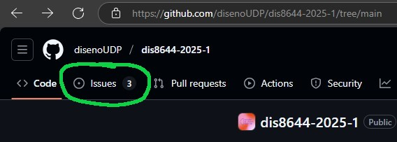
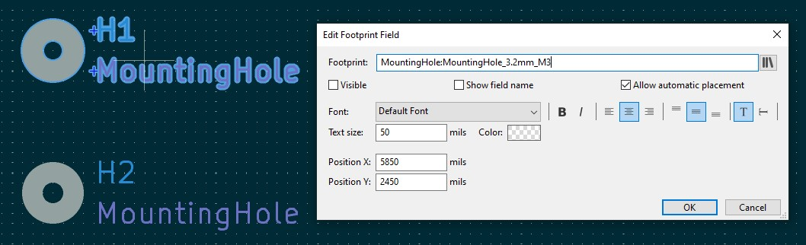

# sesion-08a

## Apuntes
> ###### ${\color{#3d3d44}Se \ recomienda \ usar \ modo \ oscuro, \ hay \ palabras \ en \ color \ blanco \ que \ de \ otra \ forma \ no \ son \ visibles.}$  
> ###### ${\color{#3d3d44}The \ use \ of \ dark mode \ is \ recommended, \ there's \ white \ colored \ text \ that \ otherwise \ is \ not \ visible.}$  
>
> ### Issues
>     En Github, ir a issues (esquina superior izquierda) para solicitar una revisión de la bitácora, alguna entrega o reportar algún otro problema      
>
>      Después, selecciona new issue (esquina superior derecha), aparecerá un cuadro con 3 opciones, seleccionar la que corresponda y rellenar con la información solicitada       
>
> ### Mounting holes
>     Se agregan orificios para fijar la placa pcb, nos recomendaron utilizar pernos M3 por su pequeño tamaño, fácil acceso y precio económico    
>
> ### Open scad
>      Permite generar volúmenes paramétricos mediante código escrito (a diferencia de Grasshopper [Rhino3d], que utiliza código en bloques)       
>
> ### Github Desktop
> Nos permite trabajar en github de manera más rápida y eficiente, desde Visual Studio Code, sin tener que lidiar con la tediosa versión web
>> ### Setup
>> Clonar repositorio (solo una vez por repositorio)
>>> Sync
>>>>> Fetch
>>>>>> Pull/Push
>>>>>>> Editar archivos 
>
> ### Other things
>
>> #### Homebrew & Winget
>> Administradores de apps desde el terminal   Homebrew = Mac & Linux / Winget = Windows
>  