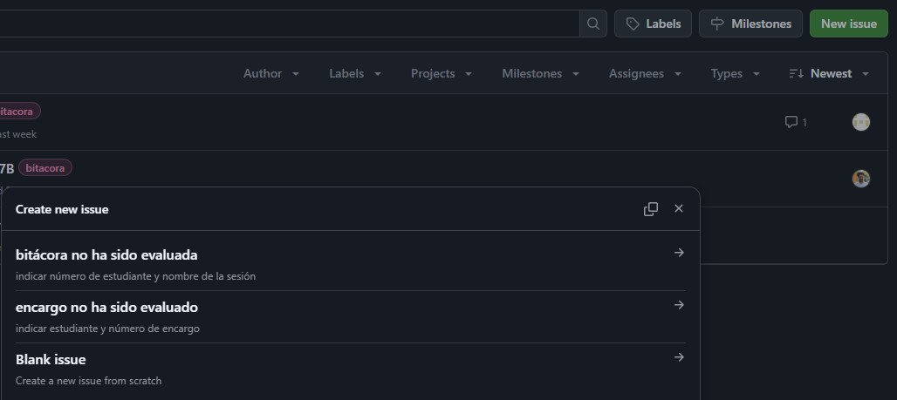

# sesion-08a

## Apuntes

### Issues

En Github, ir a ${\color{lightgreen}issues}$ (esquina superior izquierda) para solicitar una ${\color{#b0e6e6}revisión}$ de la bitácora, alguna entrega o reportar algún otro problema

Después, selecciona ${\color{lightgreen}new \ issue}$ (esquina superior derecha), aparecerá un cuadro con ${\color{#b0e6e6}3 \ opciones}$, seleccionar la que corresponda y rellenar con la información solicitada

### Mounting holes

Se agregan ${\color{#b0e6e6}orificios}$ para fijar la placa pcb, nos recomendaron utilizar pernos ${\color{#b0e6e6}M3}$ por su pequeño tamaño, fácil acceso y precio económico

### [Open scad](https://youtu.be/KrFttd5D1cw?si=dW5aR9s8_hHU4rGJ)

 Permite generar volúmenes ${\color{#b0e6e6}paramétricos}$ mediante ${\color{#b0e6e6}código \ escrito}$ (a diferencia de ${\color{green}Grasshopper\ [Rhino3d]}$, que utiliza ${\color{#b0e6e6}código \ en \ bloques}$)

### [Github Desktop](https://youtu.be/MaqVvXv6zrU?si=OLeJjsJaJcjmk-lR)

 Nos permite trabajar en github de manera más rápida y eficiente, desde ${\color{blue}Visual \ Studio \ Code \ (VSS)}$, sin tener que lidiar con la tediosa versión web

### Setup

${\color{#b0e6e6}Clonar}$ repositorio (solo una vez por repositorio)
${\color{#b0e6e6}Sync}$
${\color{#b0e6e6}Fetch}$
${\color{#b0e6e6}Pull/Push}$
${\color{#b0e6e6}Editar}$ archivos

### Other things

#### Homebrew & Winget

Administradores de apps desde el terminal Homebrew = Mac & Linux Winget = Windows
