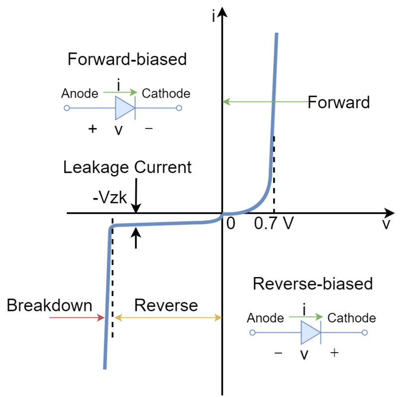
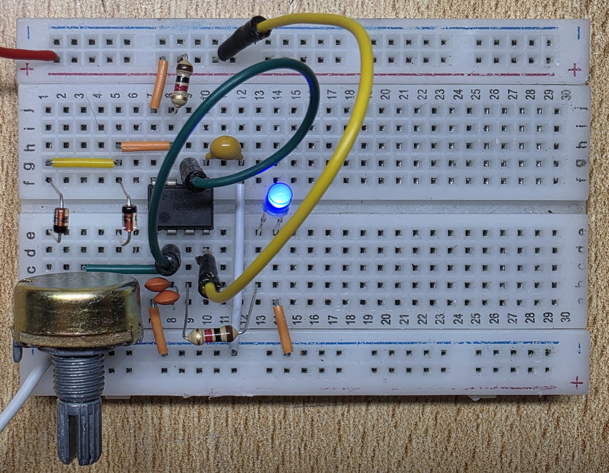
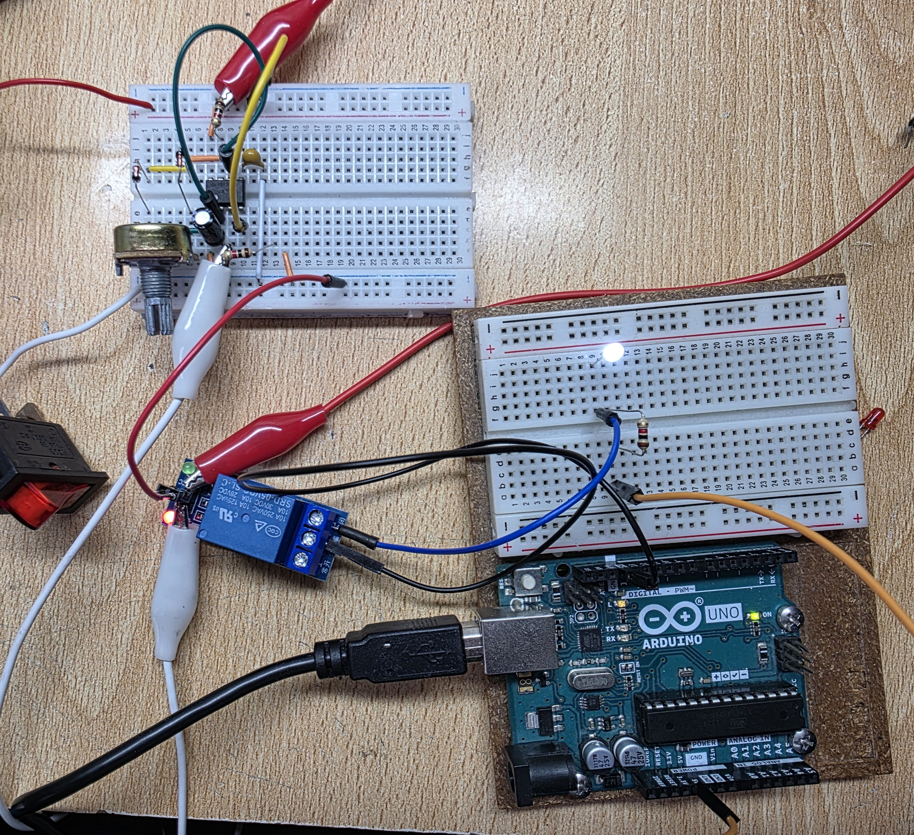

# sesion-09b

## Apuntes
> ###### ${\color{#3d3d44}Se \ recomienda \ usar \ modo \ oscuro, \ hay \ palabras \ en \ color \ blanco \ que \ de \ otra \ forma \ no \ son \ visibles.}$  
> ###### ${\color{#3d3d44}The \ use \ of \ dark mode \ is \ recommended, \ there's \ white \ colored \ text \ that \ otherwise \ is \ not \ visible.}$  
>
> ### Modulo PAM8403
>  Es un módulo amplificador clase D de 2 canales (para audio stereo [L and R speakers]). 
> #### Características:
> * Requiere 5V para operar
> * Eficiencia de un 90%
> * Puede proveer 3W (watts) a cada canal (R y L) a un parlante de 4Ω y 5V
> * Circuito de cancelación de ruido integrado en el módulo
> * Se apaga y enciende sin hacer ruido
> * Protección contra corto circuitos integrada
>
> #### Especificaciones:
> * Rango de voltaje de operación: 2.5V-5.5V
> * Carga del parlante: 4-8Ω
> * Tamaño: 21 X 18 X 3.4 mm (Largo X Ancho X Alto)
>
 :warning: <strong>No conectar las terminales negativas de los canales (R y L) entre sí, o se dañará el módulo</strong> :warning: 

>
 :warning: <strong>Conectar el parlante antes de proveer de energía al módulo</strong> :warning: 

>
> ### [Pulse Width Modulation (PWM)](https://youtu.be/aeE0u1J-1pg?si=sQ3Hyve-fgqd14Sa)
> Ver [Sesión-04b](https://github.com/disenoUDP/dis8644-2025-1/tree/main/25-FranUDP/sesion-04b)
>> ### Persistencia virtual
>> Es una ilusión óptica que nos permite percivir movimiento al ver una secuencia de imagenes estáticas, producto de la imagenes permaneciendo en nuestra vista por un período de tiempo después de haberlas visto. En el caso de las LEDs, este fenómeno nos permite percivir un cambio de luminocidad al ver LEDs parpadeando rápidamente.
> 
> ### Diagrama de flujo
>          Es un diagrama de bloques que divide los componentes y acciones que participan en un circuito para facilitar el entendimiento de este y su diseño        
>
> ### Diodo 1N4148
>    Diodo de alta velocidad (4ns), con un forward voltage de 0.7V y un voltaje reverso de 75V. Viene en un paquete DO-35 (footprint)     
>>
>> ### Voltaje y corriente en un diodo
>>  
>>
>> ### Forward Voltage
>> Es la diferencia de voltaje entre el anodo y el catodo del diodo, es decir, el voltaje que recive el diodo se reduce en el forward voltage. 
>> El forward voltage varía dependiendo del material del tipo de diodo 
>> ### Threshold Voltage (Voltaje de encendido) 
>> Este es el voltaje mínimo que requiere el diodo para permitir que pase la corriente (bajo el voltaje mínimo hay un flujo minusculo de corriente) 
>> Desde el punto threshold, la corriente que pasa por el diodo aumentará de forma exponencial   
>
> ### Modulo relé (relay module)
>    Similar a un transistor, en el sentido que una señal pequeña (input) controla una señal más grande (output), Pero difiere en que la señal que controla (output) está aislada del circuito del cual proviene la señal control (input), esto permite que la señal de salida sea muchisimo más grande que el input o incluso que sea de corriente alterna (AC)  
>
> ### Other things <!-- Things to organize + random stuff -->
>
>> ### gordon matta clark
>>      Artista y arquitecto chileno-estadounidense conocido por sus intervenciones arquitectónicas, donde hacia cortes y perforaciones en estructuras     
>>
>> ### Clases de amplificadores
>> * Clase D:  Amplificadores electrónicos de alta eficiencia energética, funcionan usando PWM. Suelen tener más distorción que las otras clases y el rápido ON y OFF del PWM puede causar interferencias de radiofrecuencia (RFI) si no se filtra 
>> * Clase A:  Amplificadores lineales de alta fidelidad (minima distorción), tienen una eficiencia muy baja (25% aprox) y produce mucho calor, por lo que requieren de enfriamiento 
>> * Clase B:  Amplificadores lineales más eficientes que la clase A (78% max), sufren de distorciones, por lo que no son aptos para aplicaciones de alta fidelidad 
>> * Clase AB:  Tienen mayor eficiencia que la clase A y menos distorción que la clase B, se suelen utilizar como amplificadored de proósito general 
>> * Clase C:  Amplificadores lineales de alta eficiencia y distorción considerable, se suelen emplear en aplicaciones de radiofrecuencia 
>> * Clase H y G:  Variaciones de la clase AB, utilizan múltiples voltajes de entrada distintos para mejorar la eficiencia energética (varian de menor a major voltaje dependiendo de la señal que estén procesando), la clase G varía entre multiples voltajes de entrada fijos, mientras que la clase H utiliza una fuente de poder variable.
>>
>> ### Mechanical turk
>>     Es un autómata que aparentaba ser un una máquina que operaba por si misma, tomando deciciones por cuenta propia, sin embargo la máquina era controlada por un enano desde el interior.  En la clase fue usada como analogía a la caja negra (inputs y outputs de un objeto sin saber sus mecanismos de operación)  
>>
>> ### Envolvente
>>     Es una curva suave que sigue los puntos más altos de la onda (amplitud). Misaa menció haber utilizado un programa que recivia la señal de un micrófono y extraía la envolvente de la señal   
>>
>> ### Digital v/s Análogo
>> Inputs y outputs digitales consisten de HIGHs y LOWs, mientras que los inputs y outputs análogos tienen casi infinitos estados (ej: 1.1 / 1.00000001 / 3.14159...).
>>
>> ### Triodo
>>       Similar al transistor, pero es controlado por la cantidad de voltaje y no por la cantidad de corriente. El triodo es un tubo de vacio (vacuum tube), mientras que el transistor es un semiconductor     
>  
-----------------------------------------------------------------------------------------------------------
## Encargo 18 <!--tomen el circuito que simulamos en tinkercad y lo traspasen a su protoboard, usando los componentes que tienen en su kit de materiales-->
### Circuito IRL
>> #### Circuito PWM usando el NE555  
>>               
>>                 
>>
>> #### Circuito relay  
>>                   
>>                  
> 
-----------------------------------------------------------------------------------------------------------
## Encargo 19 <!--estudiar la obra de laurie anderson, incluir citas y referentes usados, explicar qué y por qué les gusta o no de su trabajo-->
### Laurie Anderson
> Escuché el album Big science. Inmediatamente me llamó la atención que prácticamente no "canta" sino que habla en distintas velocidades con música repetitiva acompañandola de fondo, porque la mayoría de canciones que he escuchado que tienen gente hablando normalmente, usualmente interrumpen la canción y hablan por un período corto de tiempo antes de retomar la canción.   Tras ver una entrevista que tuvo en el canal [60 minutes](https://youtu.be/rydadItdnt0?si=7jIRZXng869N9_ud), me sorprendió que ella no busca hacer canciones o temas musicales, sino contar historias de la forma más bizarra que se le ocurra. También mencionó que los sonidos repetitivos de fondo son porque tenía varios equipos que podían hacer loops, aunque no se si es solo por eso o si hay otros factores detrás.    Aunque no considero que sus canciones sean de mi agrado, me agrada como juega con distintos elementos, como sonido, visuales y tecnología en sus obras
>
