# sesion-10a <!-- This feels so odd without the vertical lines and the ">" -->

## Apuntes
###### ${\color{#3d3d44}Se \ recomienda \ usar \ modo \ oscuro, \ hay \ palabras \ en \ color \ blanco \ que \ de \ otra \ forma \ no \ son \ visibles.}$ <br/>
###### ${\color{#3d3d44}The \ use \ of \ dark mode \ is \ recommended, \ there's \ white \ colored \ text \ that \ otherwise \ is \ not \ visible.}$ <br/>

### RGB LED
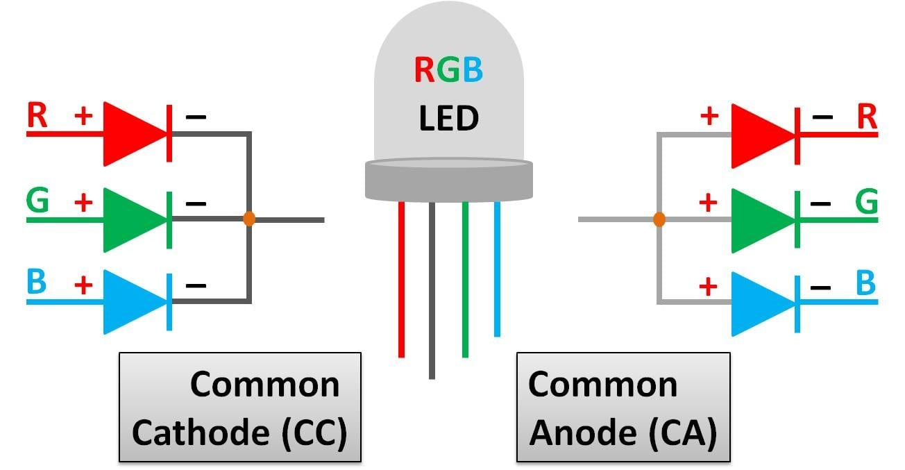 </br> Combinan 3 LEDs de distintos colores (rojo, verde y azul) en un mismo componente, cada uno de estos LEDs brilla con distinta intensidad para producir el color deseado, ya que al estar tan cerca se mezcla la luz que cada uno emite </br></br> En los LED RGB, los 3 LEDs de colores suelen venir en 2 configuraciones: cátodo y ánodo común </br></br></br>

### Display de 7 segmentos
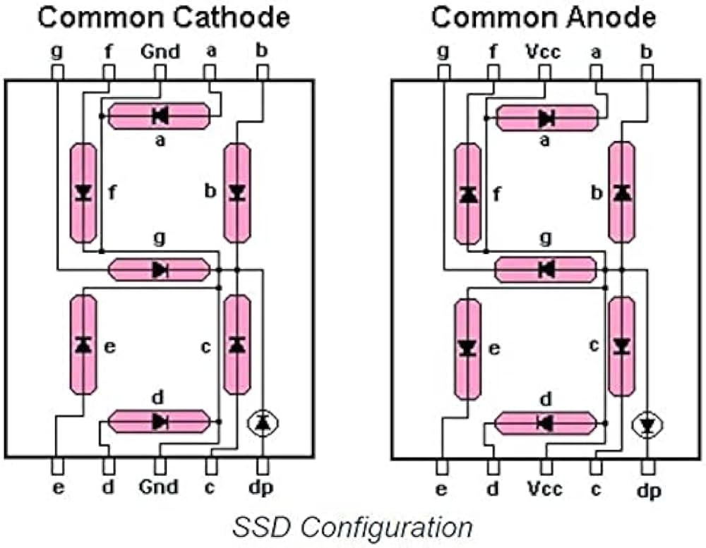 </br></br></br></br></br> Similares a los LEDs RGB en que contienen múltiples LEDs de menor tamaño dentro, sin embargo estos displays emplean LEDs del mismo color en distintas ubicaciones para formar distintos números y/o letras </br></br></br></br></br></br></br>

> ### [Codificador(encoder)](https://youtu.be/NWiPVMDh7GE?si=5goLb4drnWfBChbt) y [decodificador(decoder)](https://youtu.be/HHQFI8R1iZc?si=c0AfhkyOAGCwZzmC)
> En un display de 7 segmentos hay que controlar 7 LEDs, pero ¿qué pasa si tenemos varios displays de 7 segmentos trabajando juntos para mostrar números más grandes o pantallas de más alta resolución? necesitaríamos una cantidad enorme de pines GPIO en nuestros microcontroladores (arduino, esp32, raspberry pi pico, etc), sin mencionar la cantidad de cables y espacio. </br> Es por esto que se emplean encoders y decoders
> * Encoders: Toma múltiples inputs y los convierte en pocos outputs. Ej: Un teclado con 101 teclas que se comunica mediante USB (Universal Serial Bus), el cual utiliza 2 canales llamados Data+ y Data- para comunicarse</br>
> * Decoders: Toma pocos inputs y los convierte en múltiples outputs. Ej: Un microcontrolador controlando un display de 60 LEDs mediante el protocolo I2C, el cual emplea 2 canales de comunicación (Serial Data [SDA] y Serial Clock [SCL])</br>

### [RGB v/s CMYK](https://youtu.be/NnP-SRiOc4o?si=X7VKQyWvUsUm_wed)
Son formatos de colores utilizados en programas de diseño de ilustraciones, editores de imágenes entre otros. Se emplean estos distintos formátos por el diferente comportamiento de la luz al ser emitida directamente hacia los ojos y reflejada en una superficie y luego llegar a los ojos.</br></br>
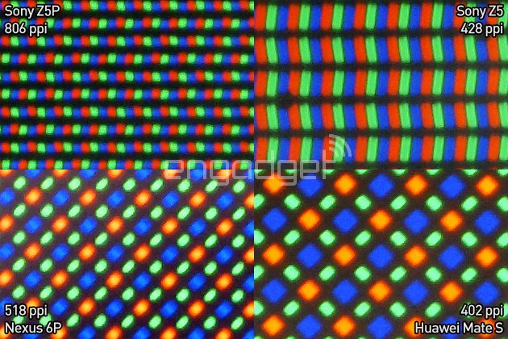</br></br></br> RGB se utiliza para diseñar imágenes que se muestran a través de pantallas, este formato obtiene su nombre de la misma forma que el LED RGB (Red, Green & Blue), aunque su uso no es exclusivo de pantallas OLED o microLED (emplean diminutos LEDs RGB como pixeles)</br></br></br></br>

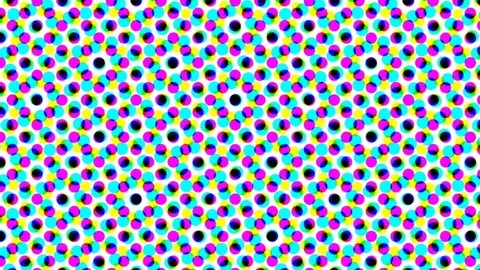</br></br> CMYK es utilizado para diseñar imágenes para impresión, se podría decir que a diferencia de RGB que se utiliza para imágenes digitales, CMYK se utiliza para imágenes analógicas. Obtiene su nombre a partir de las tintas empleadas para impresión (Cyan, Magenta, Yellow & Key [negro]</br></br></br></br>

### Comparador Minecraft
El comparador cuando está operando en modo comparador (modo resta con la antorcha frontal encendida), compara la intensidad de la señal de redstone en sus terminales laterales y principal. </br> &nbsp;&nbsp;&nbsp;&nbsp;Si la señal en su terminal A es mayor a la intensidad de la terminal B, el comparador dejará pasar la señal A (output)</br> &nbsp;&nbsp;&nbsp;&nbsp;Si la señal de la terminal A es igual o inferior a la señal de la terminal B, entonces no dejará que pase la señal</br>  
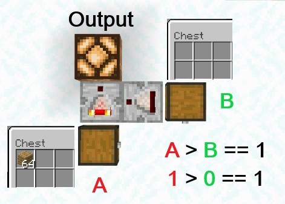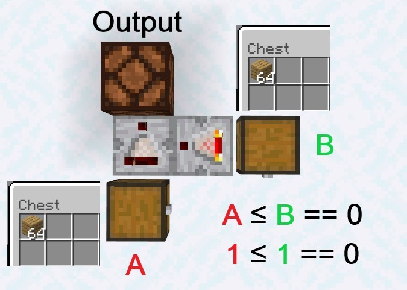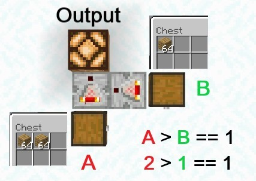</br></br></br></br></br></br></br></br></br>

> ### LM324 [Op Amp (Operational amplifier)](https://youtu.be/OSCKBmkrH_g?si=QFSQ32b00GYuRYbe)
>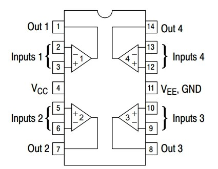</br></br> Este Op Amp (Operational Amplifier) está compuesto por 4 comparadores (LM741 x 4)</br></br> Los comparadores de los circuitos se comportan igual que el comparador de minecraft (modo comparador), pero en lugar de comparar la intensidad de la señal de redstone, comparan el voltaje que hay en cada terminal. </br></br></br></br>

<!-- Comparator -->
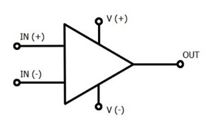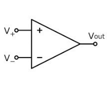 Aquí podemos apreciar los 2 símbolos que representan a los comparadores en los esquemas.</br></br> El símbolo de la izquierda es el símbolo completo, ya que el comparador requiere una conexión a una fuente de poder, además de las líneas que está comparando, para poder trabajar.</br></br> Mientras que en la derecha tenemos el símbolo simplificado, que no muestra las conexiones a la fuente de poder.</br></br> Se emplea el simplificado cuando se quiere entender la lógica con la que se está trabajando sin confundirse con las demás conexines, que se sabe estan allí, pero no son necesarias para entender el funcionamiento del circuito (en algunos casos).</br></br>

### [Componentes activos v/s pasivos](https://youtu.be/TgXMujXoG3I?si=h1dPGlVeSPS144HP)
En el mundo de la electrónica, los componentes se clasifican entre 2 grupos, componentes activos, que al igual que los comparadores, requieren estár conectados a una fuente de poder para operar. A diferencia de los componentes pasivos, como resistencias, LEDs, motores, etc. Que solo necesitan recivir un input para funcionar, es decir, no requieren una conexión dedidada a proveer energía al componente además de los inputs. 

### [Micrófono Electret](https://youtu.be/aSXv6FdYQfM?si=nr6VB09ea1yaSGRq)
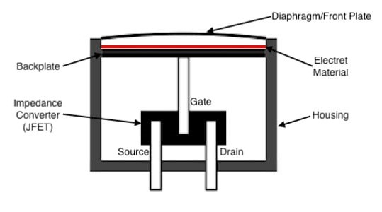 Es un micrófono que funciona teniendo un capacitor integrado.</br></br> Básicamente, tiene en su interior 2 placas conductivas que no se tocan pero están suficientemente cerca como para alterarse entre sí con sus emisiones electromagnéticas (si una placa tiene su polo positivo más cerca de la otra, esta tendrá su polo negativo más cerca de la primera) de la misma forma que funciona un capacitor.</br></br> Una de estas placas está fija, mientras la otra está sujeta a una membrana flexible que se mueve en mayor o menor medida dependiendo de las vibraciones que reciba, esto resulta en una variación de voltaje al variar la distancia entra ámbas placas (señal análoga) (los acelerómetros funcionan bajo el mismo principio)

### [Divisor de voltaje](https://youtu.be/fmSC0NoaG_I?si=IHEnsN_ys78Bt8Sm)
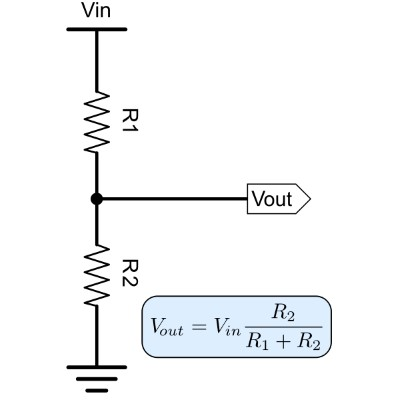</br></br></br></br> Se pueden conectar 2 resistencias en serie entre Vcc y GND para variar el voltaje (reducirlo). O en nuestro caso, un potenciómetro, ya que consiste de 2 resistencias variables.</br> Esto se puede emplear para darle energía a un componente o sección de un circuito que funciona con un voltaje inferior al resto del circuito</br></br></br></br></br></br></br>

### Other things: <!-- Things to organize + random stuff -->
> ### [Voltaje negativo](https://youtu.be/z5eB_2wjLTg?si=Ngw1xYDsibCLor0w)
>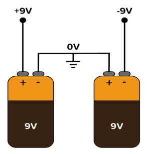</br></br> Tener un voltaje negativo significa que el voltaje medido es más bajo que el punto de referencia (GND). Por ejemplo, si conectamos la terminal positiva del multímetro a GND y la terminal negativa a +9V, el multímetro leerá -9V, porque +9V se convierte en el punto de referencia (GND) y 0V es inferior a +9V por, valga la redundancia, 9V.</br></br> Los voltajes negativos son últiles para aplicaciones como amplificadores de audio, ya que el parlante empuja el aire en una dirección (+V) y luego tiene que moverse en reversa (-V) en lugar de quedarse quieto en el medio, cuando pudo haber desplazado más aire.</br></br></br></br>
>
> ### [Buffer](https://youtu.be/VKU9ciJb5u4?si=xksuSbaQz_msCMvr)
> Es un circuito que nos permite mantener el voltaje (output) de un circuito, pero aumentando la corriente de este, para que componentes y/o circuitos que requieren una mayor corriente operen según esperado. </br>
Se puede hacer un [buffer con un comparador](https://youtu.be/PvGdRVg5QXY?si=OnEHXtQWHpUfwJ3S) al conectar su output a su input-
-----------------------------------------------------------------------------------------------------------
## Encargo 20 <!-- subir fotos de su propia autoría de pantallas de siete segmentos, y otras variantes que encuentren en su vida cotidiana. les pedimos al menos 3 fotos de distintas pantallas. pueden partir de la base de las que ya subieron hoy a discord. incluir información sobre dónde y cuándo fue capturada la imagen. -->
### Displays de 7 segmentos

### 1.- Indicador de piso del ascensor de la FAAD &nbsp;&nbsp;&nbsp;&nbsp;&nbsp;&nbsp;&nbsp;&nbsp;&nbsp;&nbsp;&nbsp;&nbsp;&nbsp;&nbsp;&nbsp;&nbsp;&nbsp;&nbsp;&nbsp;&nbsp;&nbsp;&nbsp;&nbsp;&nbsp;&nbsp;&nbsp;&nbsp;&nbsp; 2.- Pantalla que indica el recorrido de la micro 
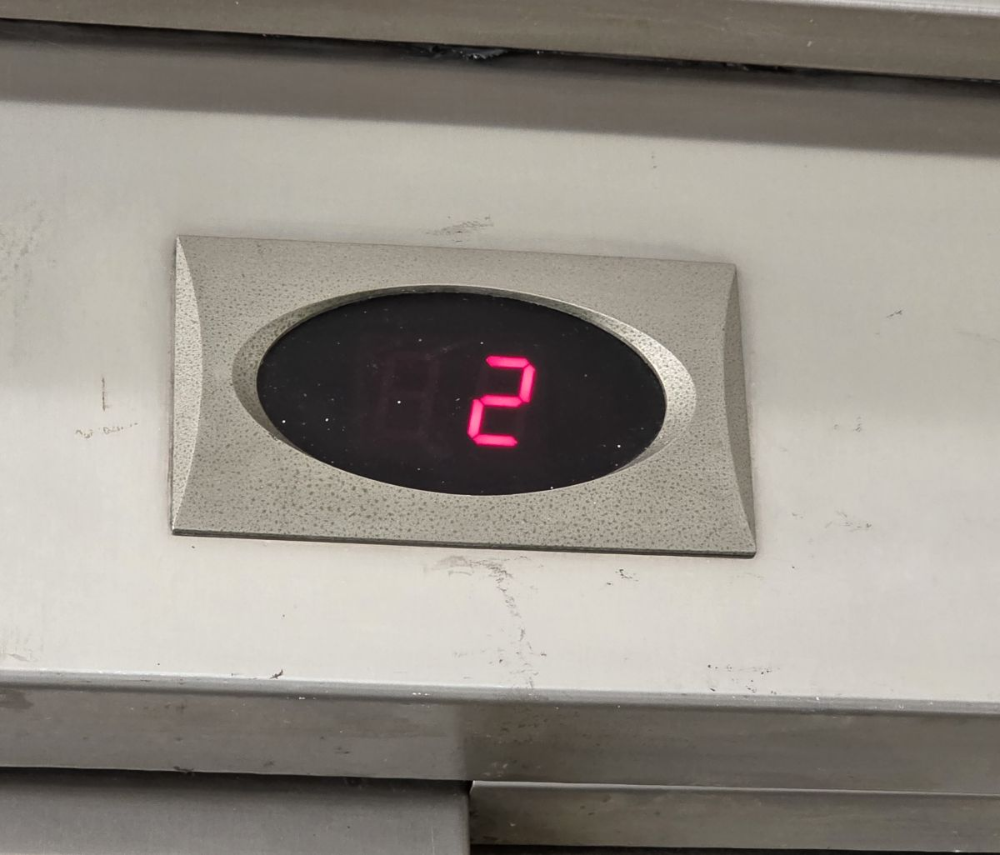 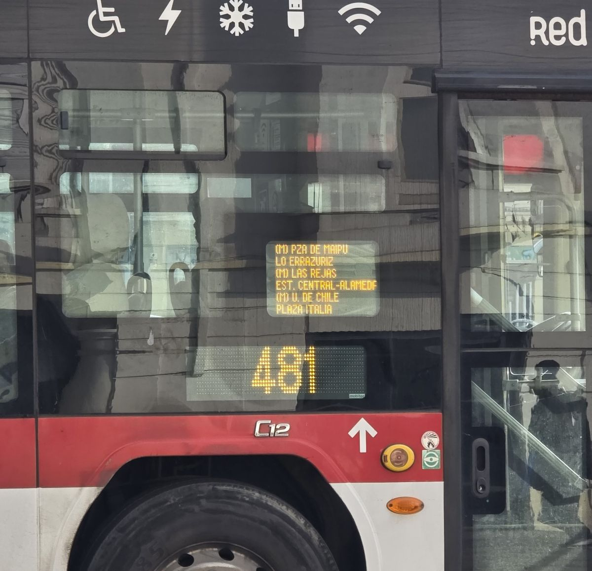

</br></br></br></br></br></br></br></br></br></br></br></br></br></br></br></br></br></br>

### 3.- Indicador de paso y contador del semáforo &nbsp;&nbsp;&nbsp;&nbsp;&nbsp;&nbsp;&nbsp;&nbsp;&nbsp;&nbsp;&nbsp; 4.- Contador del microondas de mi casa 
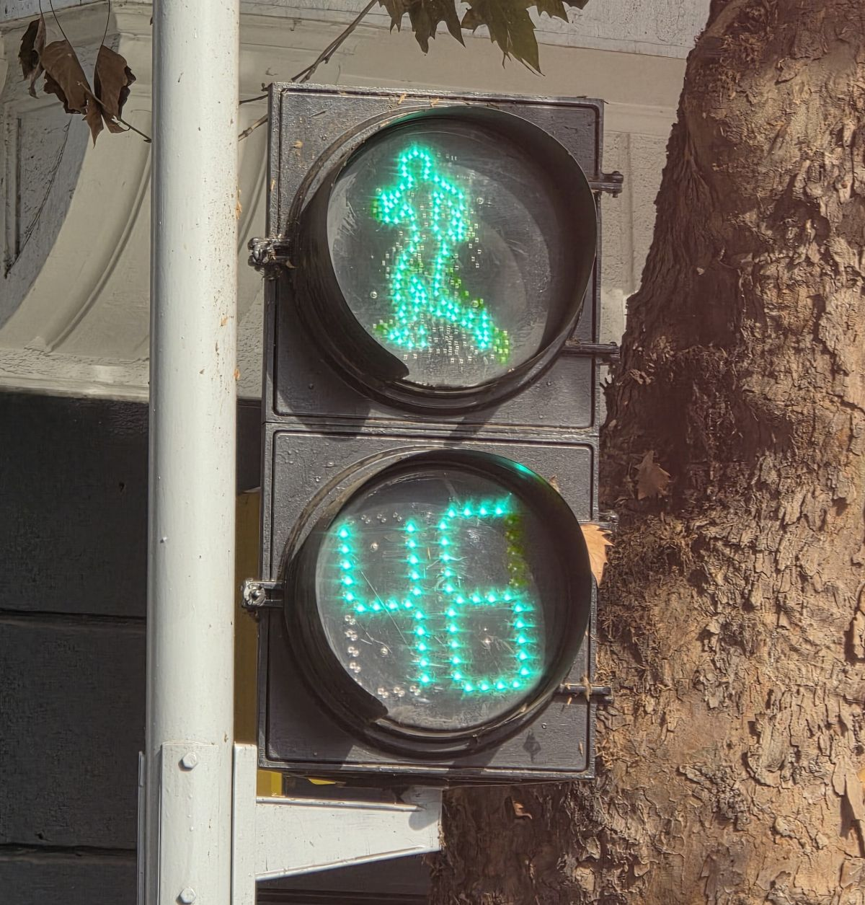 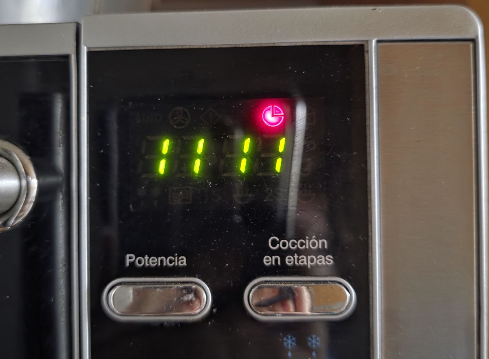

</br></br></br></br></br></br></br></br></br></br></br></br></br></br></br></br></br></br>

### 5.- Pantalla de la lavadora de mi casa &nbsp;&nbsp;&nbsp;&nbsp;&nbsp;&nbsp;&nbsp;&nbsp;&nbsp;&nbsp;&nbsp;&nbsp;&nbsp;&nbsp;&nbsp;&nbsp;&nbsp;&nbsp;&nbsp;&nbsp;&nbsp;&nbsp;&nbsp;&nbsp;&nbsp;&nbsp;&nbsp;&nbsp;&nbsp;&nbsp;&nbsp;&nbsp;&nbsp;&nbsp;&nbsp;&nbsp;&nbsp;&nbsp;&nbsp;&nbsp;&nbsp; 6.- Pantalla de reloj despertador de mi papá 
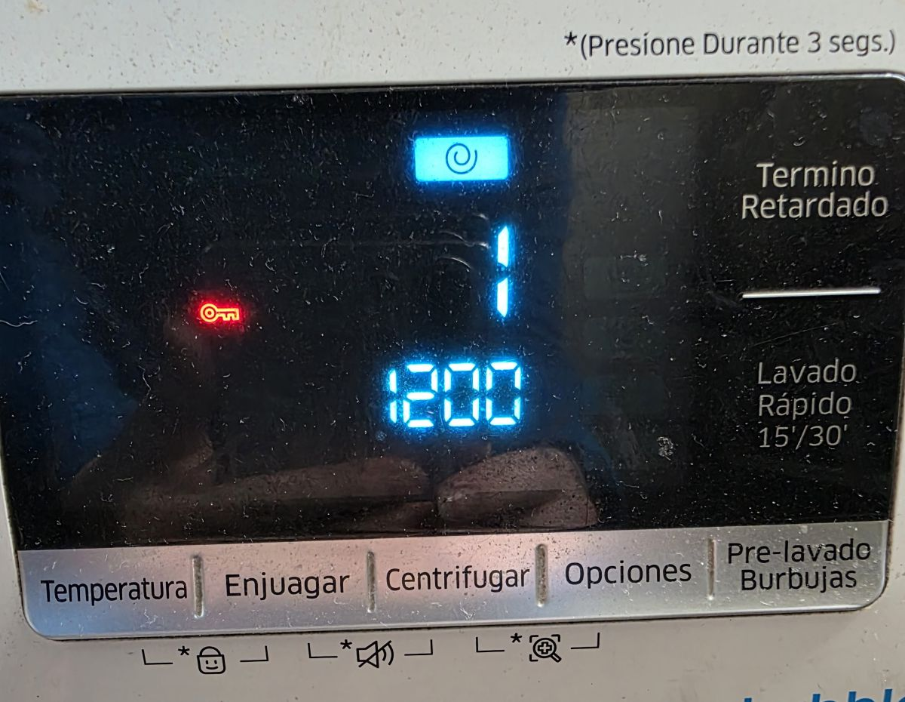 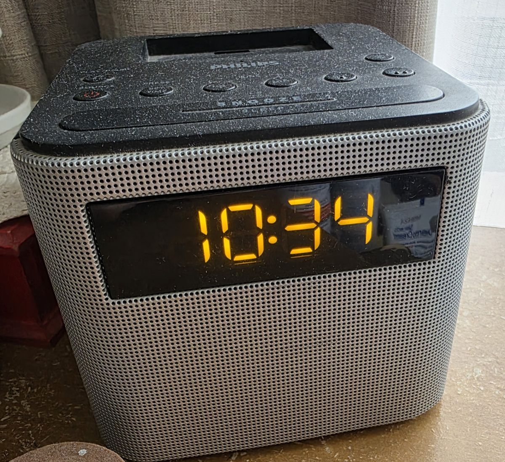

</br></br></br></br></br></br></br></br></br></br></br></br></br></br></br></br></br>

### 7.- Pantalla de reloj digital de mi casa &nbsp;&nbsp;&nbsp;&nbsp;&nbsp;&nbsp;&nbsp;&nbsp;&nbsp;&nbsp;&nbsp;&nbsp;&nbsp;&nbsp;&nbsp;&nbsp;&nbsp;&nbsp;&nbsp;&nbsp;&nbsp;&nbsp;&nbsp;&nbsp;&nbsp;&nbsp;&nbsp;&nbsp;&nbsp; 8.- Pantalla que muestra la temperatura de mi cautín 
 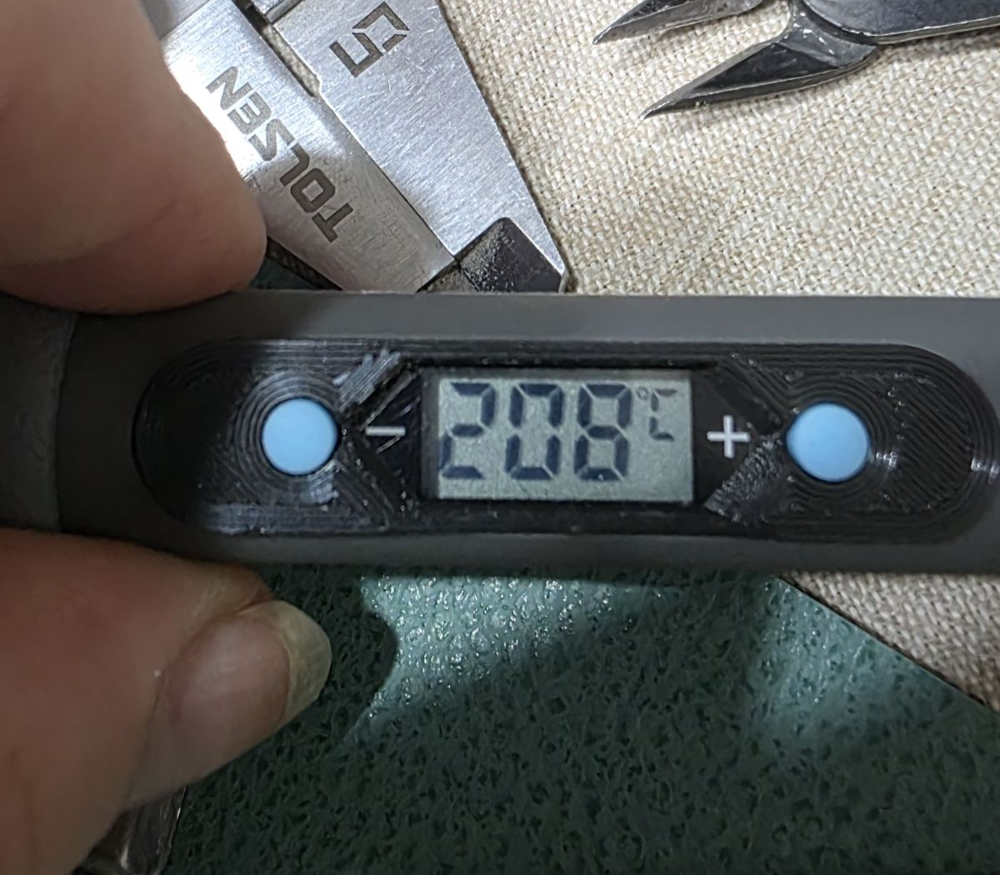

</br></br></br></br></br></br></br></br></br></br></br></br></br></br></br></br></br></br></br>

-----------------------------------------------------------------------------------------------------------
## Encargo 21 <!-- simular circuitos que hemos visto en clases con chips 555 y/o circuitos comparadores usando el simulador de Falstad disponible en -->
### Simulación de circuitos en [Falstad](https://www.falstad.com/circuit/)
Comparador + divisor de voltaje:
``` 
$ 1 0.000005 10.20027730826997 66 5 43 5e-11
r 224 224 288 224 0 1000
162 288 224 320 224 2 default-led 1 0 0 0.01
g 320 224 320 256 0 0
R 0 192 0 112 0 0 40 9 0 0 0.5
403 48 80 176 144 0 0_64_0_4099_0.0000762939453125_0.00009765625_-1_2_0_3
a 112 224 208 224 9 9 0 1000000 4.945500000000001 3.3533291106226013 100000
174 0 288 80 192 1 100000 0.5495000000000001 potenciometro umbral
g 0 288 0 304 0 0
w 80 240 112 240 0
374 208 160 112 160 0 0.8317000000000001 LDR
R 592 128 592 48 0 0 40 9 0 0 0.5
R 208 160 208 112 0 0 40 9 0 0 0.5
r 112 160 48 160 0 10000
w 112 208 112 160 0
g 48 160 48 192 0 0
w 208 224 224 224 0
403 16 256 144 320 0 8_64_0_4099_5_0.00009765625_-1_2_8_3
403 192 240 320 304 0 15_64_0_4099_0.00030517578125_0.00009765625_-1_2_15_3
403 160 256 288 320 0 13_64_0_4099_10_0.00009765625_-1_2_13_3
o 8 64 0 4099 10 0.00009765625 0 6 8 3 13 0 13 3 15 0 15 3
```

