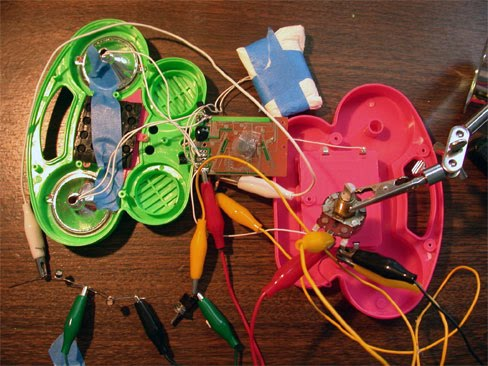
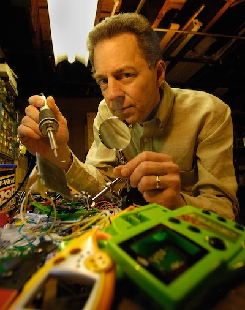
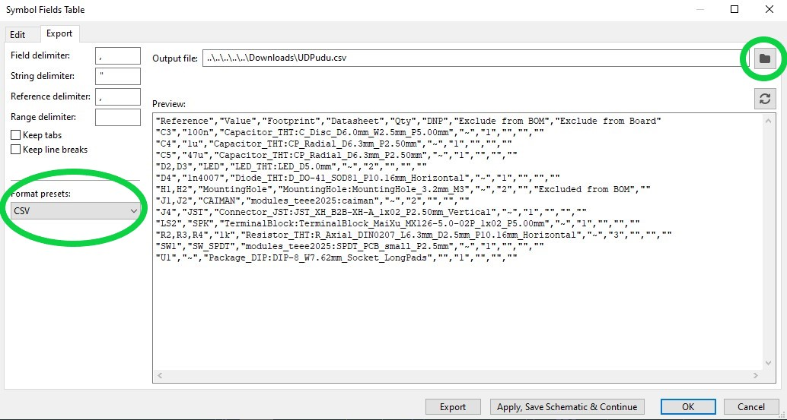
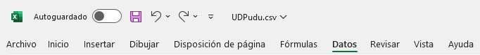
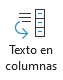
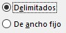
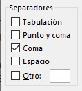
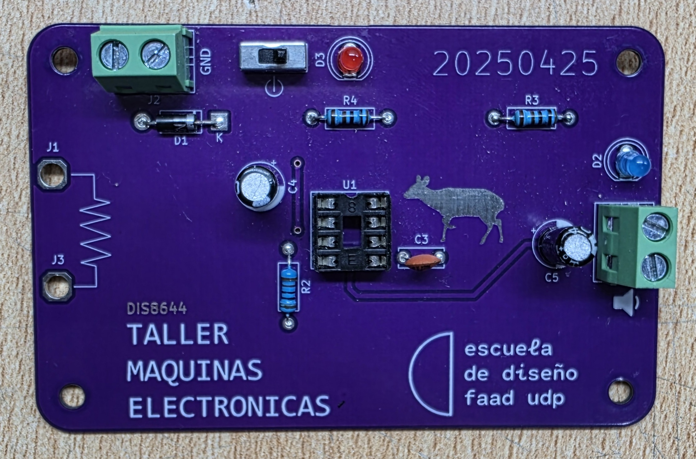

# sesion-10b

## Apuntes
###### ${\color{#3d3d44}Se \ recomienda \ usar \ modo \ oscuro, \ hay \ palabras \ en \ color \ blanco \ que \ de \ otra \ forma \ no \ son \ visibles.}$ <br/>
###### ${\color{#3d3d44}The \ use \ of \ dark mode \ is \ recommended, \ there's \ white \ colored \ text \ that \ otherwise \ is \ not \ visible.}$ <br/>

### Chromium OS
</br></br> Código open souce en baase a linux desarrollado por Google. Múltiples buscadores utilizan chromium como base, como Google Chrome, Microsoft Edge, Opera GX, Samsung Internet, etc. </br></br></br></br></br>

>### Firefox
> </br></br></br> Desarrollado por la fundación Mozilla, Firefox es un buscador open source que a diferencia de los mencionados anteriormente, no utiliza Chromium como base.</br></br></br></br>

### [Dead internet theory](https://youtu.be/apKw94iLaxc?si=ScbgQItfSVD5oG-y)
Es una teoría que dice que en la actualidad o en el futuro, la mayoría de todo el tráfico y contenido en internet será hecho por bots y AIs, reemplazando a los seres humanos como los usuarios y quienes guian tendencias y discuciones en línea. </br>
Aunque parece que dentro de poco dejará de ser una teoría, ya que Meta anunció sus planes de inundar Facebook e Instagram con usuarios hechos con Inteligencia Artificial (AI).

### [Circuit bending](https://youtu.be/kJfTdD_5XyE?si=9yY0Lwey7DgLPbjp)
</br></br></br></br></br> Consiste en modificar los circuitos de objetos baratos para alterar su funcionamiento y "ver que pasa" al conectar distintos componentes. Se suele hacer con juguetes electrónicos para niños, por su precio, fácil acceso a distintos componentes del circuito, forma interesante del objeto e inputs y outputs llamativos.</br></br></br></br></br>

>### Nic Collins
></br> Compositor, artista performático y educador, reconocido por sus obras donde hace hardware hacking (similar a circuit bending, pero más avanzado) y circuit bending.Autor del libro "Handmade electronic music: The art of hardware hacking"</br></br></br></br></br></br></br></br></br></br></br>

### Kicad BOM
Para pasar el BOM (Bill Of Materials) de Kicad a Excel hay que seguir los siguientes pasos: </br>
</br> 1.- En el editor esquemático seleccionar BOM.</br> Es importante tener seleccionadas las footprints correcpondientes a cada componente.</br></br>

</br></br></br></br> 2.- Revisar que esté seleccionado el formato CSV (Comma Separated Values), luego seleccionar la ubicación donde se exportará el BOM y seleccionar OK.</br></br></br></br></br></br></br>

 3.- Abrir el documento exportado con Microsoft Excel (Se puede abrir haciendo doble click).</br></br> Una vez dentro de Excel seleccionar la columna A y la pestaña "Datos", sobre la barra de herramientas.</br>

</br></br> Dentro de la pestaña "Datos" seleccionar la opción Texto en columnas. </br></br>

</br> En la ventana que se abrió seleccionar la opción "Delimitados", en caso que no esté pre-seleccionada, y apretar siguiente.</br>

</br></br></br> En el recuadro "Separadores" seleccionar la opción "Coma" y deseleccionar otras opciones, luego apretar siguiente y finalizar.</br></br></br></br>


### Other things: <!-- Things to organize + random stuff -->
> ### CSV
> Formato utilizado para almacenar tablas de datos.
> Ej: El siguiento texto (CSV) al convertirlo en una tabla quedaría así:
>````
> Taller, Máquinas, Electrónicas
> Electrónes, Electrónes, Electrónes
>````
> |Taller |Máquinas |Electrónicas |
> |--|--|--|
> |Electrónes |Electrónes |Electrónes |
>
>
> ### CSS (Cascading Style Sheets)
> Es un lenguaje que define la visuallización de elemntos HTML, definiendo colores, escala, posiciones, etc.
>
-----------------------------------------------------------------------------------------------------------
## Encargo 22 y 23 <!-- 22: escribir manual con pasos a seguir, receta, de los pasos que siguieron para ensamblar la PCB. incluir aciertos y errores, aprendizajes y consejos. 23: complementar encargo 22 con fotos explicativas de los materiales usados, de los pasos, etc.-->
### Manual de ensamble udpudu
### Paso 1: </br>
Separar los componentes a utilizar según el BOM de udpudu y testearlos individualmente con el multímetro para verificar que funcionen según esperado y polaridad. </br>
 
|Referencia  |Valor   |Huella                   |Qty|OBS               | 
|------------|--------|-------------------------|---|------------------|
|U1          |~       |Socket 8 pines           |1  |                  |
|R2,R3,R4    |1k      |Resistencias             |3  |                  |
|D1          |1n4007  |Diodo                    |1  |                  |
|C3          |100n    |Condensador cerámico     |1  |104               |
|C4          |1u      |Condensador electrolítico|1  |                  |
|C5          |47u     |Condensador electrolítico|1  |                  |
|D2,D3       |LED     |Led 5mm                  |2  |                  |
|J2          |TBLOCK_2|Terminal Block 2         |1  |                  |
|LS1         |SPK     |Terminal Block 2         |1  |                  |
|SW1         |SW_SPDT |Switch spdt              |1  |                  |
|U1          |NE555   |DIP-8                    |1  |Va en el socket U1|
|Clip batería|9v      |                         |1  |                  |
|Parlante    |8ohm    |                         |1  |                  |
|J1,J3       |CAIMAN  |Cables caimán            |2  |                  |

### Paso 2: <!-- socket --> </br>
Colocar el socket del 555 (U1), doblando los pines de los extremos opuestos (1 & 5 y/o 4 & 8), para que se sujete a la PCB (Printed Circuit Board). Después hicimos lo mismo con las recistencias (R2, R3 y R4) y el diodo (D1)

  </br></br></br></br></br></br></br></br></br></br></br></br></br></br></br></br></br></br></br></br></br></br></br></br>

### Paso 3: <!-- soldando --> </br> 
Soldar los componentes anteriores. Para tener mayor estabilidad utilizaamos 2 trozos de madera para apoyar la PCB, manteniendola nivelada. Y para mayor control sobre la cantidad de estaño siendo depositado, me puse un guante para aislar mi mano del calor y poder tomarlo desde más cerca.

 </br></br></br></br></br></br></br></br></br></br></br></br></br>

### Paso 4: <!-- flush cutter --> </br> 
Cortar el material sobrante de las patas de cada componente, teniendo cuidado de sujetarlos al momento de corlarlos con el *flush cutter*, ya que pueden salir volando y causar considerable daño en caso de enterrarse en un ojo.

</br></br></br></br></br></br></br></br></br></br></br></br></br>

### Paso 5: <!-- assembly line --> </br> 
Repetir los pasos anteriores con el resto de componentes del BOM. </br> Para este punto ya habíamos formado una linea de ensamblaje, donde yo iba soldando las placas (con la asistencia de @brauliofigueroa2001 iluminando el área de trabajo), mientras @duckusu cortaba las patas de los compentes ya soldados y @jotamorales-romulus colocaba los componentes por soldar  

</br></br></br></br></br></br></br></br></br></br></br></br></br>

### Paso 6: </br> 
La semana siguiente (sesión 11b) terminamos de soldar los componentes faltantes (spdt y terminal blocks) empleando mis *helping hands* en lugar de los trozos de madera y usando *masking tape* para sujetar los terminal blocks, ya que sus pines/patas eran muy gruesas y cortas como para doblarlas.

