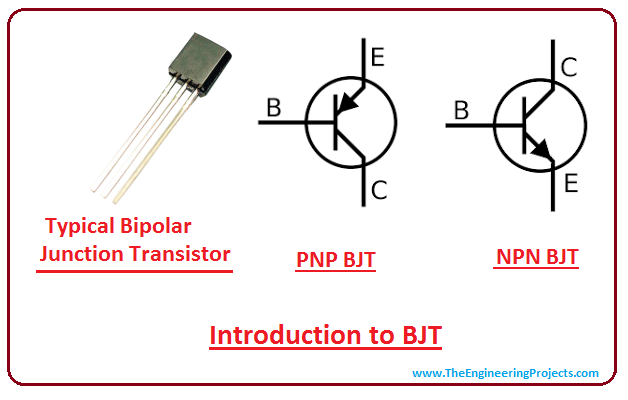
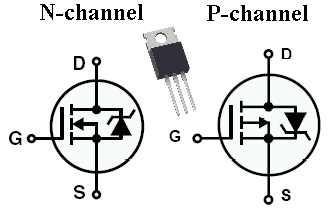
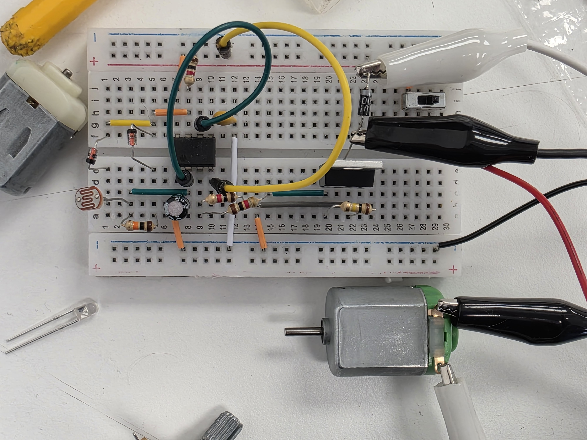
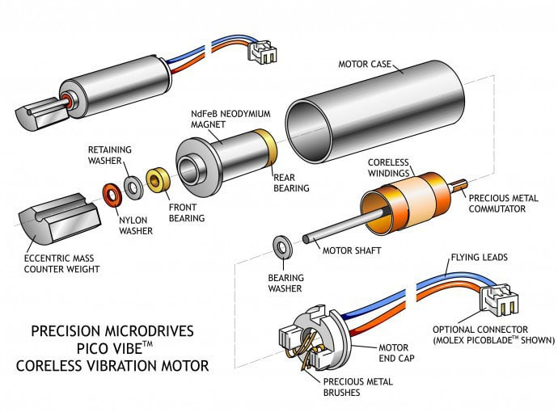

# sesion-11a

## Apuntes

### Object Oriented Programming (OOP)
Se emplean "clases" y "objetos" al programar, para atribuir ciertas propiedades a los elementos pertenecientes a una determinada "clase" u "objeto".
Es decir, en lugar de definir que X elemento tiene Y características, por cada elemento que tengamos. Solo tendríamos que definir las características y seleccionar los elementos que las poseen. 

### Recapitulando:
> ### Componentes
> | Componente | Ejemplos | Referencia |
> |:----------:|:--------:|:----------:|
> | Resistencias de distintos tipos | Resistencia, potenciómetro, LDR, etc. | R |
> | Capacitores/Condensadores | Capacitores electrolíticos, cerámicos, poliéster, etc. | C |
> | Diodos de distintos tipos | Diodo, LED, Zener, Schottky, Germanio, etc. | D |
> | Circuitos integrados U | NE555P, PAM8403, LM324, CD4017, etc. | U |
> | Transistores | MOSFET y BJT (NPN y PNP) | Q |
> | Relay | Electromecánico, estado sólido, etc. | K |
> | Fuentes de poder | Baterías, power supplies, puerto USB, panel solar, etc. | Vcc, +9V etc.|
> | Protoboards | Breadboard y Perfboard | n/a |
> | PCBs | 2 capas, 4 capas, etc. Fr4, aluminio, rogers, etc. | n/a |
>
> ### Circuitos
> PWM, astable, monostable, bistable
>
> ### Aplicaciones
> Atari Punk Console (APC)
> Regular brillo LED (PWM)
> On/off ampolleta
> Sintetizador resistencia experimental (udpudu)

### [Transistores](https://youtu.be/OwS9aTE2Go4?si=TQAmymHZw24puJBD)
Componentes de 3 patas que funcionan como interruptores y/o amplificadores de señales. Dependiendo del input que reciva una de sus patas, se controla el paso de la corriente entre las otras 2.  

 :warning: <strong>Siempre revisar datasheet, el orden de las patas varía entre un transistor a otro</strong> :warning: 

> ### [BJT](https://youtu.be/J4oO7PT_nzQ?si=6vagG6-MUBwWrMin)
>       El flujo entre los pines __*Collector*__ y __*Emiter*__ es controlado por la corriente que reciva __*Base*__.        
>
> ### [MOS1](https://youtu.be/lyfx8CL7AkI?si=nxnBvYwK4QcfRnip)[FET2](https://youtu.be/AwRJsze_9m4?si=ggg4DjgZcoY8Zjya)
>       El flujo entre los pines __*Drain*__ y __*Source*__ es controlado por voltaje que reciva __*Gate*__.        

### Circuito PWM para controlar velocidad de un motor
Para poder controlar las rotaciones por minuto (velocidad) de un motor, usando el circuito PWM de la sesión 09b, hay que agregar un __MOSFET__, debido que el pin 3 del NE555P puede dejar salir un máximo de 200mA, lo cual no es suficiente para que funcione el motor DC, ya que este requiere 600mA para arrancar.
Por lo que utilizaremos el NE555 para controlar el MOSFET, que actuará como un switch que permitirá que circule, a traves del motor, la corriente directamente de la batería (switch que conecta el motor a GND).

 

El mosfet es controlado mediante un pulldown resistor, porque si __*Gate*__ no fuese conectada a GND, el MOSFET permanecería __*HIGH*__ (interruptor cerrado)   D4 se encarga de proteger el MOSFET del "golpe" de voltaje reverso producido por el motor al apagarse, esto ocurre porque el motor está tomando corriente mientras gira, luego le cortamos la corriente, pero sigue girando por inercia, por lo que se pone a producir corriente, causando que la terminal del motor que antes estaba conectada a GND ahora tenga un exceso de voltaje positivo, el cual es llevado al riel positivo por el diodo.

 

### Other things: <!-- Things to organize + random stuff -->
> ### Motor háptico (vibrador)
> Es un motor que rota un peso desbalanceado, lo que produce la vibración.
>                 
>
> ### Efecto Moiré
> Es un efecto visual que se genera al poner dos patrones regulares uno sobre el otro. Esta superposición produce un patrón nuevo.
> 
