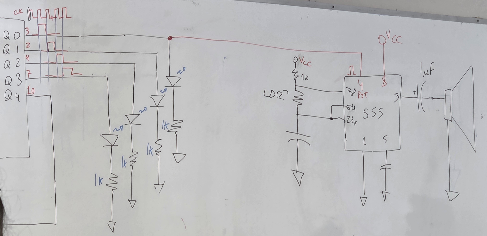

# sesion-11b

## Apuntes

### [CD4017](https://www.ti.com/lit/ds/symlink/cd4017b-mil.pdf?ts=1749282389151&ref_url=https%253A%252F%252Fwww.google.com%252F)
 Contador de décadas con 10 outputs decodificados (0 a 9) + el pin __Carry Out__, que emite una señal cuando el contador ha condado hasta 10, esto se usa en convinación con otros chips para contar más allá de 10. 
Sus inputs consisten de:
* __Clock__: El contador añade un número cuando la señal de Clock pasa a ser positiva (__*rising edge*__), lo cual significa que el conteo será más rápido si las pulsaciones en __Clock__ son más rápidas, o el conteo será mas lento si la frecuencia del input es más lenta.
* __Reset__: Si recibe una señal __HIGH__, entonces el contador volverá a contar desde 0 
* __Clock inhibit__: También llamado __Clock Enable__. Si recibe una señal __HIGH__, entonces el contadór no avanzará al siguiente número, hasta que la señal sea __LOW__, o en otras palabras, si __Clock Inhibit__ == 1 entonces el CD4017 ignorará cualquier input que __clock__ reciba, hasta que __Clock Inhibit__ == 0.

Su rango de voltaje operacional es de 3-18V

### Circuito
Armamos un NE555 en modo astable y lo conectamos al pin __Clock__ del CD4017

                 

                 

El CD4017 tiene su pin 13 (__Clock Inhibit__) conectado a tierra, a traves de una resistencia, esto hace que el chip reaccione ante los __inputs__ que recibe el pin 14 (__Clock__).

Hay 4 LEDs conectados a los __Outputs 0, 1, 2 y 3__ (pines 3, 2, 4 y 7 respectivamente). Para hacer que el contador después de activar el LED 4 no intente seguir activando los __Outputs__ restantes del chip (5 a 9), se conecta el __Output 4__ (pin 10) a __Reset__ (pin 15), haciendo que tras completar el ciclo vuelva a contar desde 0.

 

               

 Luego hicimos otro NE555 en modo astable y lo conectamos al __Output 0__ del circuito anterior. En lugar de utilizar __Trigger__ (pin 2) como __Input__, esta vez utilizamos __Reset__ (pin 4) siendo controlado por el pin 4 (__Reset__), lo que genera que __reset__ sea conectado a __GND__ cuando no está reciviendo un input del CD4017, haciendo que el pin 3 (__Output__) se mantenga en __LOW__, efectivamente deteniendo el funcionamiento del NE555.

 Video:   

### Other things: <!-- Things to organize + random stuff -->
> #### SUB_SUBTITULO

 
__**__
