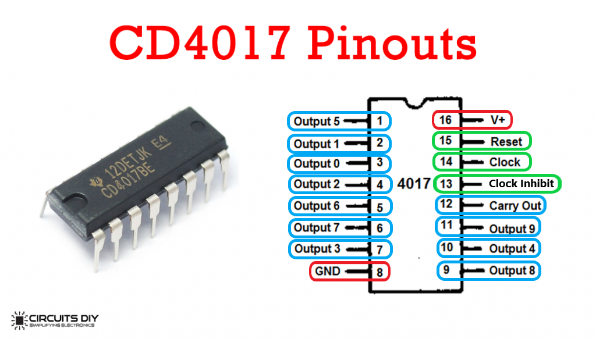
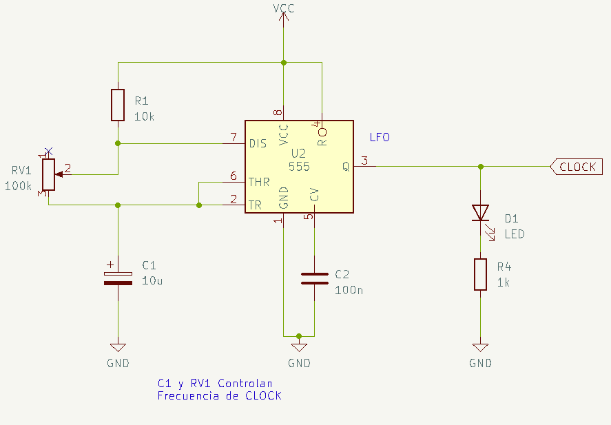

# sesion-11b

## Apuntes

### [CD4017](https://www.ti.com/lit/ds/symlink/cd4017b-mil.pdf?ts=1749282389151&ref_url=https%253A%252F%252Fwww.google.com%252F)

Fuente: <https://circuits-diy.com/wp-content/uploads/2020/02/cd4017-in-pinout-1024x583.png>, editada por FranUDOP

Contador de décadas con 10 outputs decodificados (0 a 9) + el pin __Carry Out__, que emite una señal cuando el contador ha condado hasta 10, esto se usa en convinación con otros chips para contar más allá de 10. 
Sus inputs consisten de:

* __Clock__: El contador añade un número cuando la señal de Clock pasa a ser positiva (__*rising edge*__), lo cual significa que el conteo será más rápido si las pulsaciones en __Clock__ son más rápidas, o el conteo será mas lento si la frecuencia del input es más lenta.
* __Reset__: Si recibe una señal __HIGH__, entonces el contador volverá a contar desde 0
* __Clock inhibit__: También llamado __Clock Enable__. Si recibe una señal __HIGH__, entonces el contadór no avanzará al siguiente número, hasta que la señal sea __LOW__, o en otras palabras, si __Clock Inhibit__ == 1 entonces el CD4017 ignorará cualquier input que __clock__ reciba, hasta que __Clock Inhibit__ == 0.

Su rango de voltaje operacional es de 3-18V

### Circuito

Armamos un NE555 en modo astable y lo conectamos al pin __Clock__ del CD4017

Fuente: <https://misaa.cc>

Fuente: <https://misaa.cc>

### Other things: <!-- Things to organize + random stuff -->
>
> #### SUB_SUBTITULO

-----------------------------------------------------------------------------------------------------------

## Encargo XX <!-- TEXT -->

-----------------------------------------------------------------------------------------------------------

## Encargo YY <!-- TEXT -->
