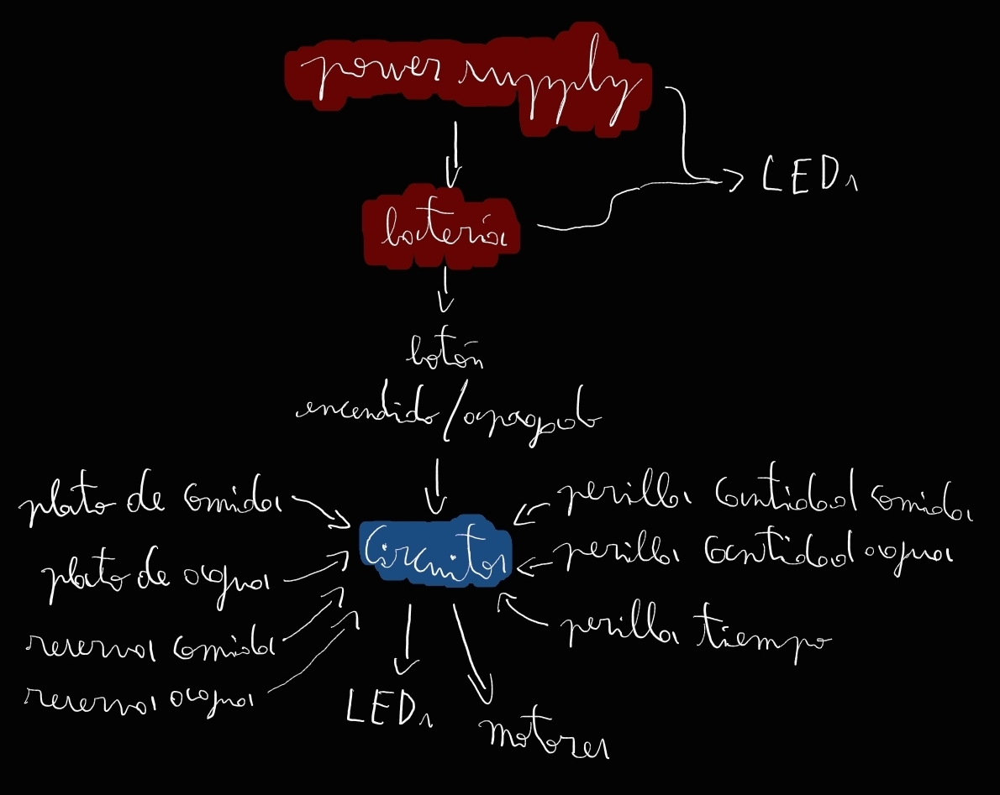
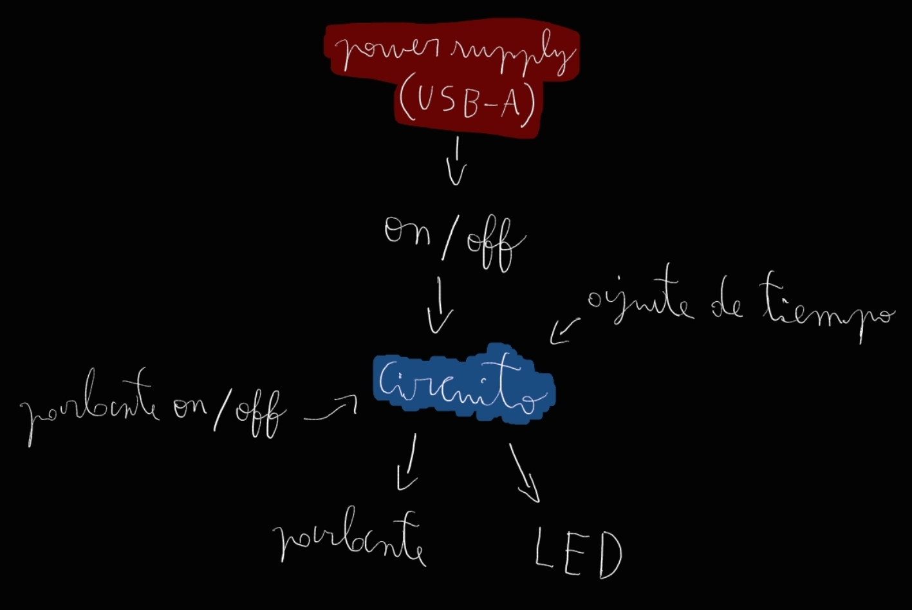
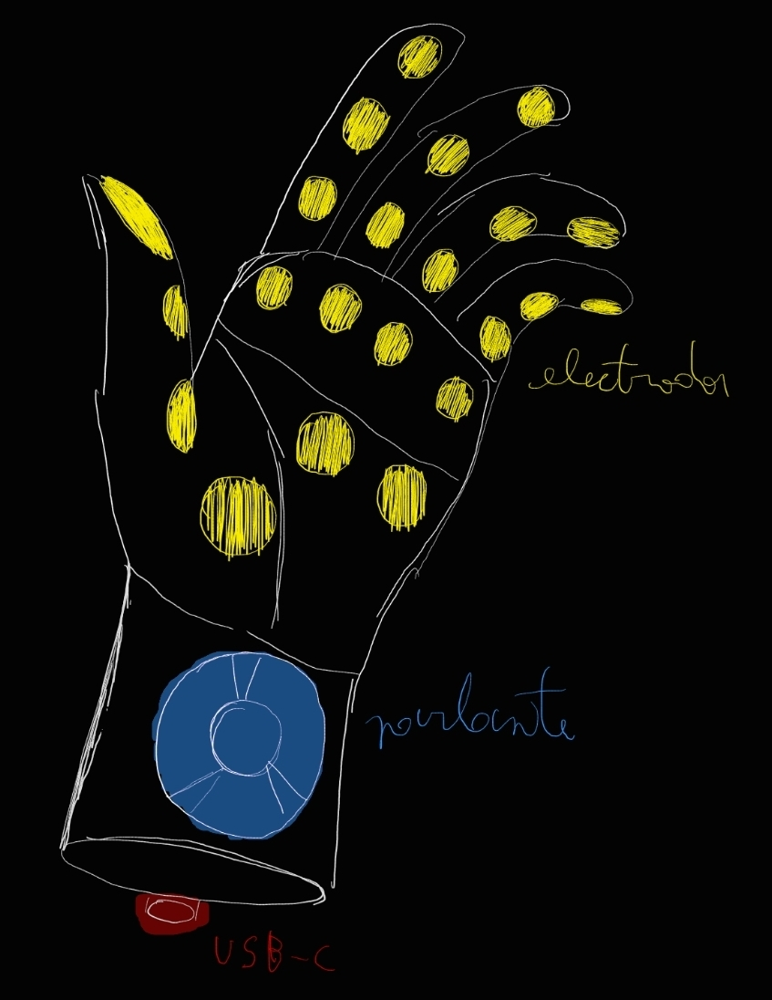

# sesion-12b

## Apuntes

### Web 1.0/2.0/3.0
> 1.0: *Read-Only*. En la primera versión de la World Wide Web (WWW), solo se podía acceder a información, mas uno no podía llegar y subir información, como se hace ahora. Y las páginas usaban un HTML básico.
>2.0: *Read-Write*. Esta versión se enfoca en el usuario, ya que es interactiva y permite compartir información fácilmente (redes sociales). El internet ya no es libre, las plataformas tienen dueños, restringen lo que se puede hacer en ellas y colectan venden nuestra información.
>3.0: *Read-Write-Own". La siguiente versión de la web (aunque en algunos aspectos es la actual), el concepto clave detrás de ella es la descentralización, mover el control fuera de las corporaciones y plataformas y de vuelta a las manos de los usuarios. Es inteligente y altamente interactiva debido a las tecnologías de Inteligencia Artificial (AI).

### RSS (Really Simple Syndication) feed
Sistema de suscripción (gratuito) donde un sitio web te envía periódicamente los nuevos posts, noticias, contenidos varios, etc.

### Web ring
Colección de sitios web de temática similar. Al final de cada página perteneciente a un ring hay un botón para moverse a la página "Siguiente" o a la "Previa". Si uno continúa avanzando a través de los distintos sitios, eventualmente regresaría donde comenzó, de ahí su nombre.

### MIDI (Musical Instrument Digital Interface)
Es un protocolo de comunicación que se usa para controlar dispositivos compatibles, enviando notas musicales (pulsos eléctricos, no sonoros)

### Fuentes de poder: Voltaje y corriente
Una fuente de poder (PS) no envía una cantidad delimitada de corriente, sino que el dispositivo a la que está conectada va a "chupar" la corriente que necesite para funcionar. Se lista el máximo amperaje que la PS puede dar.

Si el aparato necesita más corriente de la que PS le puede proveer, no funcionará (o no funcionará bien) y probablemente se dañará la fuente de poder.

Si el voltaje es mayor al voltaje máximo que necesita el dispositivo, este se puede quemar

Si el voltaje es menor, aparato funcionará mal, si es que funciona, y probablemente también se dañe.

### H-bridge
IC que se utiliza para controlar motores, consiste de 4 transistores (switches) que pueden variar la polaridad de las terminales del motor para hacerlo girar en una dirección o la otra.

### Bobinas y electroimanes
El magnestismo crea electricidad y la electricidad crea magnetismo. al pasar corriente por cables delgadosenrollados se produce una emición electromagnética.

### Solenoide
Similar a un parlante, en que recibe vibraciones y las convierte en información. También puede generar vibraciones dependiendo del input que reciba

### Piezoelectricidad
Un objeto emite electricidad al set deformado, aunque también puede recivir electricidad y deformarse en respuesta.

### LCD (Liquid Christal Dysplay)
Tecnología empleada en pantallas, donde una de estas pantallas está llena de diminutas "cortinas" que regulan el paso de la luz.

los cristales se cambian de forma dependiendo de la electricidad que recivan, gracias a esto se puede mezclar la luz RGB en estas pantallas.

## Encargo 24 y 25 <!-- Describir de forma textual 3 proyectos de máquinas electrónicas que quieran hacer de forma individual, ordenar por preferencia o interés de que sea desarrollado. Dibujar diagrama de comportamiento, flujos de interacción. No específicar chips. Considerar procesos de manera especulativa. ¿Cuánto tiempo se usará? ¿Qué encendidos y apagados tiene? ¿Cómo se interactúa? -->

### Descripción ideas

### 1.- Dispensador de comida automático

Mi perrita se la pasa sola en la casa durante la mayoría del día, debido a que estamos todos ocupados fuera, todos menos mi hermano (por ahora).
Previendo la posibilidad que él deje de poder reponerle el agua y la comida a causa de la universidad, pensé en un dispensador de agua y comida automático.

Este aparato se enchufará a la pared a través de una power supply de 5V USB-C y contará con una batería interna que asegurará que se mantendrá funcionando incluso durante cortes de luz.

El dispositivo tendrá un botón de encendido y apagado, además de una perilla para determinar la cantidad de comida, otra para la cantidad de agua dispensada y otra para seleccionar el tiempo de espera antes de reponer los alimentos.

El dispensador detectará cuando le hayan acabado el agua (agua como switch) y la comida (LDR al fondo del plato), en caso de que los platos estén vacíos, el dispositivo comenzará a contar hasta que se cumpla el delay establecido antes de liberar la cantidad especificada de alimento. Este delay se debe a que si no se regula la frecuencia y las porciones que inhieren las mascotas, la salud de estas se verá afectada.

Si el dispensador está recibiendo energía del power supply mantendrá encendida un LED azul, en caso de estar funcionando en energía de emergencia este LED parpadeará; mientras la batería se esté cargando, brillará un LED rojo; Si los tanques de agua y comida de reserva están cerca de vaciarse, el dispositivo avisará parpadeando el LED rojo.

### 2.- Pomodoro sonoro

A quienes tenemos TDAH (ADHD) nos puede llegar a costar muchísimo sentarnos a trabajar sin inmediatamente distraernos o comenzar a soñar despiertos.

Una solución usualmente recomendada para este dilema es la técnica del pomodoro (tomate en italiano) que consiste en estudiar por aproximadamente 25 minutos con pequeños breaks entre medio, sin embargo, sin embargo, dependiendo de la capacidad de mantenerse consciente de cada uno, es posible que uno se "vuele" sin saberlo incluso empleando esta técnica.

El dispositivo recibirá energía a través de un puerto USB-A (5V).

EL aparato contará con una palanca de encendido y apagado, un botón para seleccionar si funciona o no el parlante y una perilla para variar la duración de los períodos de estudio y descanso (no son valores independientes).

Una vez el pomodoro es encendido, este comenzará a emitir un sonido (pulso) cada aproximadamente 10 segundos, esto es para que el usuario pueda mantenerse al tanto del paso del tiempo sin tener que ver un reloj, mientras esto está pasando, un LED irá brillando con una intensidad cada vez mayor, hasta que se cumpla el tiempo de estudio.

Una vez comience el período de descanso, el LED comenzará a atenuarse hasta apagarse, momento en el cual comenzará otro ciclo estudio-descanso.

### 3.- Guante sintetizador

Se me ocurrió la idea de un instrumento que emita distintos sonidos dependiendo del gesto que se haga con la mano, esto se lograría teniendo los inputs de distintos elementos sonoros en la yema de los dedos (zona metalizada) y distintos valores experimentales ubicados en las falanges y otras zonas de la mano (en caso de que este método no sea viable, se pueden usar pequeños botones de TPU esparcidos por la superficie del guante).
En otras palabras, dependiendo de que parte de la mano (incluyendo otros dedos) toques con cada dedo variará la frecuencia, el tono, la nota siendo tocada, el volumen, etc.

Este aparato funcionaría con un una batería recargable mediante USB-c.

