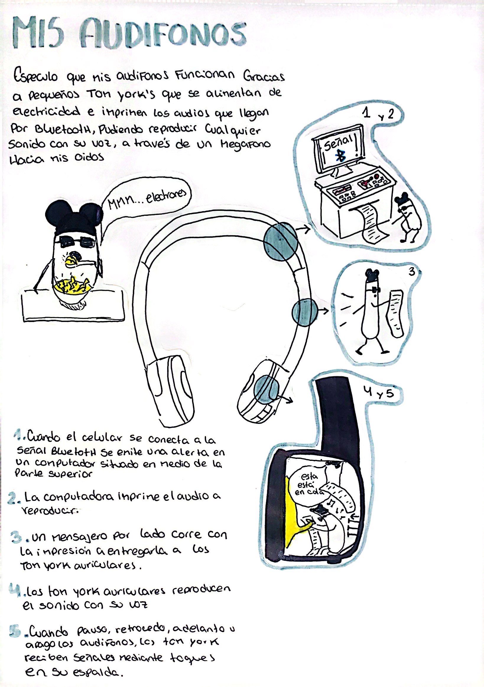

# sesion-01a

11 de marzo de 2025

## Encargos

1. Escuchar un disco de Kraftwerk
2. Ver pelicula "Barrio universitario" 2023
3. Mi caja negra y yo, en este encargo debemos especular acerca del funcionamiento de un objeto afectivo, imaginando su funcionamiento interno y representarlo mediante diagramas, dibujos, etc.

Debemos comprender que siempre será mas importante el concepto que la tecnología.

Durante la clase conocimos distintas maneras de hacer sonidos mediante elementos electronicos.

### Referentes de la clase

* Oficina de sonido <https://www.instagram.com/oficina_de_sonido/>

* Corazón de robota <https://www.instagram.com/corazonderobota/>

* Bastl instruments <https://bastl-instruments.com/>

* Critter and Guitari <https://www.critterandguitari.com/>

### encargo-01: caja negra

