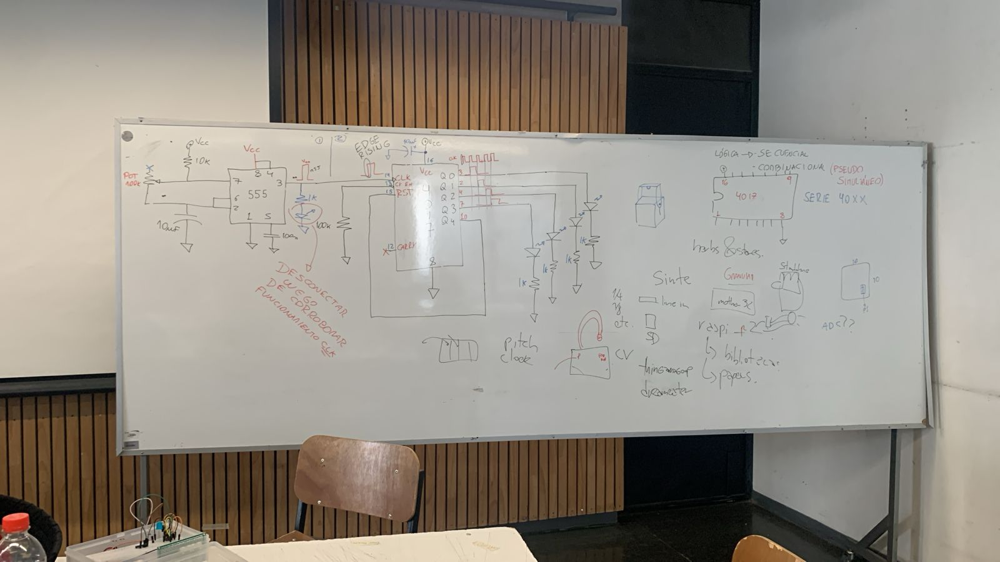

# sesion-11b

23 de mayo de 2025

## 555 usado como timer conectado a un 4017 para usar 4 salidas

Un chip 4017 tiene 16 pines, de los cueles 10 son de output

## Resultado

Aprenderemos a modularizar, o sea hacer un diagrama de flujo de las acciones e interacciones dentro de nuestro circuito.

vamos a conectar el circuito que hicimos hoy al PWM.

Si desconectamos el pin 4 del positivo el 555 no funcionará, porque este pin espera un voltaje positivo y podemos hacer que este funcione según otro lo permita

## Resultado

Al hacer el circuito es dificil posicionar los componentes, ya que la protoboard que se utilizó era muy pequeña, en la primera version se usó un potenciometro.

En el proceso presenciamos la muerte de un potenciometro, se quemo debido a que uno de sus pins estaba incorrectamente conectado a VCC :(, salio mucho humo.

Luego usamos un LDR como resistencia variable

Por último misa nos ayudó a conectar el circuito al pwm y conseguimos un sonido muy loco.

