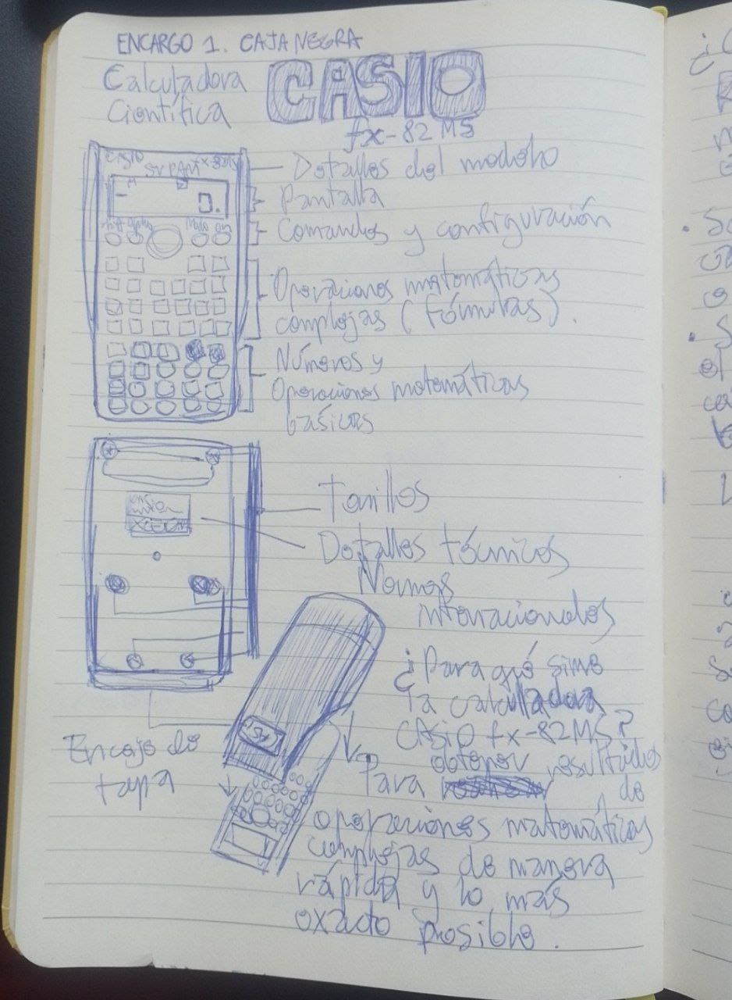
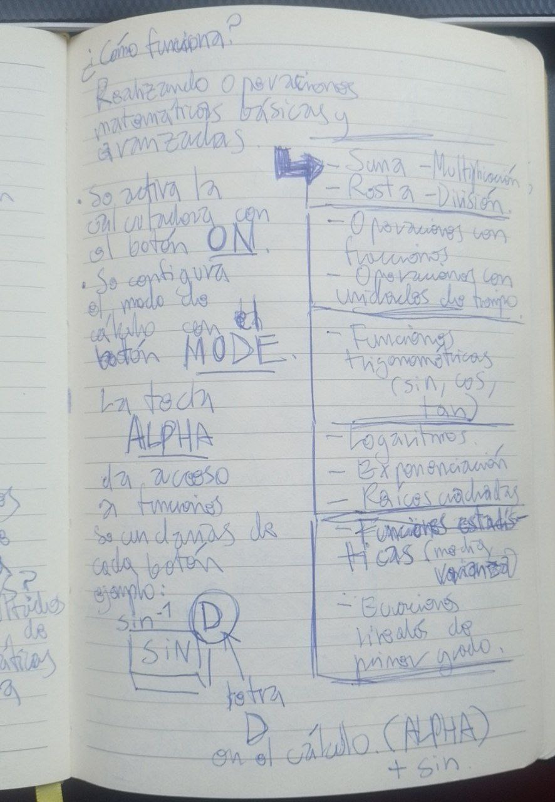
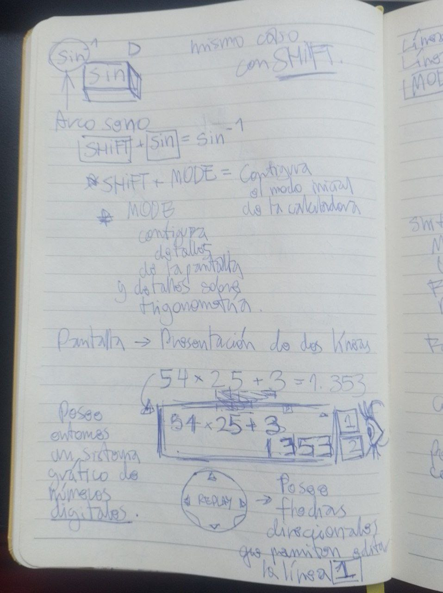
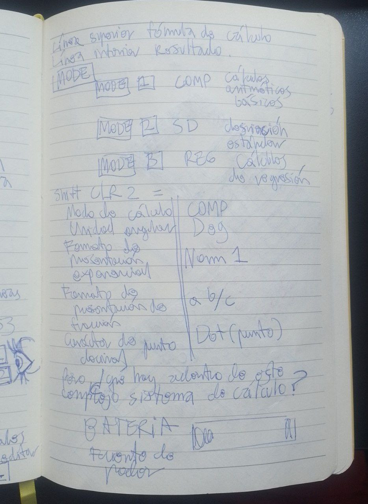
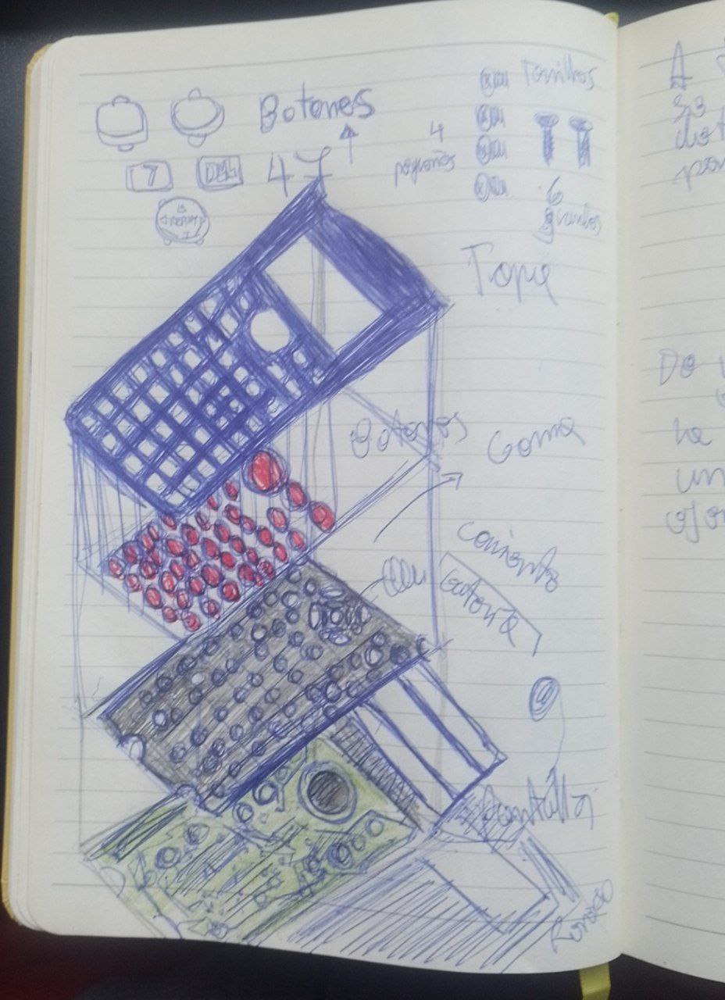
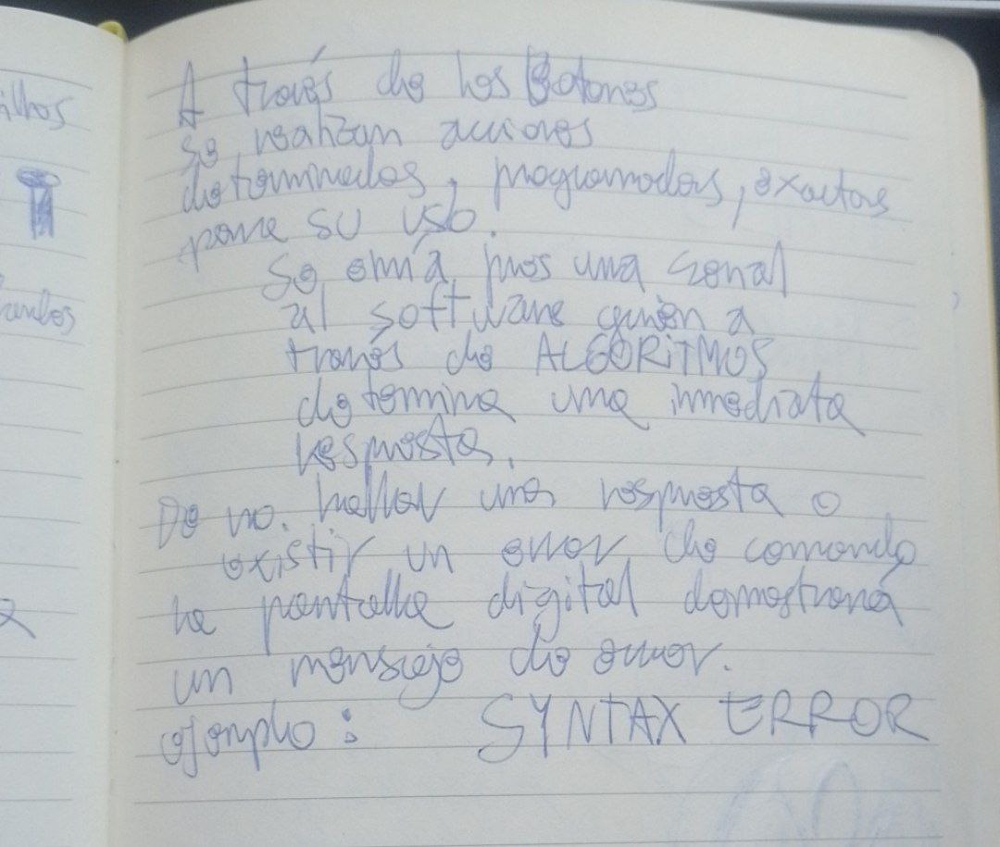

# sesion-01a

Apuntes Martes 11 de marzo de 2025

Tema: Presentación de Equipo, Explicación de Encargo 1

## Conceptos y palabras clave a investigar

* Arduino: Plataforma de __hardware__ y software libre para crear objetos electrónicos interactivos.
* Tecnologías interactivas: Reconocimiento de gestos, multimedia, 3D, realidad virtual, trabajo de apoyo computarizado, soporte y lenguaje natural.
* Experiencias de usuario (UX): __User Experience__: "experiencia de usuario". La manera en que una persona percibe, siente o interactúa con un producto, servicio o plataforma.
* Fibra de carbono: Fibra sintética que se compone de filamentos de 5 a 10 micrómetros de diámetro. Poseen resistencia y propiedades mecánicas. Un excelente conductor de electricidad.
* Máquina: Artificio combinado que recibe formas de energía y las transforma en otras más adecuadas, o para producir un efecto determinado.
* Videojuego: Juego electrónico que se visualiza en una pantalla.
* __Javascript__: Lenguaje de programación, se utiliza para crear páginas web.
* Interfaz (UI): Interfaz de usuario, punto de contacto entre el usuario y la computadora.
* Soldar al arco: Proceso de fusión para unir metales, se raya y se golpea.
* Soldadura electronica: Proceso en el que se unen piezas de metal generalmente de cobre o hierro mediante estaño con fines electrónicos.
* __Python__: Lenguaje de programación que se utiliza para el desarrollo de software.
* __Pure data__: Lenguaje de programación visual desarrolado por Miller Puckette para la creación de música por odernador.
* __Circuitpython__: Derivado de código abierto del lenguaje de programación __Micropython__ dirigido a estudiantes y principiantes.
* __ESP32__: Familia de chips SoC (__System on Chip__) de bajo costo y consumo de energía, posee __Wi-Fi__ y __Bluetooth__.
* SoC: Circuito integrado que contiene todos los componentes de un sistema electrónico en un solo chip.
* __UNITY__: Motor de videojuegos multiplataforma, software de rutinas de programación que permite el diseño, reación y funcionamiento de un entorno interactivo.
* Tutupá __drum machine__: __Drum machine__ mecánica, trasciende del __sample__ convencional.
* Licencia __copyright/copyleft__: Conceptos de derechos de propiedad intelectual que se diferencian: el __copyright__ restringe y protege al autor, el __copyleft__ permite la modificación y distribución.
* Open source: Modelo de desarrollo de software que permite que el código fuente de un programa sea accesible para quien lo use, modifique y que permite que lo comparta con cualquier persona.

## encargo-01: Mi caja negra y yo

Elegir un objeto con el que se tenga relación.

Plantearse preguntas como ¿Qué pasa en el __input__ y el __output__?, realizar diagramas eléctricos, explicar distintas funciones a través de dibujos y textos.

## encargo-00: reflexión sobre Kraftwerk y Barrio Universitario

### Kraftwerk

Mi primera impresión al escuchar "The robots" en youtube, fue interés debido a la utilización de notas producidas a través de objetos electrónicos. Me dediqué a seleccionar un álbum del grupo y descubrí "Trans-Europe Express" (1977), el cuál es un punto de referencia clave para analizar el impacto y estilo del grupo. Pioneros del toque synth-pop, techno y electrónico al mismo tiempo, algo totalmente inspirador para las siguientes generaciones musicales. La presencia de sintetizadores, cajas de ritmos y vocoders.  La idea de movimiento y conexión, inspirados en la red ferroviaria europea explican la situación de modernidad y unidad que se anhelaba en ese momento del siglo XX. La música que parece alejada del presente (hacia el futuro) que concuerda con emociones, quizás, propias de la de música ambient es lo que los mantiene relevantes y se ganen el reconocimiento de su influencia en la historia musical, pues uno no termina de asimilar la electrónica con el instrumento musical, es algo impresionante. En mi percepción considero que la instrumentalización de los circuitos electrónicos otorga asombro porque uno no termina de comprender el cómo estas máquinas creadas por el ser humano sean capaces de mantener un ritmo virtuoso. Ciertamente recomendado.

### Barrio Universitario. Fabrizio Copano (2013)

Tras visualizar esta película donde participan varios miembros del elenco del Club de la Comedia, puedo presenciar un archivo que contiene un momento histórico: la generación "millennial" que se crió con el humor que se venía desarrollando en la época de los gobiernos concertacionistas, sin duda, tener reminiscencias de los roles de Sergio Freire, Fabrizio Copano o el "guatón" Salinas me divierte, incluso también añadir a Felipe Avello e Ítalo Passalacqua (que recuerdan también a SQP), es un factor nostalgia de cómo era CHV en su momento. Las referencias a la cultura chilena y el estilo coloquial y directo, hace que la película sea divertida, pero, sin embargo, posee algo de exageración. Ofrece pues, una mirada fresca de la vida universitaria en Chile a inicios del siglo XXI, estilos y formas de actuar y pensar que se replican quizás no de manera tan notoria pero al menos generacionalmente de otras formas, sobre todo con los grupos urbanos y las clases sociales. Más aún en la rivalidad que existía en la creación de los robots en el proyecto universitario y el cortejo de pareja de entre los personajes. Considero que posee un humor absurdo y divertido por y para chilenos, pero se queda ahí.

Me divierte las actuaciones y los gags, pero no creo que yo sea acérrimo defensor de que sea una película excelente, es algo para pasar el rato.

## encargo-01: mi caja negra y yo (entrega)

Calculadora Científica CASIO modelo fx-82MS

### ¿Por qué elegí este objeto electrónico?

Elegí la calculadora científica porque considero que en el colegio, en la enseñanza media más exactamente, era una herramienta capaz de salvar las almas que peligraban las materias que contenían cálculos, mayormente, a quienes elegían los electivos Humanistas (yo siendo parte de dichos indivuduos).

Quizá a día de hoy no pueda todavía comprender todas las funcionalidades de cada botón pues las matemáticas nunca han sido mi fuerte, sin embargo es sumamente destacable que una máquina eléctrica sea capaz de resolver problemas tan complejos sobre logaritmos, funciones, ecuaciones, entre otros ejercicios.

### ¿Qué es lo que supondría que pasa dentro de ésta caja negra?

Podría pensar yo, entonces, que existe una magia capaz de resolver las ciencias exactas sin un dolor de cabeza de por medio que (supondría) funciona a través de botones que provocan reacciones diversas a nuestra intrigante caja, unas más detalladas que otra. Será, pues, que estamos en presencia de un cerebro superinteligente dentro de nuestra portátil pieza de plástico y metal. Un input que ya venía procesado energía de nuestro anonadado cerebro y que se disuelve en una acción de un dedo que presiona botones, estos botones conversan con el cerebro, le obligan a responder cada cosa que sea manifestada en la pequeña pantalla. El output del supercerebro es interpretar el mensaje, responderlo de la mejor manera posible y de no ser posible lo desecha y expresa su descontento con un __SYNTAX ERROR__, este ser, a pesar de su cansado trabajo no pareciera desmoralizarse, aburrirse o agotarse mentalmente, no hasta que se acaba lo que contiene detrás: las baterías. Sabiendo entonces nosotros, que debemos darle de comer a la maquinaria de vez en cuando porque sino, nuestro órgano se va de vacaciones.

### Detalles de bitácora

En las siguientes imágenes se visualizan anotaciones acerca de cómo funciona formalmente una calculadora (de manera general) y cuáles son sus componentes

