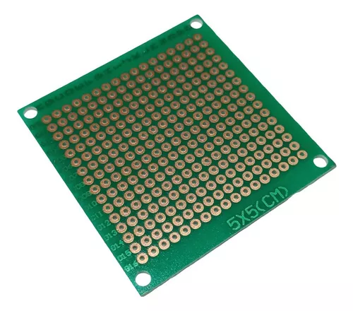
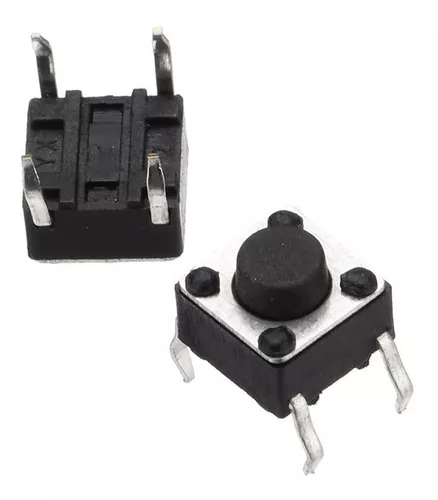
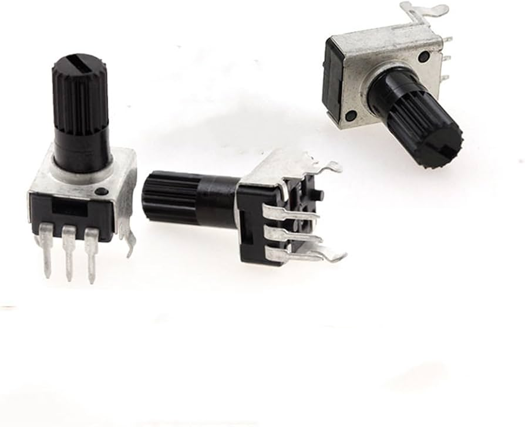
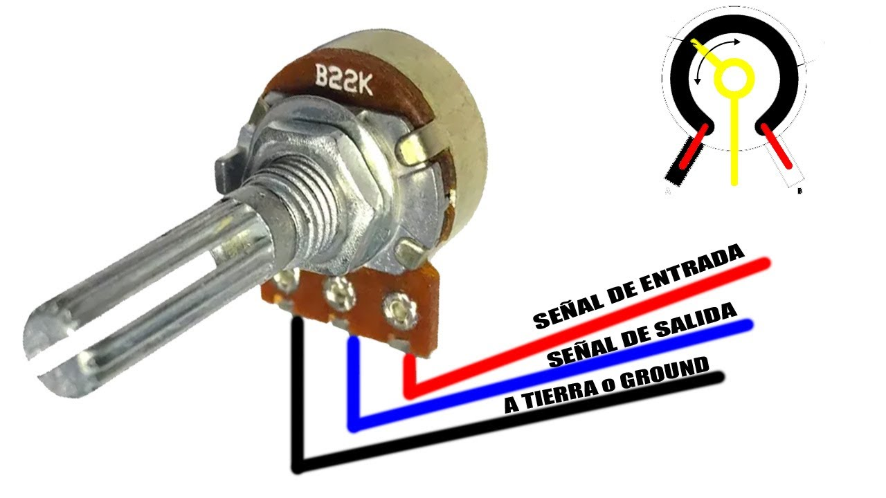
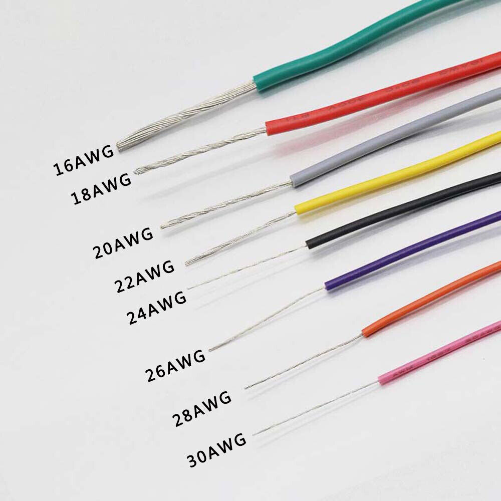
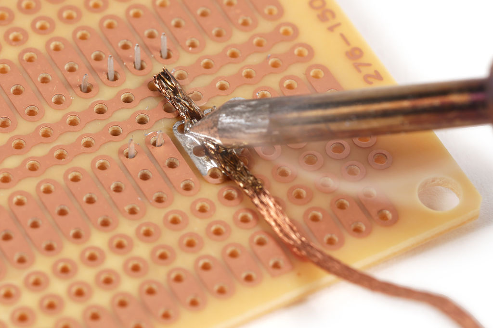

# sesion-05b

## Soldadura de PCBs y diferencia con Panel

_Protoboard_, _perfboard_ y PCB.

Los componentes para PCB están pensados para conectarse directamente en las placas PCB o _perfboard_, a diferencia de las _protoboard_.

### Placa perforada

Placa que viene perforada de fábrica para fijar componentes de forma permanente. Hay de distintos tamaños y colores. Unos son de agujeros aislados y otros de agujeros pre-conectados.

_Perfboard_ o "placa perforada" es un material para prototipar rápidamente circuitos electrónicos, una lámina delgada y rígida con agujeros pre-perforados, sirve para ubicar temporalmente diferentes elementos como resistencias, LED'S, etc.

Una _perfboard_ generalmente posee los componentes visibles en la parte superior y en la parte inferior la soldadura de estaño que une dichos componentes a la placa.

En una _perfboard_ deben ser conectados los componentes a través de cables. Se pueden hacer poco a poco, o también con planificación.

Para instalar ICs como el 555 no se recomienda directamente soldar dicho chip a la placa sino utilizar unas bases DIP (_Double In-Line Package_) que funcionan como intermediarias, las cuales permiten reemplazar el componente en caso de fallos puesto que no hay necesidad de desoldarlo. Ejemplos: DIP-20.

### _Perfboard_ PY-Z*9CM

### Botón pulsador tipo DIP de 4 pines

Es un micro-interruptor que se utiliza para configurar dispositivos electrónicos. Permite el flujo de corriente mientras es accionado, suele utilizarse en dispositivos de audio, oficina, comunicación, medición, televisores, grabadoras de video, equipos automotrices.

### Potenciómentro para PCB

Se suelen utilizar en circuitos de poca corriente. Controla motores, sensores y sistemas de medición. Calibra equipos, ajusta señales, mejora precisión de procesos automatizados y realiza ajustes de circuito en todo tipo de equipos electrónicos.

### Potenciómetro para panel

Similar al potenciómetro para PCB este componente suele estar conectado a cables y no directamente a la placa.

### Cables AWG26

Cable eléctrico de calibre 26, AWG significa _American Wire Gauge_ (Calibre de Alambre Estadounidense), un estándar para medir diámetros de cable. El valor delante del AWG indica el número de orificios por los que pasa el cable antes de formar su diámetro final. A mayor valor de AWG, mayor diámetro del cable. No son costosos ni complejos de instalar, son de uso residencial. Los utilizamos, en este caso, para soldar un circuito.

### Cables AWG24

Son más gruesos que los AWG26 y son resistentes, transporta más corriente que calibres más delgados, suele ser utilizado para electrodomésticos, proyectos electrónicos, cables Ethernet y conexiones USB.

## ¿Cómo soldar circuitos?

1. Pasar alambre o cable a través de PAD.
2. Calentar alambre y PAD al mismo tiempo con el cautín (3 segundos).
3. Sin retirar el cautín, insertar soldadura.
4. Sin sacar cautín, sacar soldadura.
5. Esperar 3 segundos, luego retirar el cautín.

A considerar: Ojo que la forma de la soldadura que no se excesiva o viceversa, poca. Tampoco que esté muy quemada o que hayan conexiones indeseadas de entre las soldaduras.

Incluye un hilo para colocar una **tuerca**, y debe llevarse con cables.

## **A considerar sobre Solemne 1.**

* Intro, premisa.
* Anatomía física.
* Bitácora multimedia.
* Esquema eléctrico.
* _Bill of materials_.
* Referencias en foros.
* Presentación oral en base a _Github_.
* Funcionamiento y robustez electromecánica.

## **solemne_01** Circuito _Atari Punk Console_

**Grupo:**
  
* Antonia Fuentealba
* Sofía Pérez
* Félix Rodriguez
* Izhak Villegas
