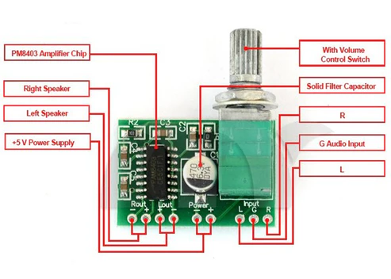
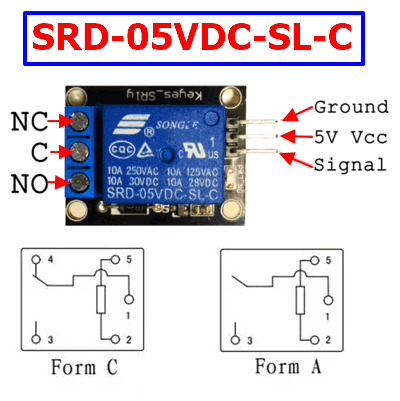
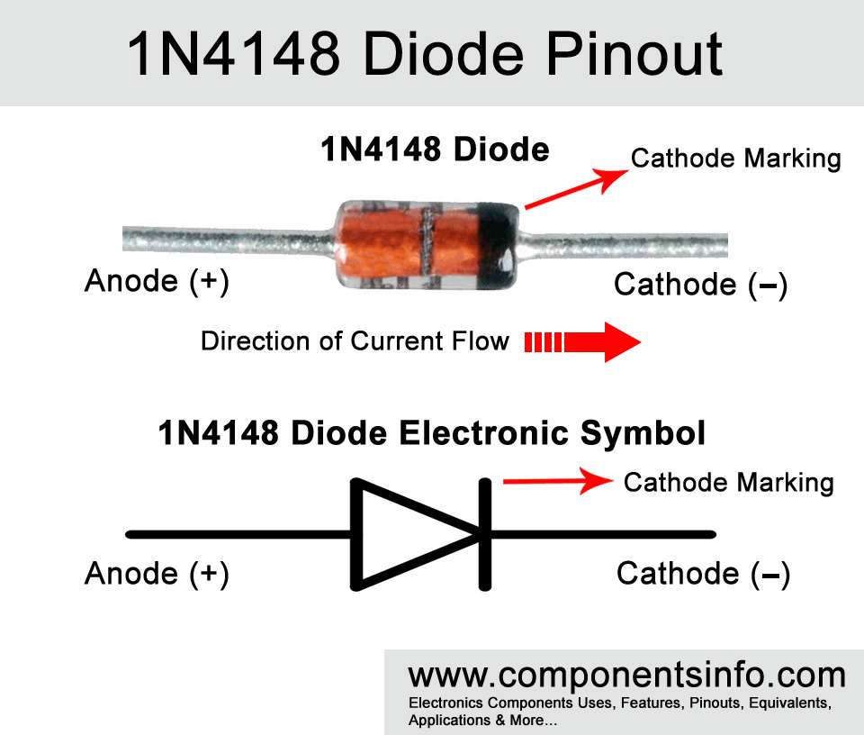
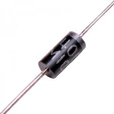

# sesion-09b

## 13-05-2025

### chip PAM8403

El PAM8403 es un amplificador de audio dual de 3W por cada una de sus salidas, correspondientes a los bafles derecho e izquierdo, este amplificador es de clase D. Ofrece baja THD N, lo que le permite lograr una reproducción de sonido de alta calidad. **AMPLIFICA SEÑALES DE AUDIO**.

En el diagrama se explica la ubicación de:
-  Los speakers izquierdo y derecho
-  La presencia de los pines de fuente de poder +5V
-  Un controlador que amplifica el volumen (potenciómetro).
-  Pines R, G y L respectivamente.
  1.  **R** (Right): Es el canal de audio derecho (Right Channel). Pin que conecta la señal de audio positivo del altavoz derecho.
  2.  **G** (Ground): Es la tierra (Ground) del sistema. Pin negativo de los altavoces o directos a tierra.
  3.  **L** (Left):  Es el canal de audio izquierdo (Left Channel). Pin que conecta la señal de audio positivo del altavoz izquierdo.

### SRD-05VDC-SL-C / Relé de 01 canal

El SRD-05VDC-SL-C es un relé electromecánico que funciona como un interruptor controlado eléctricamente.
Su principio de funcionamiento es la activación mediante bobina:

-  El  relé tiene una bobina electromagnética que, al recibir 5V DC, genera un campo magnético que atrae una armadura móvil (contacto mecánico) dentro del relé.

Los Form A, B y C (para el diagrama) son designaciones estandarizadas para describir la configuración de sus contactos eléctricos.

Estas designaciones siguen un sistema de clasificación basado en el **comportamiento de los contactos** cuando el relé está en reposo (sin energía).

1. Form A (Normally Open - NO - Normalmente Abierto)
   - El contacto NO está abierto cuando el relé está **sin energía** y se **cierra** al activarse.  
2. Form B (Normally Closed - NC - Normalmente Cerrado)
   - El contacto NC está **cerrado** en reposo y se **abre** al energizar el relé.  
3. Form C (Changeover - SPDT - Conmutador)
   - También se le llama SPDT (Single Pole Double Throw) porque tiene un polo común (COM) que se conecta a **dos salidas alternativas (NO/NC)**.
   
El SRD-05VDC-SL-C es Form C porque puede alternar entre dos estados (NO y NC).

La armadura cambia de posición (conmutación de contactos), conectando el COM (común) con:

- NO (Normalmente Abierto) si se energiza la bobina.
- NC (Normalmente Cerrado) si la bobina está sin energía.

Siendo así un ejemplo:

- Sin energía: COM ↔ NC (circula corriente).
- Con energía: COM ↔ NO (cambio de circuito).

**Aislamiento eléctrico:**

- La bobina (5V DC) y los contactos (hasta 250V AC/30V DC) están eléctricamente aislados, lo que **permite controlar cargas peligrosas de forma segura con un microcontrolador**.

Una aplicación típica del relé electromecánico es lograr prender un foco (o ampolleta) mediante un arduino. Siendo COM la lámpara. NO la línea de 220V y la bobina (controlada mediante arduino vía transistor).

### 555 Astable de oscilación binaria (periódica) sí/no

Resistencia, condensador, leds, speaker, aviso

Electrón (e-), materia, componentxes (baterías power supply, condensadores, resistencias, leds, cables, potenciómetros, LDRs, etc.) circuitos (APC, AS, MS, PLS) Caja negra (módulo).

### Ejemplo diagrama de flujo

-  1  Inicio (espera la activación)  >
-  2  Detectar luz (mide la intensidad lumínica) >
-  3  Evaluar oscuridad (¿El voltaje LDR es menor que el umbral?, si es SÍ activa el 555, si es NO vuelve al paso 2) >
-  4  Activar temporizador (oscilación, pulso rectangular)> Contar tiempo (duración del pulso, se define el tiempo alto y bajo) >
-  5  Encender salida (si existe un pulso alto en pin 3, el LED (o ampolleta) parpadea) >
-  6  Verificar sombra (¿La sombra persiste? si es SÍ, mantiene la salida, si es NO vuelve al paso 2: detectar luz).

detecta sombra -> timer -> interruptor -> ampolleta.

### Pulse width modulation -> modulación por ancho de pulso PWM.

-  Técnica utilizada para regular la cantidad de energía entregada a un dispositivo sin variar directamente el voltaje.
>  (...) "Se usa para transmitir señales analógicas cuya señal portadora será digital. En esta técnica se modifica el ciclo de trabajo de una señal periódica (una senoidal o una cuadrada, por ejemplo), ya sea para transmitir información a través de un canal de comunicaciones o para controlar la cantidad de energía que se envía a una carga". Solectro (2020).
Fuente: https://solectroshop.com/es/blog/que-es-pwm-y-como-usarlo--n38
-  Funciona encendiendo y apagando rápidamente una señal eléctrica, controlando el tiempo que está encendida (ancho del pulso) en relación al tiempo que está apagada.

### DIODOS RECTIFICADORES
- **1n4148** -> package DO-35

Diodo de señal de propósito general ampliamente utilizado en aplicaciones de rectificación, conmutación y protección.

Imagen referencial del diodo que explica dónde va el ánodo y cátodo respectivamente, así entonces intuimos la dirección en la que va el diodo.

- **1n4007**

Su capacidad para manejar corrientes moderadas y bloquear tensiones inversas lo convierte en una opción popular en una amplia gama de aplicaciones electrónicas.

-  La principal diferencia entre ambos es la velocidad de conmutación. El propósito principal del **4007** es la rectificación de voltaje en fuentes de alimentación (**alta corriente**), mientras que el **4148** es un propósito general para la rectificación de señales (**baja corriente**).

Si la resistencia es mayor, es menor el período.
duty -> cantidad de tiempo en el que el "período" se extiende.

Se genera un promedio:

- Existe uno 5 y otro de 0 pero se mantiene más en 5, aún así va a 0, el promedio resulta 4.
- Existe uno 5 y otro de 0 y el tiempo entre éstos es el mismo, el promedio resulta 2,5.
- Existe uno de 5 y otro de 0 pero se mantiene más en 0, aún así va a 5, el promedio resulta 1.

### Circuito PWM - realizado en clases en tinkercad

### Circuito PWM con variación - realizado en clases en tinkercad

<https://www.tinkercad.com/things/cjlMCnsaGub-controladorbrilloled?sharecode=GNXjLMek9DDpu2Een1sW7Y4ERK3FCmdPG-fGHW3Wv9c>

## encargo-18: de tinkercad a protoboard

Tomar el circuito que simulamos en tinkercad y traspasarlo a protoboard, usando los componentes del kit de materiales.

<a href="https://github.com/IzhakVillegas/dis8644-2025-1/raw/main/28-IzhakVillegas/sesion-09b/archivos/555kicadaplicado.mp4" class="download-btn" download> Descargar Video </a>

<video src="./archivos/555kicadaplicado.mp4" width= 400></video>

## encargo-19: cultura electrónica y laurie anderson

Estudiar la obra de Laurie Anderson, incluir citas y referentes usados, explicar qué y por qué les gusta o no de su trabajo.

Laurie Anderson, estadounidense (5 de junio de 1947) cantante, violinista, poeta, dibujante y artista experimental, viuda de **Lou Reed**.

##  **Big Science** (1982) álbum debut de Laurie Anderson.

-  A primera vista puedo percibir un estilo musical en base a cómo las voces humanas se vuelven un instrumento de percusión más, pero a su vez logra ser electrónico y también sigue siendo una voz. Al ocurrir esto la artista aprovecha este sistema musical para introducir líricas que parecieran una conversación normal o una voz sampleada, pero que sin embargo, mucho tiene que ver con el tema principal de cada canción. Una fusión de entre instrumentos convencionales y electrónicos inusual, sintetizadores minimalistas, loops hipnóticos y una voz que va narrando la canción. Puedo apreciar una estética futurista y un tipo de música que apela a la comunicación. Visionaria del art pop y el post-punk, y el hip-hop experimental.

-  El álbum en sí es una reflexión sobre la alienación tecnológica, la deshumaniación, la sociedad, la burocracia y la fragilidad humana, pareciera algo demasiado experimental para algunos pero aquella impredicibilidad es fundamental en la reflexión filosófica que trae a colación.

-  Me parece un trabajo genial pues me recuerda mucho a Björk quien seguramente tomó referencia de Laurie, ese estilo musical del diálogo, de la naracción revela un aspecto filosófico de la música que aprecio bastante porque explaya una escena bastante íntima.
