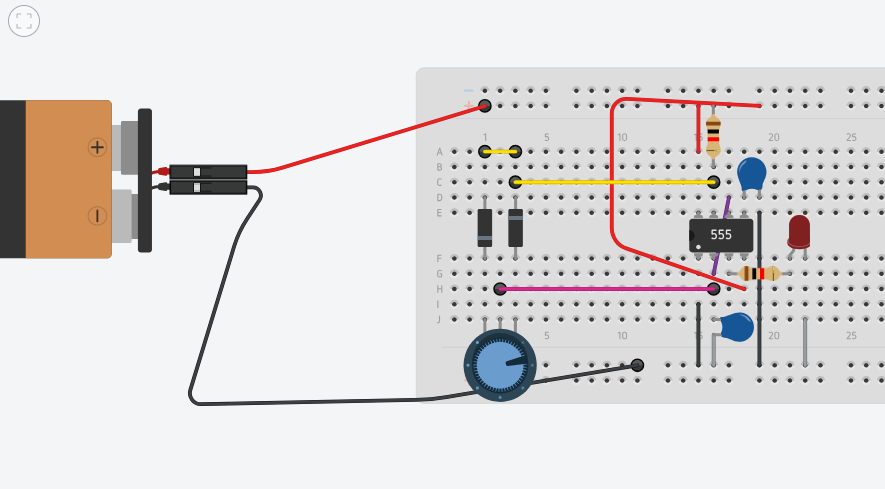

# sesion-09b

## 13-05-2025

### chip PAM8403

Mini amplificador de audio estéreo 3w clase D

### SRD-05VDC-SL-C / Relé de 01 canal

### 55 Astable de oscilación binaria (periódica) sí/no

Resistencia, condensador, leds, speaker, aviso

Electrón (e-), materia, componentxes (baterías power supply, condensadores, resistencias, leds, cables, potenciómetros, LDRs, etc.) circuitos (APC, AS, MS, PLS) Caja negra (módulo).

### Ejemplo diagrama de flujo

detecta sombra -> timer -> interruptor -> ampolleta.

### Pulse width modulation -> modulación por ancho de pulso

### 1n4148 -> package DO-35

### 1u4007

Si la resistencia es mayor, es menor el período.
duty -> cantidad de tiempo en el que el "período" se extiende.

Se genera un promedio:

- Existe uno 5 y otro de 0 pero se mantiene más en 5, aún así va a 0, el promedio resulta 4.
- Existe uno 5 y otro de 0 y el tiempo entre éstos es el mismo, el promedio resulta 2,5.
- Existe uno de 5 y otro de 0 pero se mantiene más en 0, aún así va a 5, el promedio resulta 1.

### Circuito PWM - realizado en clases en tinkercad

### Circuito PWM con variación - realizado en clases en tinkercad

<https://www.tinkercad.com/things/cjlMCnsaGub-controladorbrilloled?sharecode=GNXjLMek9DDpu2Een1sW7Y4ERK3FCmdPG-fGHW3Wv9c>

## encargo-18: de tinkercad a protoboard

Tomar el circuito que simulamos en tinkercad y traspasarlo a protoboard, usando los componentes del kit de materiales.

<a href="https://github.com/IzhakVillegas/dis8644-2025-1/raw/main/28-IzhakVillegas/sesion-09b/archivos/555kicadaplicado.mp4" class="download-btn" download> Descargar Video </a>
<video src="./archivos/555kicadaplicado.mp4" width= 400></video>

## encargo-19: cultura electrónica y laurie anderson

Estudiar la obra de Laurie Anderson, incluir citas y referentes usados, explicar qué y por qué les gusta o no de su trabajo.

Laurie Anderson, estadounidense (5 de junio de 1947) cantante, violinista, poeta, dibujante y artista experimental, viuda de **Lou Reed**.

**Big Science** (1982) álbum debut de Laurie Anderson.

A primera vista puedo percibir un estilo musical en base a cómo las voces humanas se vuelven un instrumento de percusión más, pero a su vez logra ser electrónico y también sigue siendo una voz. Al ocurrir esto la artista aprovecha este sistema musical para introducir líricas que parecieran una conversación normal o una voz sampleada, pero que sin embargo, mucho tiene que ver con el tema principal de cada canción. Una fusión de entre instrumentos convencionales y electrónicos inusual, sintetizadores minimalistas, loops hipnóticos y una voz que va narrando la canción. Puedo apreciar una estética futurista y un tipo de música que apela a la comunicación. Visionaria del art pop y el post-punk, y el hip-hop experimental.

El álbum en sí es una reflexión sobre la alienación tecnológica, la deshumaniación, la sociedad, la burocracia y la fragilidad humana, pareciera algo demasiado experimental para algunos pero aquella impredicibilidad es fundamental en la reflexión filosófica que trae a colación.

Me parece un trabajo genial pues me recuerda mucho a Björk quien seguramente tomó referencia de Laurie, ese estilo musical del diálogo, de la naracción revela un aspecto filosófico de la música que aprecio bastante porque explaya una escena bastante íntima.
