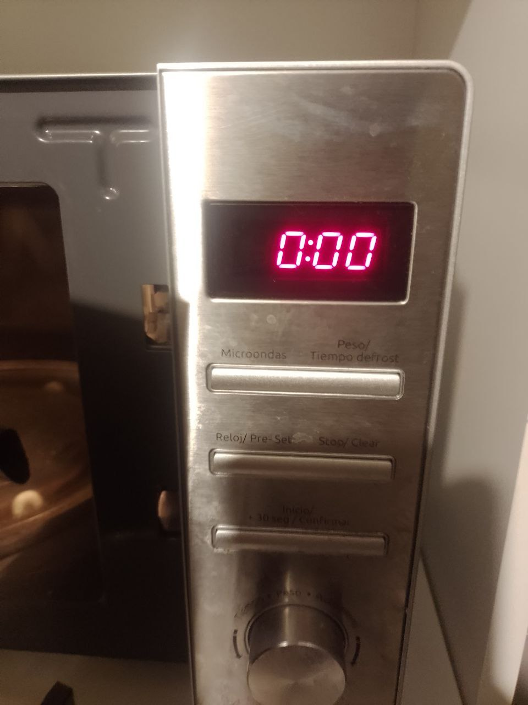
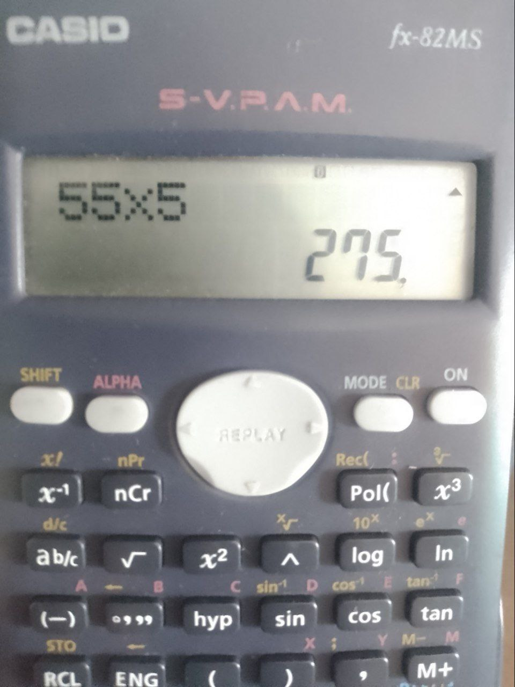
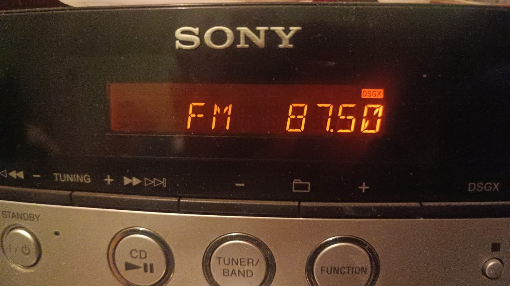
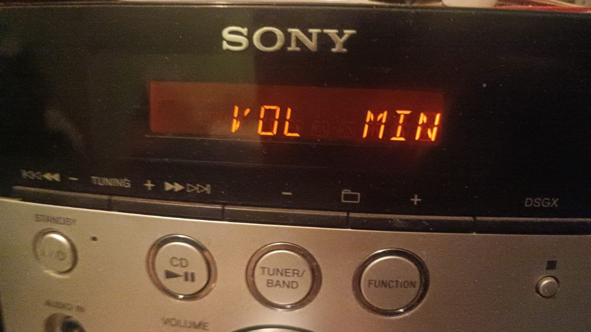
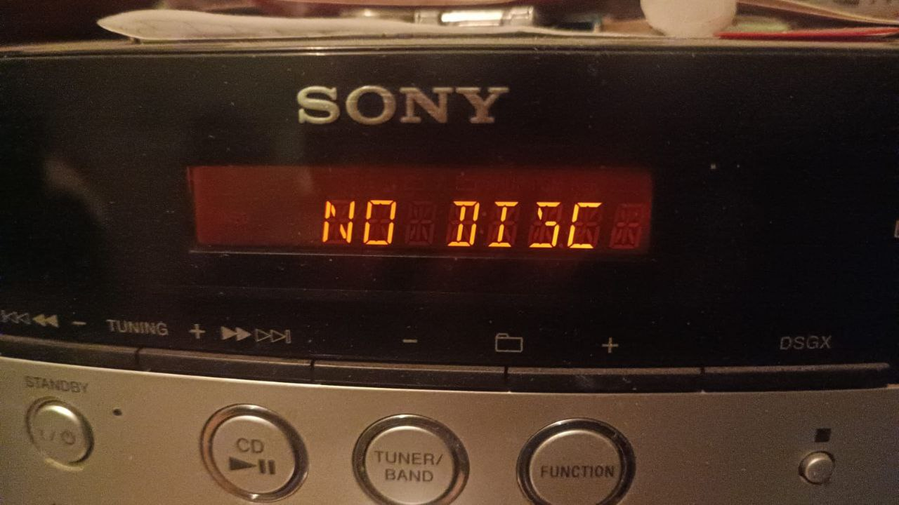
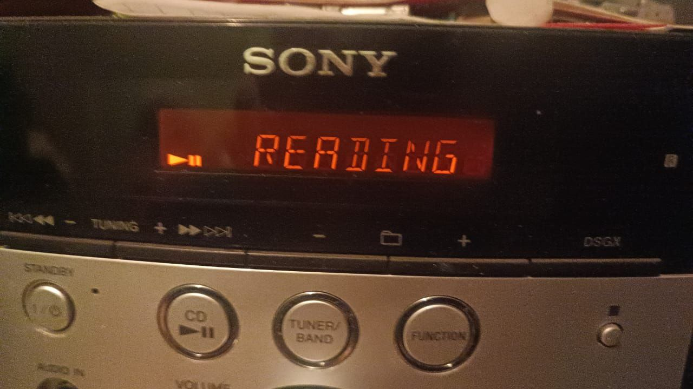

# sesion-10a

## Armar circuito PMW

- LEDs
- LEDS RGB
- Cátodo común
- Ánodo común
- LED de 7 segmentos, el display de los números o palabras (reloj digital) se programa, display con muchos leds tipo de señal CK CA.
  Se puede realizar un contador de segmentos.
- Decodificadores
- Codificadores
- Multiplexores

Sirve para determinar voltaje, y por cada segmento de voltaje determinar en qué componente recibe la corriente y cuál no, es programación display pero no es programación en un terminal.

Así funcionan los pixeles en una pantalla, son cuadrados en función de un plano cartesiano. (René Descartes).

Los colores son contextuales, colores son subproductos de luces en RGB. Color aditivo y sustractivo RGB y CMYK

Mucho tiene que ver la calidad del archivo con el tamaño del archivo y por lo tanto la percepción visual del archivo en función de su compresión, ocurre tanto en imágenes como audio, esto se decide en base a la percepción sensorial que nosotros tengamos de esto.

Pixeles quemados ocurren por uso y condiciones materiales, no por asuntos digitales.

> Los leds funcionan como redstone de Minecraft.
Comparador:
¿Es A mayor que B? SI/NO
Condiciones

- Si A es mayor que B , salida C funciona
- Si A e s menor que B, salida C no funciona.

### chip LM324 (Amplificador operacional, OP-AMP u Operational Amplifiers)

tiene 14 patas

- Estadios históricos de la luz electrónica:
Tubo de vacío > diodio > transistor > OP-AMP

"caja negra llena de transistores"

Amplificador operacional (triángulo).
Chip que resuelve operaciones matemáticas integrales. Bell Labs.

- Alimentación de Vs negativo y positivo.
- 2 Entradas y
- 1 salida.

LMx24 (4 OP-AMP)
14 patas
(1,2,3) Inputs y Output
(4)  VCC+ batería
(11) VEE- GND
LM358 (2 OP-AMP)
Simplificado con 2 patas INPUT que sale en un OUT

2 baterías negativo con positivo suman y ale tierra GND(+-), aparece +9V y -9V. Fuente bipolar. Sirve a nivel de audio. Sirve para micrófono.

Electret sensor que sabe si se perturbó el aire alrededor.

Comparadores.

LM741 (tiene 1 OP-AMP)

Resonador (RLC) bobina

Voltaje de batería es campo de posibilidades, lienzo electrónico, determina donde empieza y dónde termina. En nuestro caso no puede ser mayor que 9V o menor que 0 porque no tenemos algo mayor o menor que esto.

Divisor de voltaje DIV de Voltaje
Si hay dos resistencias Vo = Vx R1/R1+R2
9V y 0V cuál es Vo?? se calcula como dos pines de un potenciómetro, Voltaje de la mitad.

Voltaje de dos terminales como una batería.

Umbral de potenciómetro, decide quiénes pasan y quiénes no.

Aproximación de voltaje entre resistencias con base al LDR (fotorresistor).

La distorsión es un comparador a nivel de audio

Buffer. Boss DS-1 Distortion

Álegra de Boole, funcionan los comparadores, las compuertas son por ejemplo and y or.

- Abstracciones.
or gate.
and o nand gate. el logo de android está basado en esto.
nmos, cmos.
Las compuertas son la versión física en el circuito, la programación es en lo digital.

"Si baja la luz lo suficiente se prende una ampolleta".

Comparadores se pueden hacer con otros componentes, sin embargo, es engorroso.

Top down design.

Voltaje y corriente es distinto.

Detector de sombras.

- Tarea continuar encontrando pantallas. Y encontrar la cantidad de segmentos.
- Hacer pwm en falstad
- Y entender pines de los comparadores.

## encargo-20: pantallas de siete segmentos

subir fotos de su propia autoría de pantallas de siete segmentos, y otras variantes que encuentren en su vida cotidiana. les pedimos al menos 3 fotos de distintas pantallas. pueden partir de la base de las que ya subieron hoy a discord. incluir información sobre dónde y cuándo fue capturada la imagen.

-  Microondas

-  Calculadora

-  Reproductor de música






## encargo-21: simulación de circuitos con 555 y/o comparadores hechos con opamps en Falstad

simular circuitos que hemos visto en clases con chips 555 y/o circuitos comparadores usando el simulador de Falstad disponible en <https://falstad.com/circuit/>

```txt
subir el texto en una cajita como esta, revisar cómo se hace esta cajita de texto revisando el código en Markdown que lo hace posible.
```

555 experimental con presencia de transistor y op-amps en Falstad

```txt
$ 1 0.000015625 382.76258214399064 94 5 50 5e-11
165 64 96 128 96 6 -1.1899102991241788e-15
g 160 256 160 320 0 0
c 128 256 128 320 4 1.04e-7 7.999999999999948 0.001 0
g 128 320 128 384 0 0
w 64 128 -48 128 0
w -48 -16 128 -16 0
c -128 272 -128 336 4 0.00009999999999999999 3.9997714722084132 0.001 0
g -128 336 -128 400 0 0
r -128 -16 -128 64 0 10000
w -128 96 -128 80 0
r -128 112 -128 192 0 1000
R 256 -16 368 -16 0 0 40 12 0 0 0.5
w 128 -16 256 -16 0
w 128 -16 128 16 0
w -48 -16 -128 -16 0
w -128 80 -128 64 0
w -128 96 -128 112 0
w -48 80 -128 80 0
w -128 240 -128 272 0
w 64 224 48 224 0
w 32 192 32 224 0
w 32 224 48 224 0
w 128 16 128 64 0
w -48 80 -48 128 0
w -128 192 -128 240 0
w 32 192 -128 192 0
w 64 192 48 192 0
w 48 192 48 224 0
w 192 80 192 128 0
w 192 80 192 16 0
w 192 16 128 16 0
w 192 160 240 160 0
w 240 160 240 64 0
w 240 64 384 64 0
w 384 64 384 112 0
t 384 112 384 160 0 1 0.00024360981869536917 -2.43609937687589e-9 100 default
w 368 160 304 160 0
w 400 160 448 160 0
w 448 160 448 224 0
w 304 160 304 224 0
w 128 288 144 288 0
c 448 224 304 224 4 0.00009999999999999999 -0.00024361225479474605 0.001 0
w 304 224 304 304 0
w 448 224 448 384 0
w 304 304 304 368 0
a 304 384 448 384 8 15 -15 1000000 2.436098186965591e-9 0 100000
w 448 384 576 384 0
a 576 368 704 368 9 15 -15 1000000 -0.00024360981869655908 11.999999999948876 100000
w 512 -16 512 -64 0
w 512 -64 128 -64 0
w 128 -64 128 -16 0
w 224 368 224 432 0
w 224 464 -192 464 0
w -192 464 -192 -64 0
w -192 -64 128 -64 0
w 224 432 224 464 0
w 304 400 304 432 0
g 304 432 304 480 0 0
211 704 368 800 368 0 1 8000 1
374 512 -16 512 96 0 0.0199 Light\sBrightness
w 512 352 576 352 0
374 512 160 512 272 0 0.8713000000000001 Light\sBrightness
w 512 96 512 160 0
w 512 272 512 336 0
w 512 336 512 352 0
r 224 368 304 368 0 100000
```
