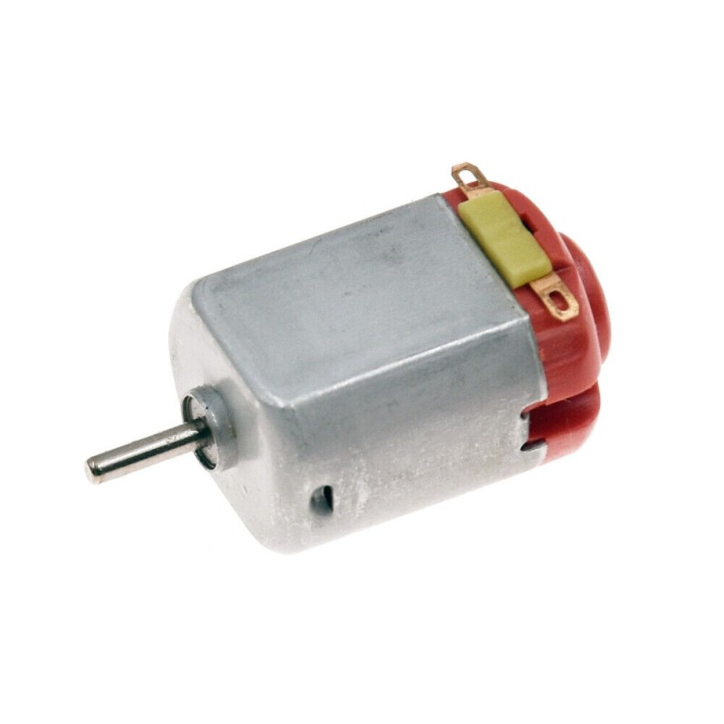
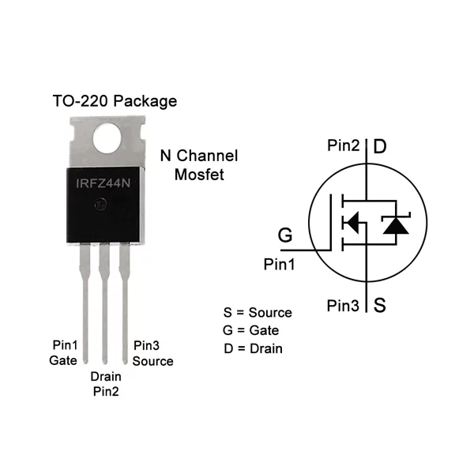
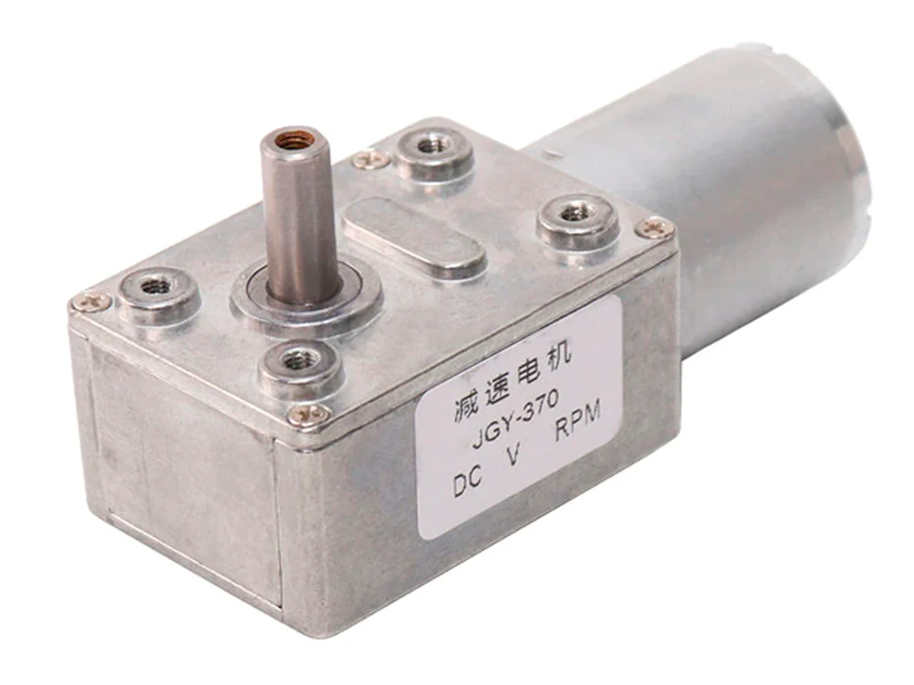
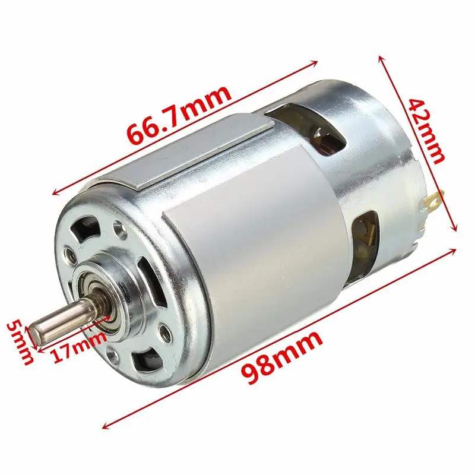
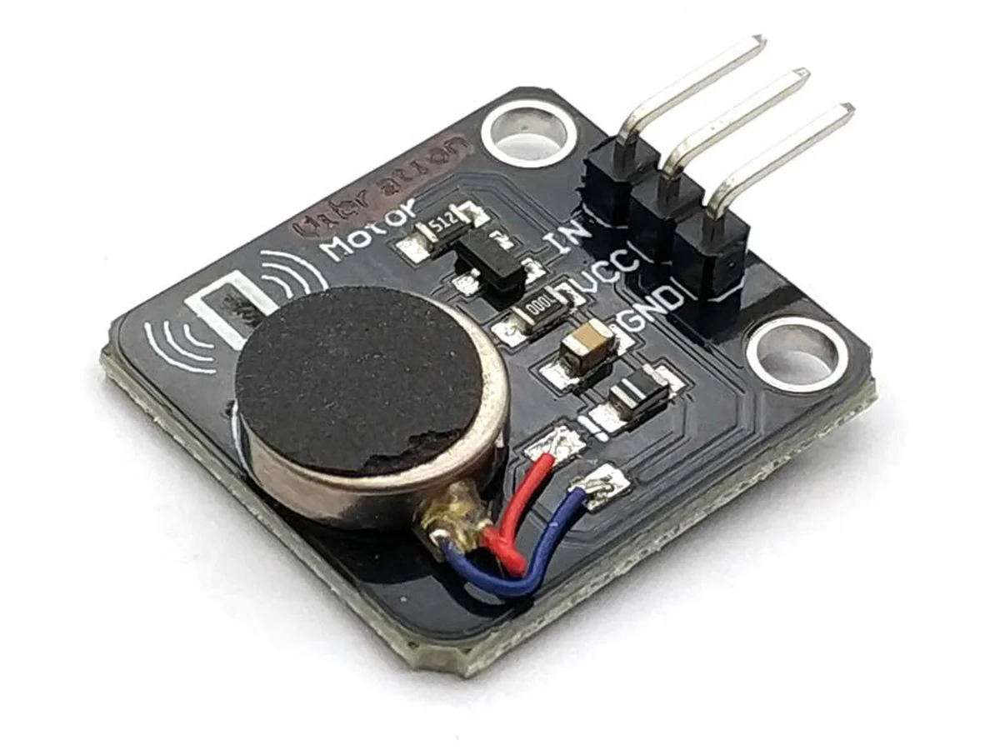

# sesion-11a

### **Menciones musicales**

-  Canto gregoriano
-  Caterina barbieri -  This causes consciousness to fracture (electrónica monostable)
-  Ela minus 
-  Kali Malone (órgano)  - Spectacle of ritual

**Programación procedural** y **Programación orientada a objetos** > "clase" (variables o propiedades) instancias, métodos, funciones. Enemigo es una instancia (tipo?: debilidad o fortaleza, tabla de tipos como Pokémon).

La programación procedimental se centra en procedimientos o funciones, mientras que la orientada a objetos se enfoca en objetos y sus interacciones.

**CLASES y OBJETOS.**

La "_clase_" posee instancias.

Dimensión proyectual. **OOO** -> Propiedades y métodos.

**OOO**: ontología orientada a objetos. Todo es objeto. NO sujeto objeto. Por Graham Harman

>  La ontología orientada a objetos (OOO) es una filosofía que plantea que todos los objetos, independientemente de su naturaleza (físicos o virtuales, grandes o pequeños), tienen el mismo estatus ontológico. No le da prioridad a la percepción humana, ni a las relaciones entre objetos, y sostiene que los objetos existen independientemente de la percepción humana.

>  Class: car
>  Objects: Mercedes, Bmw, Audi.

-  **Se crea una interfaz al programar** > el auto puede partir y puede acelerar function start(){} function accelerate(){}.

Tiene que ver con implementación en chips.

- Object-oriented Python | OOP editorial: no starch press.

OOP: ¿mesa? sirve para apoyar, rayar ¿propósito? ¿para qué sirve? ¿cuál es su uso? ¿de qué está hecha?
OOP tiene propiedades y método, no existe una tercera forma para explicar esto, niega la relación sujeto objeto.

objetos tienen relaciones entre sí, tienen una interfaz y una implementación.

-  Estética, metafísica filosofía primera. Aristóteles.

Componentes: R, C, D IC (integrated circuit), POT (potenciómetro), Transistores, Batería, PS (power supply, fuente de poder), +9V, GND, LED, LED RGB. OP-AM (multiplicador de voltaje), **MÓDULO** Relé, LDR, protoboard (lienzo), perfboard, PCB, soldadura, estaño (Sn), (Cu) cobre (Si) silicio (Au) oro.

Circuitos: APC (AS-MS), PWM, ASTABLE (AS), MONOSTABLE (MS).

Aplicaciones: APC, Brillo LED, ON/OFF Ampolleta, Sinte Rexp (udpudu).

-  Primera semana de Julio:

### **EXAMEN: proyecto de dispositivo electrónico para comisión.**

-  Presentación de examen. Encargos + bitácoras + proyecto_1.
-  Mediados de junio **ANTEPROYECTO** : feedback cruzado y semanas de producción en exámen ¿Qué queremos hacer y cómo lo hacemos? Mandar a imprimir la PCB.
-  **JUNIO**: Listo para **IMPRIMIR a JLCPCB**.
-  Aceleradores en distintos chips, módulos, chips con resistencias para llegar y conectar.
-  ¡Memoria de flujos! Aprender a usar cajas para poder aplicarlas en nuestros proyectos.

### **Objetivos hoy**:

Controlar motor tipo DC.

Armar circuito PWM.

-  Motor convierte electricidad en movimiento, según el sentido + - será el sentido del giro del motor.
-  MOTOR DC -> electricidad como movimiento, Miliamperes.
-  Importante: **Motor necesita mucha corriente**. MOTOR 600mA (I) requiere amp.

**IRFZ44n -> transistor**

-  **Transistores:** Amplificador pequeña señal genera la entrada para algo enorme, es como un diodo controlado, tiene 3 partes.

 Ejemplo:  Lógica de las CPU, transistores miles de transistores.

-  Se puede diseñar un chip por dentro, pueden ser grandes o millones de transistores. Base de la implementación de la electrónica moderna.
-  GDS (gate puerta, drain drenaje, source fuente). Transistor. 1 2 3, G, D, S.

Transistor de tipo MOSFET 1,2,3 de izquierda a derecha PACKAGE TO-220

La parte superior metálica es conductiva es D, si la carcasa de arriba toca tierra puede generar cortocircuito. Se atornillan a **disipadores**, disipan el calor.

Disipador de potencia en protoboard.

Traer powerbank y cargador USB tipo A.

Muchos dispositivos electrónicos utilizan PWM

Motor DC de 6V (el que tenemos)

Motorreductor DC 6V 3RPM (revoluciones por minuto) en 1 minuto da 3 vueltas

>  Unidad compacta que combina un motor y un reductor de velocidad en una sola pieza. Su principal función es reducir la velocidad de rotación del motor mientras aumenta el par (**torque**) de salida. Esto lo convierte en una solución eficiente para aplicaciones que requieren movimiento preciso y control de velocidad.

AFEL Baquedano Salvador 3er piso tienda.

Motor 12V DC

-  Motor Vibrador PWM Switch DC (similar a de los joysticks de Playstation).

Fuente de poder indica cuanto voltaje da siempre y el máximo cualquier cosa entre A y B.

En una casa cuando se excede los miliamperes se desconecta. **Por eso se corta la luz** con tanta saturación.

Vibrador es un motor.

Zimoun

-  Regleta elétrica, evita usar huincha aislante.
-  Ventiladores de tipo DC, **ventiladores de computadores**.
-  Ventiladores USB.

¡La maravilla de los motores!

Potenciómetro: en realidad son dos resistencias variables.

bastl-instruments.com
