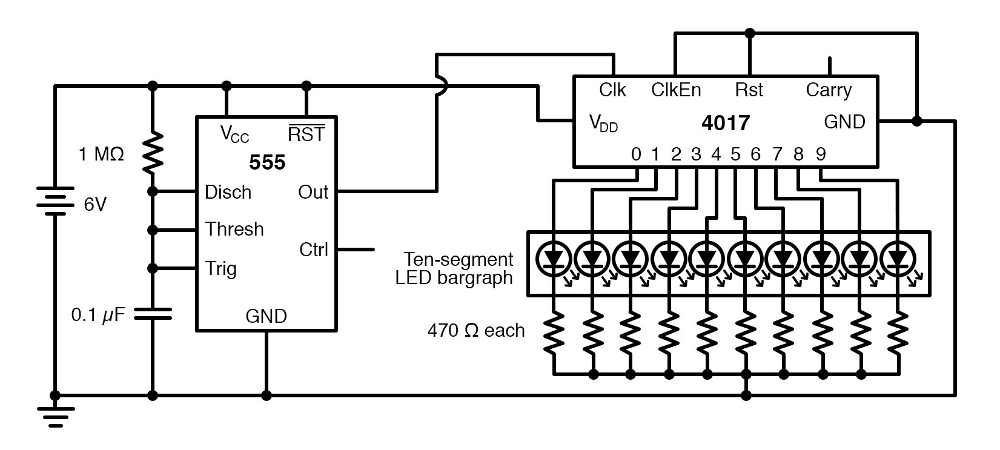
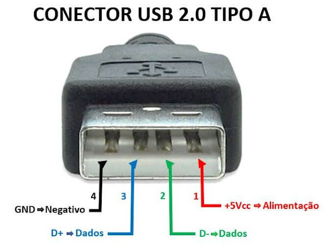
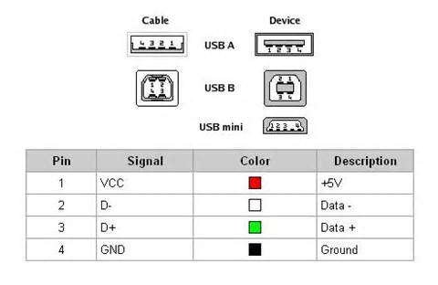
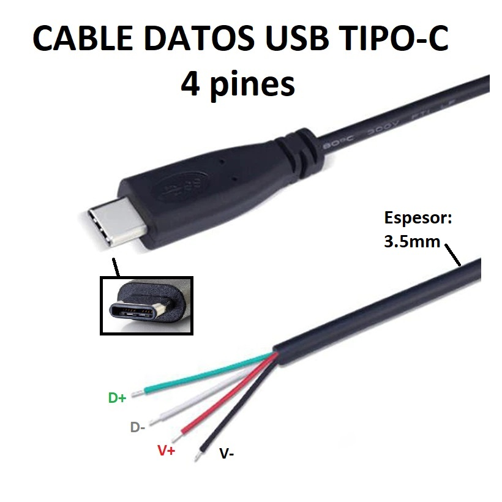

# sesion-11b

viernes 23 de mayo de 2025

## Mención musical

-  **Radiohead Hail to the Thief.**

##  chip 4017

Señal de aviso. En 0s y 1s, en apagados y encendidos.

-  Dos tipos de lógica en la electrónica: Lógica secuencial y lógica combinacional.
-  **Lógica secuencial:**  Cosas que suceden en el tiempo una después de la otra.
-  ¿Qué es un secuenciador?  : 
-  Secuencias de pasos.

**10-bit Flashing LED Sequencer.**
   

En timer 555 **OUT(3)** llega a **CLK:** CLOCK en 4017, aplica una secuencia, Ten-segment LED bargraph. Por ejemplo 470 Ω
-  4017: 0, 1, 2, 3, 4 En cada clock las luces LED se activan por la onda.
-  Hay muchos chips que empiezan con 40XX.
-  **16 (VCC)** y **8 (GND)**.
-  **CLK (14)** Indica a los demás pines la estabilidad de la onda. CLOCK -> 14(CLK).
-  **CKEN (13)** (clock enable) para habilitar o deshabilitar que esto no se cuente.
-  **Reset (15)** Reinicia el ciclo al principio. Se puede colocar algo en el pin reset, de no ser así se puede llegar a reiniciar solo.
-  **Q0 - Q9**. Las **1-11** (Q0)3, (Q1)2, (Q2)4, (Q3)7, (Q4)10, (Q5)1, (Q6)5, (Q7)6, (Q8)9, (Q9)11 salidas Q dependen de pin clock.

Circuito negador (lo contrario) +5V contrario --> -5V

CKEN --> resistencia 100k ---> GND

555 (potenciómetro) > 4017 (leds) > 555 (speaker)

>   Diagramas de conexiones USB, cómo se transimiten los datos a través de los cables y una comparativa evolutiva de los pines presentes en cada versión de USB.
*  **USB A:** pines
1. tierra
2. data +
3. data -
4. tierra
* **USB B**
* **MICROUSB** (variante de B)
* **MINIUSB** (variante de B)
* **USB C**
