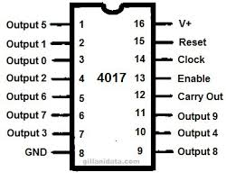
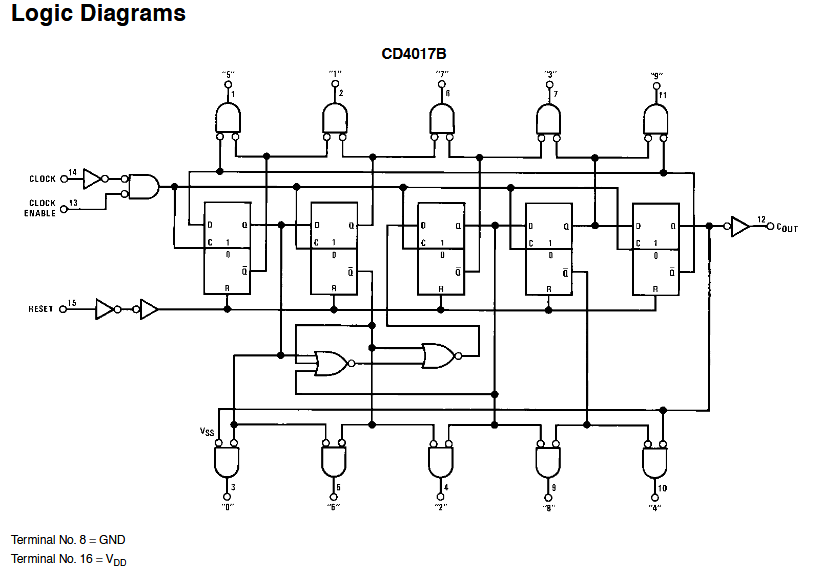
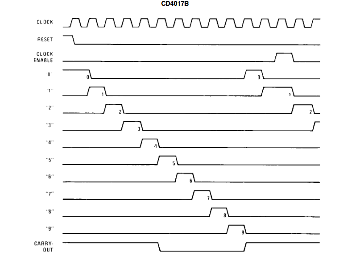
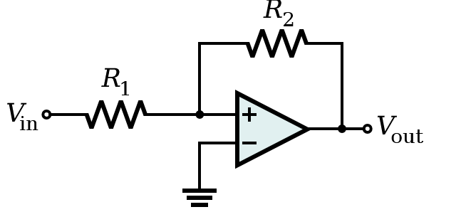
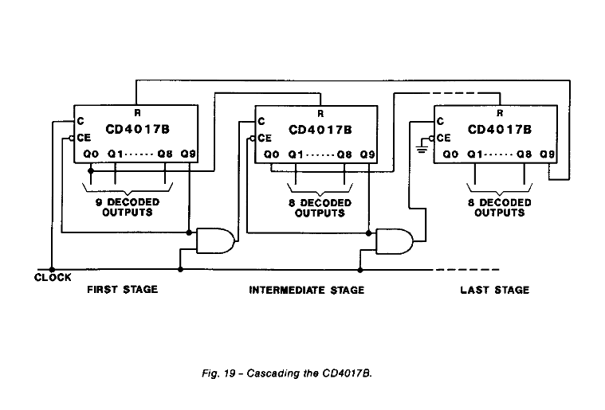
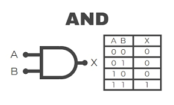

# sesion-12a
27/05/2025

Ejercicio: **¿Cómo llegamos del 555+4017 a un semáforo?**

Hipotéticamente:

-  Luz amarilla semáforo dura 4 segundos
-  Luz roja 60 segundos
-  Luz verde 60 segundos

¿Cuánto tiempo se mantiene encendido? Depende del CLK

Ordenar 31 tiempos de semáforo mediante transistores.

**TRANSISTORES**  (BJT, mosfett, NPN, PNP)

-  Tempo regular R y C (pin 2-6) en 555 indica a 4017

Modulación, modularización (pensar en la caja negra haciendo zoom), cambio.

>  CONSULTAR:  Datasheet 4017  /  **CMOS counter dividers** 2004
Fuentes:
1.  https://www.alldatasheet.com/datasheet-pdf/download/50846/FAIRCHILD/CD4017.html
2.  https://docs.rs-online.com/5bb6/0900766b80028d77.pdf

**Diferencia entre 4017 y 4022:** 4017 Cuenta hasta 10. 4022 Cuenta hasta 8.

+  CD4017B

+  Binary counter / decoder (cada pulso de reloj que recibe incrementa el número binario almacenado en sus flip-flops)

**CLOCK**         14

**CLOCK INHIBIT** 13

**RESET**         15

**CARRY OUT**     12

(termina la cuenta) como contar 1 2 3 4 5 6 7 8 9 10 (repito) concadena, no sobrepasa una cantidad máxima.
                    
                   
###  **TIMING DIAGRAM**

-  Diagrama de lógica combinacional

-  Diagrama de tiempo

-  CD4093 PINOUT

El **CD4093** es un circuito integrado CMOS que contiene cuatro compuertas NAND de dos entradas con disparador Schmitt. Cada compuerta NAND funciona con acción de disparador Schmitt en ambas entradas, lo que significa que el voltaje de entrada debe superar un cierto umbral antes de que la compuerta cambie de estado. Este circuito se utiliza comúnmente en electrónica digital para aplicaciones como osciladores, temporizadores y circuitos de lógica combinacional. 

- **Circuito integrado CMOS.** (Complementary Metal-Oxide-Semiconductor) Es un circuito integrado fabricado contransistores de efecto de campo MOFSET. De tipo N y P. Frecuente en microprocesadores.

- **Disparador Schmitt**
-  Un schmitt trigger o disparador de Schmitt es un tipo especial de circuito comparador.
-  Los disparadores Schmitt se pueden utilizar para transformar una onda sinusoidal en una onda cuadrada, limpiar señales ruidosas y convertir bordes lentos en bordes rápidos.

-  Compuerta lógica. AND, OR, NOT, NAND, NOR.

-  Compuerta lógica
>  Una compuerta lógica, también conocida como puerta lógica, es un dispositivo electrónico que implementa una función booleana (¡Álgebra de Boole!), es decir, una operación lógica que toma una o más entradas y produce una salida única.

Las compuertas lógicas son componentes fundamentales en la electrónica digital y se utilizan para construir circuitos que realizan operaciones lógicas como **AND**, OR, NOT, NAND, NOR, etc.

-  **Álgebra de Boole.** Análisis de la lógica matemática. Fundamental en el desarrollo de la lógica digital. George Boole. Define el sistema de escala booliana, cómo llevamos esto a lo físico, voltaje, Dios mediante las matemáticas. Binario.

-  **Cascading CD40178 DECODED OUTPUTS.** Esquemático.

-  **Compuerta AND**

Imagen referencial de la compuerta AND y cómo se representa de manera binaria en una tabla de lógica booleana.

-  **Condicionales lógicos.** Estructuras que permiten tomar decisiones en programas informáticos o en la lógica de razonamiento. IF, THEN, AND, NOT (programación básica).

**Bitácoras y encargos mayo, recorreciones en 'issues' hasta el 10 de junio.** 10 de junio mayo en bitácoras y encargos.

w3schools.com > guías para usar HTML CSS JAVASCRIPT SQL PHYTON, entre otros.

**alt "texto"** dentro de img src en HTML es similar a [] en markdown para describir una imagen, va antes de width "" y height "". Escala de imágenes por size, compresión de imagen para que se lean. Imagenes no pueden pesar más de 100MB y el repositorio no más de 1GB.

GitHub Artic Code Vault. Se financia en Microsoft.
